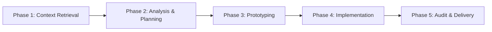

# Pi Agent

Enterprise-grade AI Agent system for code generation, analysis, and orchestration.

**[English](README.md) | [中文](README.zh-CN.md)**

## Overview

Autonomous AI orchestrator managing complex software development workflows through a structured skill system. Enforces enterprise-level protocols for code quality, documentation, and multi-model collaboration.

## Design Philosophy

Pi Agent is built on these core principles:

### 1. 精简高效 (Minimal & Efficient)

- **Code**: Self-documenting, minimal comments, no redundancy
- **Documentation**: Token-efficient, information-dense
- **Optimization**: From 22KB to 8.8KB (59% reduction, 500+ lines to 214 lines)

### 2. SSOT (Single Source of Truth)

- **One Authoritative Source**: Each knowledge domain has exactly one canonical document
- **Reference Over Copy**: Link to detailed docs instead of duplicating content
- **File System as Memory**: Store large content in files, keep only paths in context

### 3. 代码主权 (Code Sovereignty)

- **External Code as Reference**: AI-generated code is only a reference
- **Mandatory Refactoring**: Must refactor to clean, efficient enterprise code
- **Unified Diff Patch**: All changes must be reviewed before application

### 4. 沙箱安全 (Sandbox Security)

- **No Direct Writes**: External models cannot write directly
- **Human-in-the-Loop**: All modifications require human review
- **Mandatory Audit**: Phase 5 audit is enforced for all changes

## Architecture Principles

```
Pi Agent (Orchestrator)
├── Global Protocols (Design Philosophy)
├── 5-Phase Workflow
│   ├── Phase 1: Context Retrieval (ace-tool/ast-grep)
│   ├── Phase 2: Analysis & Planning (Gemini)
│   ├── Phase 3: Prototyping (Gemini → Unified Diff)
│   ├── Phase 4: Implementation (Refactoring)
│   └── Phase 5: Audit & Delivery (Code Review)
├── Modular Skills (14+ capabilities)
├── Specialized Subagents
│   ├── scout (fast reconnaissance)
│   ├── worker (deep analysis)
│   ├── planner (task planning)
│   ├── reviewer (code review)
│   └── brainstormer (design exploration)
└── Documentation System (workhub)
```

### Multi-Model Orchestration

- **Codex**: Algorithm implementation, bug analysis, code review
- **Gemini**: Frontend/UI design, backend logic, architecture planning
- **Specialized Tools**: ace-tool, ast-grep, context7, deepwiki

### Skill-Based Architecture

Each skill is a self-contained capability with:
- Clear purpose and documentation
- Standardized interface
- Independent testing and validation

## Documentation Philosophy

Pi Agent's documentation strategy:

- **Token Efficiency First**: Optimized for context window (15,000 → 8,814 chars, 41% saved)
- **Reference Links**: Detailed content in skill docs, avoid duplication
- **File System as Memory**: Large content in files, context holds only paths
- **State Management**: Read Issue before decisions, update Issue after actions
- **Change Traceability**: Every PR must link to an Issue

## Core Workflows

### Standard 5-Phase Workflow



**Phase 1: Context Retrieval** (Mandatory)
- Tool: `ace-tool` (semantic search) or `ast-grep` (AST-aware)
- Strategy: Natural language queries (Where/What/How), recursive retrieval
- Output: Complete code definitions

**Phase 2: Analysis & Planning** (Complex tasks only)
- Model: Gemini
- Input: Raw requirements (no assumptions)
- Output: Step-by-step plan with pseudocode

**Phase 3: Prototyping** (Mandatory)
- Route A (Frontend/UI): Gemini → Unified Diff Patch
- Route B (Backend/Logic): Gemini → Unified Diff Patch
- Constraint: NO file writes, diff only

**Phase 4: Implementation** (Mandatory)
- Refactor prototype to production code
- Remove redundancy, optimize for efficiency
- Minimal scope, audit side effects

**Phase 5: Audit & Delivery** (Mandatory)
- Automated code review (Codex/Gemini)
- Delivery after audit passes

### Workflow Commands

| Command | Purpose | Agent |
|---------|---------|-------|
| `/analyze` | Deep code analysis | worker |
| `/brainstorm` | Design exploration | brainstormer |
| `/research` | Parallel codebase research | multi-tool |
| `/scout` | Fast reconnaissance | scout |

**Usage Examples**:
```bash
/scout authentication flow          # Quick file location
/analyze database schema            # Deep architecture analysis
/brainstorm caching strategy        # Design ideation
/research error handling patterns   # Parallel research
```

## Usage Examples

### Scenario 1: Quick Code Reconnaissance

```bash
# Find authentication-related code
/scout authentication flow

# Scout returns:
# - Relevant files with line ranges
# - Key functions and interfaces
# - Architecture overview
# - Starting point for deep analysis
```

### Scenario 2: Deep Code Analysis

```bash
# Analyze database schema design
/analyze database schema

# Worker returns:
# - Complete architecture analysis
# - Pattern identification
# - Dependency mapping
# - Improvement recommendations
```

### Scenario 3: Design Brainstorming

```bash
# Explore caching strategies
/brainstorm caching strategy

# Brainstormer returns:
# - Multiple design approaches
# - Trade-off analysis
# - Implementation considerations
# - Architecture decision points
```

### Scenario 4: Parallel Codebase Research

```bash
# Research error handling patterns across the codebase
/research error handling patterns

# Multi-tool returns:
# - ace-tool: Semantic search results
# - ast-grep: Pattern matches
# - context7: External references
# - Synthesis: Comprehensive analysis
```

## Best Practices

### 1. Always Execute workhub from Project Root

```bash
# ✅ Correct
cd /path/to/your/project
bun ~/.pi/agent/skills/workhub/lib.ts create issue "Task description"

# ❌ Wrong (stores docs in wrong location)
~/.pi/agent/skills/workhub/lib.ts create issue "Task description"
```

### 2. Use workhub for Complex Tasks

- Create Issue before starting
- Update Issue status during execution
- Create PR after completion
- Link PR to Issue

### 3. Choose the Right Search Tool

- **ace-tool**: Semantic search (concepts, functionality)
- **ast-grep**: AST-aware search (patterns, structures)
- **rg (ripgrep)**: Exact identifier/literal matches

### 4. Refactor External Code

- AI-generated code is reference only
- Must refactor to clean, efficient code
- Apply design patterns and best practices

### 5. Follow 5-Phase Workflow

- Phase 1: Always retrieve context first
- Phase 2: Plan complex tasks
- Phase 3: Get prototypes (diff only)
- Phase 4: Implement and refactor
- Phase 5: Audit before delivery

### 6. Use tmux for Long-Running Tasks

- Long compilation/build tasks
- Interactive programs (Python REPL, gdb)
- Background services (dev servers, databases)
- Real-time monitoring tasks

## Skills Reference

| Skill | Purpose | Documentation |
|-------|---------|---------------|
| `workhub` | Documentation management (Issues/PRs) | `~/.pi/agent/skills/workhub/SKILL.md` |
| `ace-tool` | Semantic code search | `~/.pi/agent/skills/ace-tool/SKILL.md` |
| `ast-grep` | AST-aware code search/rewrite | `~/.pi/agent/skills/ast-grep/SKILL.md` |
| `codemap` | Code flow analysis | `~/.pi/agent/skills/codemap/SKILL.md` |
| `context7` | GitHub Issues/PRs search | `~/.pi/agent/skills/context7/SKILL.md` |
| `deepwiki` | GitHub repository docs | `~/.pi/agent/skills/deepwiki/SKILL.md` |
| `exa` | High-quality web search | `~/.pi/agent/skills/exa/SKILL.md` |
| `tavily-search-free` | Real-time web search | `~/.pi/agent/skills/tavily-search-free/SKILL.md` |
| `tmux` | Terminal session management | `~/.pi/agent/skills/tmux/SKILL.md` |
| `project-planner` | Project planning | `~/.pi/agent/skills/project-planner/SKILL.md` |
| `sequential-thinking` | Systematic reasoning | `~/.pi/agent/skills/sequential-thinking/SKILL.md` |
| `system-design` | Architecture design | `~/.pi/agent/skills/system-design/SKILL.md` |
| `web-browser` | Chrome DevTools Protocol | `~/.pi/agent/skills/web-browser/SKILL.md` |
| `improve-skill` | Improve/create skills | `~/.pi/agent/skills/improve-skill/SKILL.md` |
| `zai-vision` | MCP vision server access | `~/.pi/agent/skills/zai-vision/SKILL.md` |

## Configuration

| File | Purpose |
|------|---------|
| `docs/system/SYSTEM.md` | Core protocols and workflow (detailed version) |
| `settings.json` | Agent settings |
| `models.json` | Model configurations |
| `auth.json` | Authentication credentials |

## Documentation Structure

```
docs/
├── system/              # System protocol documents
│   ├── SYSTEM.md        # Current system protocol
│   ├── VERSIONS.md      # Version history
│   └── *.md             # Backup versions
├── guides/              # Usage guides
├── knowledge/           # Knowledge base
├── issues/              # Task tracking (workhub)
└── pr/                  # Change logs (workhub)
```

## Quick Start

```bash
# Initialize documentation structure (from project root)
cd /path/to/your/project
bun ~/.pi/agent/skills/workhub/lib.ts init

# Create a new issue
bun ~/.pi/agent/skills/workhub/lib.ts create issue "Task description"

# Use workflow commands
/scout authentication flow
/analyze database schema
/brainstorm caching strategy
```

## See Also

- **System Protocol**: `docs/system/SYSTEM.md` (detailed version)
- **Workhub Guide**: `skills/workhub/SKILL.md`
- **Subagent Config**: `docs/system/subagent.md`

## License

Enterprise-grade AI Agent system for professional software development.