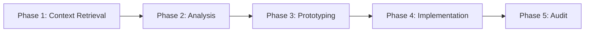

# Pi Agent

Enterprise-grade AI coding agent system with modular architecture.

**[English](README.md) | [中文](README.zh-CN.md)**

---

## Overview

Pi Agent is an autonomous AI orchestrator for software development — a monorepo containing the agent core, a multi-channel gateway, 40+ skills, 30+ extensions, and 20+ specialized subagents.

- **5-Phase Workflow**: Context retrieval → Analysis → Prototyping → Implementation → Audit
- **Multi-Model Orchestration**: Claude, Gemini, and specialized tool routing
- **Multi-Channel Gateway**: Telegram, Discord, WebChat via single-port HTTP+WS server
- **Plugin Architecture**: Skills (prompt injection), Extensions (runtime hooks), Agents (task delegation)
- **Enterprise Protocols**: Code sovereignty, sandbox security, SSOT documentation

## Prerequisites

- [Bun](https://bun.sh) >= 1.1.0
- [Pi Agent Core](https://github.com/nicepkg/pi) (`pi` CLI installed)
- Node.js >= 18 (for some skills)

## Quick Start

```bash
# Clone with submodules
git clone --recurse-submodules <repo-url> ~/.pi/agent

# Use workflow commands in any project
/scout authentication flow      # Fast code reconnaissance
/analyze database schema        # Deep analysis
/brainstorm caching strategy    # Design exploration

# Start the multi-channel gateway
cd ~/.pi/agent/pi-gateway && bun install && bun run start
```

## Project Structure

```
~/.pi/agent/
├── pi-gateway/            # Multi-channel AI gateway (Telegram/Discord/WebChat)
├── extensions/            # Runtime extensions (30 modules)
│   ├── pi-interactive-shell/  # Interactive CLI overlay (vim, psql, ssh)
│   ├── pi-subagents/          # Multi-agent chains & parallel execution
│   ├── plan-mode/             # Read-only planning with command interception
│   ├── role-persona/          # Per-role memory & personality isolation
│   ├── games/                 # Mini-games (Snake, Tetris, 2048, Minesweeper)
│   ├── answer.ts              # Interactive Q&A TUI (Ctrl+.)
│   ├── workflow-commands.ts   # /scout, /analyze, /brainstorm, /research
│   ├── safety-gates.ts        # Destructive operation interception
│   └── ...
├── skills/                # Prompt-injectable capabilities (40 modules)
│   ├── ace-tool/              # Semantic code search (AugmentCode MCP)
│   ├── web-browser/           # Chromium automation (CDP)
│   ├── tmux/                  # Remote terminal session control
│   ├── workhub/               # Issue/PR documentation management
│   ├── office-combo/          # Excel, PPT, PDF, Word support
│   └── ...
├── agents/                # Subagent definitions (20+ markdown specs)
├── prompts/               # Workflow templates (init, handoff, implement, etc.)
├── roles/                 # Role-based persona configurations
├── commands/              # Slash command definitions (/scout, /analyze, etc.)
├── messenger/             # Inter-agent session registry & event feed
├── landing-page/          # Marketing site (Vite + Lit + Tailwind)
├── docs/                  # System protocols, guides, knowledge base
├── APPEND_SYSTEM.md       # Agent system prompt
├── settings.json          # Agent runtime settings
├── models.json            # Model provider configurations
└── auth.json              # Authentication credentials
```

## Pi Gateway

Single-port HTTP+WebSocket gateway that routes messages from Telegram, Discord, and WebChat into isolated pi agent RPC processes.

```bash
cd pi-gateway
bun install
bun run start                    # Start gateway (default port 18800)
bun run dev                      # Start with hot-reload
bun run src/cli.ts doctor        # Health check
bun run src/cli.ts config show   # Show current config
```

Key capabilities:
- **3 built-in channels**: Telegram (polling/webhook, multi-account, media), Discord (slash commands), WebChat (browser UI)
- **RPC process pool**: Min/max scaling, capability-based matching, idle eviction
- **Session routing**: `agent:{agentId}:{channel}:{scope}:{id}` key format with role mapping
- **Plugin system**: 14 lifecycle hooks, register channels/tools/HTTP routes/WS methods/commands/services
- **Cron & Heartbeat**: Scheduled jobs (cron/every/at), periodic agent wake-up
- **Media pipeline**: Receive/send images with HMAC-SHA256 signed URLs
- **OpenAI-compatible API**: `/v1/chat/completions` endpoint
- **Config**: `pi-gateway.jsonc` with JSON5 support, deep merge, hot-reload

[→ Architecture docs](pi-gateway/docs/architecture/ARCHITECTURE.md)

## Extensions

Runtime hooks that enhance the agent's UI, commands, and behavior. [→ Details](extensions/README.md)

| Extension | Description |
|-----------|-------------|
| `pi-interactive-shell/` | Run interactive CLIs (vim, psql, ssh) in TUI overlay — interactive/hands-free/dispatch modes |
| `pi-subagents/` | Multi-agent orchestration: chains, parallel execution, skill injection, async support |
| `plan-mode/` | Read-only planning mode with 40+ dangerous command interception |
| `role-persona/` | Per-role isolated memory, personality, workspace context |
| `games/` | Game framework: Snake, Tetris, 2048, Minesweeper, Breakout, Pong |
| `answer.ts` | Interactive Q&A TUI (`Ctrl+.`) |
| `qna.ts` | Editor Q&A extraction (`Ctrl+,`) |
| `continue.ts` | Quick continue dialog (`Ctrl+Option+C`) |
| `handoff.ts` | Context handoff to new session |
| `git-commit.ts` | Auto git commit with message generation |
| `workflow-commands.ts` | `/scout`, `/analyze`, `/brainstorm`, `/research` commands |
| `safety-gates.ts` | Safety checks before destructive operations |
| `knowledge-builder/` | Knowledge base construction |
| `token-rate.ts` | Token usage rate tracking |

## Skills

Prompt-injectable capabilities — each skill is a `SKILL.md` file injected into the agent's system prompt at runtime.

| Category | Skill | Description |
|----------|-------|-------------|
| **Code Search** | `ace-tool` | Semantic fuzzy search via AugmentCode MCP |
| | `ast-grep` | AST-aware code search and rewrite |
| | `codemap` | Code flow visualization and mapping |
| **Documentation** | `workhub` | Issue/PR documentation management |
| | `deepwiki` | GitHub repository documentation & Q&A |
| | `context7` | Library documentation retrieval |
| | `knowledge-base` | Knowledge management system |
| **Web & Search** | `tavily-search-free` | Real-time web search |
| | `exa` | High-quality web search |
| | `web-browser` | Chromium automation (navigation, forms, network, PDF) |
| **Dev Tools** | `tmux` | Remote terminal session control (CLI/TUI modes) |
| | `project-planner` | Project planning & documentation |
| | `system-design` | Architecture design (EventStorming) |
| | `coding-runner` | Code execution sandbox |
| **Generators** | `office-combo` | Excel, PPT, PDF, Word support |
| | `har-to-vue` | Convert HAR network captures to Vue code |
| | `svg-logo-generator` | Generate SVG logos |
| | `mcp-to-skill` | Wrap any MCP server as a pi skill |
| **Best Practices** | `react-best-practices` | React patterns and conventions |
| | `vue-best-practices` | Vue patterns and conventions |
| | `vercel-design` | Vercel design system patterns |

## Agents

Specialized subagents defined as markdown files with YAML frontmatter. [→ Examples](agents/README-EXAMPLES.md)

| Agent | Mode | Purpose |
|-------|------|---------|
| `scout` | READ-ONLY | Fast code reconnaissance via semantic search + grep |
| `planner` | PLANNING | 5-phase task planning (discovery → design → review → plan → approval) |
| `worker` | STANDARD | Full-capability implementation with TODO enforcement |
| `reviewer` | READ-ONLY | Code quality & security analysis via git diff |
| `brainstormer` | STANDARD | Design exploration and ideation |
| `vision` | STANDARD | Multimodal analysis (images, video, PDF, UI/UX, diagrams) |
| `security-reviewer` | READ-ONLY | Security audit |
| `simplifier` | STANDARD | Code simplification |
| `system-design` | STANDARD | Architecture design |

## Messenger

Inter-agent session registry and event feed for multi-agent coordination.

- `messenger/registry/` — JSON metadata per agent (PID, session, model, activity)
- `messenger/feed.jsonl` — JSONL event log (messages, test results, agent activities)
- `messenger/inbox/` — Per-agent message directories

## Roles

Role-based persona system mapping project paths to agent identities.

- `roles/config.json` — Path-to-role mapping (e.g., `~/.pi/agent` → "zero")
- `roles/default/` — Default role configuration
- Each role can have isolated memory, personality, and workspace context (via `role-persona` extension)

## Core Workflow



| Phase | Status | Tools | Output |
|-------|--------|-------|--------|
| 1. Context Retrieval | Mandatory | ace-tool, ast-grep, rg | Complete code definitions |
| 2. Analysis & Planning | Complex tasks | Gemini | Step-by-step plan + pseudocode |
| 3. Prototyping | Mandatory | Gemini → Unified Diff | Diff only, no file writes |
| 4. Implementation | Mandatory | Claude | Production code, minimal scope |
| 5. Audit & Delivery | Mandatory | Codex/Gemini | Reviewed, delivered |

### Workflow Commands

| Command | Agent | Purpose |
|---------|-------|---------|
| `/scout <query>` | scout | Fast code reconnaissance |
| `/analyze <topic>` | worker | Deep code analysis |
| `/brainstorm <idea>` | brainstormer | Design exploration |
| `/research <topic>` | multi-tool | Parallel research |

## Design Principles

1. **Code Sovereignty** — External AI code is reference only; must refactor to production quality via Unified Diff Patch
2. **Sandbox Security** — External models cannot write directly; human-in-the-loop for all modifications
3. **SSOT** — One authoritative source per knowledge domain; reference over copy; filesystem as memory
4. **Token Efficiency** — Information-dense docs; reference links over duplication; context holds paths, files hold content

## Configuration

| File | Purpose |
|------|---------|
| `APPEND_SYSTEM.md` | Agent system prompt (instructions & protocols) |
| `settings.json` | Runtime settings (provider, thinking level, packages, extensions) |
| `models.json` | Model provider configurations |
| `auth.json` | Authentication credentials |
| `roles/config.json` | Role-to-path mapping |
| `pi-gateway/pi-gateway.jsonc` | Gateway config (port, channels, plugins, cron) |

## See Also

- [Gateway Architecture](pi-gateway/docs/architecture/ARCHITECTURE.md) — System design and module reference
- [Core Modules](pi-gateway/docs/architecture/CORE-MODULES.md) — RPC pool, session router, message queue
- [Plugins & Channels](pi-gateway/docs/architecture/PLUGINS-AND-CHANNELS.md) — Plugin system and channel implementations
- [Extension Development](skills/pi-extensions/README.md) — Guide to building pi extensions
- [Agent Examples](agents/README-EXAMPLES.md) — Subagent usage patterns

## License

MIT
