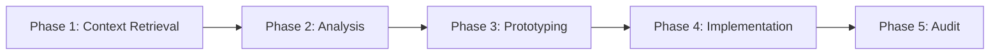

# Pi Agent

Enterprise-grade AI coding agent system with modular architecture.

**[English](README.md) | [中文](README.zh-CN.md)**

---

## Overview

Pi Agent is an autonomous AI orchestrator for software development, featuring:

- **5-Phase Workflow**: Context retrieval → Analysis → Prototyping → Implementation → Audit
- **Multi-Model Orchestration**: Seamless integration with Claude, Gemini, and specialized tools
- **Modular Architecture**: 30+ skills, 10+ extensions, 15+ subagents
- **Enterprise Protocols**: Code sovereignty, sandbox security, SSOT documentation

## Quick Start

```bash
# Initialize documentation structure
cd /path/to/your/project
bun ~/.pi/agent/skills/workhub/lib.ts init

# Use workflow commands
/scout authentication flow      # Fast code reconnaissance
/analyze database schema        # Deep analysis
/brainstorm caching strategy    # Design exploration
```

## Architecture

```
Pi Agent
├── Core System
│   ├── 5-Phase Workflow (Context → Analysis → Prototype → Implement → Audit)
│   ├── Multi-Model Orchestration (Claude, Gemini, specialized tools)
│   └── Enterprise Protocols (Code sovereignty, sandbox security)
│
├── Extensions (10+)           → UI/UX enhancements, custom commands
├── Skills (30+)               → Reusable capabilities (search, docs, tools)
├── Agents (15+)               → Specialized subagents (scout, planner, reviewer)
└── Prompts (6)                → Workflow templates
```

## Components

### 🔌 Extensions

UI/UX enhancements and custom commands. [→ Details](extensions/README.md)

**Core Extensions:**
- `answer.ts` - Interactive Q&A TUI (`Ctrl+.`)
- `qna.ts` - Editor Q&A extraction (`Ctrl+,`)
- `continue.ts` - Quick continue dialog (`Ctrl+Option+C`)
- `handoff.ts` - Context handoff to new session
- `subagent/` - Delegate tasks to specialized agents
- `games/` - Mini-games framework (Snake, 2048, Tetris, etc.)

**Tool Extensions:**
- `git-commit.ts` - Auto git commit
- `workflow-commands.ts` - Workflow commands (`/scout`, `/analyze`, etc.)
- `insights-*.ts` - Session insights and reports
- `safety-gates.ts` - Safety checks before destructive operations

[→ Full extension list](extensions/README.md)

### 🛠️ Skills

Reusable capabilities for code search, documentation, and tools. [→ Details](skills/)

**Code Search & Analysis:**
- `ace-tool` - Semantic code search
- `ast-grep` - AST-aware code search/rewrite
- `codemap` - Code flow visualization

**Documentation & Knowledge:**
- `workhub` - Documentation management (Issues/PRs)
- `deepwiki` - GitHub repository docs
- `context7` - GitHub Issues/PRs search
- `knowledge-base` - Knowledge management system

**Web & Search:**
- `tavily-search-free` - Real-time web search
- `exa` - High-quality web search
- `web-browser` - Browser automation (Chrome DevTools Protocol)

**Development Tools:**
- `tmux` - Terminal session management
- `project-planner` - Project planning & documentation
- `system-design` - Architecture design (EventStorming)
- `improve-skill` - Improve/create skills from sessions

**Specialized:**
- `office-combo` - Microsoft Office support (Excel, PPT, PDF, Word)
- `har-to-vue` - Convert HAR files to Vue code
- `svg-logo-generator` - Generate SVG logos
- `mcp-to-skill` - Wrap MCP servers as skills

[→ Full skill list with descriptions](skills/)

### 🤖 Agents

Specialized subagents for different tasks. [→ Details](agents/README-EXAMPLES.md)

**Core Agents:**
- `scout` - Fast code reconnaissance (read-only)
- `worker` - Deep analysis and implementation
- `planner` - 5-phase task planning
- `reviewer` - Code review and quality assurance
- `brainstormer` - Design exploration and ideation
- `vision` - Visual analysis (images, videos, OCR, UI/UX)

**Specialized:**
- `security-reviewer` - Security audit
- `simplifier` - Code simplification
- `system-design` - Architecture design

[→ Agent usage examples](agents/README-EXAMPLES.md)

### 📝 Prompts

Workflow templates for different scenarios. [→ Details](prompts/)

- `init.md` - Initial session setup
- `handoff.md` - Context handoff between sessions
- `scout-and-plan.md` - Reconnaissance and planning
- `implement.md` - Implementation workflow
- `implement-and-review.md` - Implementation with review
- `check-progress.md` - Progress checking

## Core Workflows

### 5-Phase Workflow



**Phase 1: Context Retrieval** (Mandatory)
- Tools: `ace-tool` (semantic) / `ast-grep` (AST) / `rg` (exact match)
- Strategy: Natural language queries, recursive retrieval
- Output: Complete code definitions

**Phase 2: Analysis & Planning** (Complex tasks only)
- Model: Gemini
- Input: Raw requirements
- Output: Step-by-step plan with pseudocode

**Phase 3: Prototyping** (Mandatory)
- Route A (Frontend/UI): Gemini → Unified Diff
- Route B (Backend/Logic): Gemini → Unified Diff
- Constraint: NO file writes, diff only

**Phase 4: Implementation** (Mandatory)
- Refactor prototype to production code
- Remove redundancy, optimize efficiency
- Minimal scope, audit side effects

**Phase 5: Audit & Delivery** (Mandatory)
- Automated code review (Codex/Gemini)
- Delivery after audit passes

### Workflow Commands

| Command | Purpose | Agent |
|---------|---------|-------|
| `/scout <query>` | Fast code reconnaissance | scout |
| `/analyze <topic>` | Deep code analysis | worker |
| `/brainstorm <idea>` | Design exploration | brainstormer |
| `/research <topic>` | Parallel research | multi-tool |

## Design Principles

### 1. Code Sovereignty
- External AI code is **reference only**
- Must refactor to clean, efficient enterprise code
- All changes via **Unified Diff Patch**

### 2. Sandbox Security
- External models **cannot write directly**
- Human-in-the-loop for all modifications
- Mandatory Phase 5 audit

### 3. SSOT (Single Source of Truth)
- One authoritative source per knowledge domain
- Reference over copy
- File system as memory

### 4. Token Efficiency
- Information-dense documentation
- Reference links instead of duplication
- Context holds paths, files hold content

## Best Practices

### 1. Always Execute workhub from Project Root

```bash
# ✅ Correct
cd /path/to/your/project
bun ~/.pi/agent/skills/workhub/lib.ts create issue "Task"

# ❌ Wrong (stores docs in wrong location)
~/.pi/agent/skills/workhub/lib.ts create issue "Task"
```

### 2. Choose the Right Search Tool

- **ace-tool**: Semantic search (concepts, functionality)
- **ast-grep**: AST-aware search (patterns, structures)
- **rg (ripgrep)**: Exact identifier/literal matches
- **fd**: File/directory search (faster than `find`)

### 3. Use workhub for Complex Tasks

- Create Issue before starting
- Update Issue status during execution
- Create PR after completion
- Link PR to Issue

### 4. Refactor External Code

- AI-generated code is reference only
- Must refactor to clean, efficient code
- Apply design patterns and best practices

### 5. Use tmux for Long-Running Tasks

- Long compilation/build tasks
- Interactive programs (Python REPL, gdb)
- Background services (dev servers, databases)
- Real-time monitoring tasks

## Configuration

| File | Purpose |
|------|---------|
| `APPEND_SYSTEM.md` | System prompt (agent instructions) |
| `docs/system/SYSTEM.md` | Detailed protocols and workflow |
| `settings.json` | Agent settings |
| `models.json` | Model configurations |
| `auth.json` | Authentication credentials |

## Documentation Structure

```
docs/
├── system/              # System protocol documents
│   ├── SYSTEM.md        # Current system protocol
│   └── VERSIONS.md      # Version history
├── guides/              # Usage guides
├── knowledge/           # Knowledge base
├── issues/              # Task tracking (workhub)
└── pr/                  # Change logs (workhub)
```

## Examples

### Scenario 1: Quick Code Reconnaissance

```bash
/scout authentication flow

# Returns:
# - Relevant files with line ranges
# - Key functions and interfaces
# - Architecture overview
```

### Scenario 2: Deep Code Analysis

```bash
/analyze database schema

# Returns:
# - Complete architecture analysis
# - Pattern identification
# - Dependency mapping
# - Improvement recommendations
```

### Scenario 3: Design Brainstorming

```bash
/brainstorm caching strategy

# Returns:
# - Multiple design approaches
# - Trade-off analysis
# - Implementation considerations
```

## See Also

- **System Prompt**: [APPEND_SYSTEM.md](APPEND_SYSTEM.md) - Agent instructions and protocols
- **Workflow Guide**: [docs/system/SYSTEM.md](docs/system/SYSTEM.md) - Detailed workflow and protocols
- **Extensions Guide**: [extensions/README.md](extensions/README.md) - Extension development
- **Agent Examples**: [agents/README-EXAMPLES.md](agents/README-EXAMPLES.md) - Agent usage patterns
- **Skills Documentation**: [skills/](skills/) - Individual skill docs

## License

Enterprise-grade AI Agent system for professional software development.
