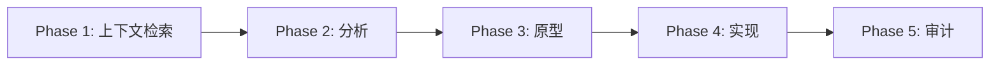

# Pi Agent

企业级 AI 编码代理系统，模块化架构。

**[English](README.md) | [中文](README.zh-CN.md)**

---

## 概述

Pi Agent 是一个面向软件开发的自主 AI 编排器 — 单一仓库包含代理核心、多通道网关、40+ 技能、30+ 扩展和 20+ 专用子代理。

- **5 阶段工作流**：上下文检索 → 分析 → 原型 → 实现 → 审计
- **多模型编排**：Claude、Gemini 及专用工具路由
- **多通道网关**：Telegram、Discord、WebChat 通过单端口 HTTP+WS 服务
- **插件架构**：Skills（提示词注入）、Extensions（运行时钩子）、Agents（任务委派）
- **企业级协议**：代码主权、沙箱安全、SSOT 文档

## 前置要求

- [Bun](https://bun.sh) >= 1.1.0
- [Pi Agent Core](https://github.com/nicepkg/pi)（`pi` CLI 已安装）
- Node.js >= 18（部分技能需要）

## 快速开始

```bash
# 克隆（含子模块）
git clone --recurse-submodules <repo-url> ~/.pi/agent

# 在任意项目中使用工作流命令
/scout authentication flow      # 快速代码侦察
/analyze database schema        # 深度分析
/brainstorm caching strategy    # 设计探索

# 启动多通道网关
cd ~/.pi/agent/pi-gateway && bun install && bun run start
```

## 项目结构

```
~/.pi/agent/
├── pi-gateway/            # 多通道 AI 网关 (Telegram/Discord/WebChat)
├── extensions/            # 运行时扩展 (30 个模块)
│   ├── pi-interactive-shell/  # 交互式 CLI 覆盖层 (vim, psql, ssh)
│   ├── pi-subagents/          # 多代理链式 & 并行执行
│   ├── plan-mode/             # 只读规划模式，拦截 40+ 危险命令
│   ├── role-persona/          # 按角色隔离记忆与人格
│   ├── games/                 # 小游戏 (贪吃蛇、俄罗斯方块、2048、扫雷)
│   ├── answer.ts              # 交互式 Q&A TUI (Ctrl+.)
│   ├── workflow-commands.ts   # /scout, /analyze, /brainstorm, /research
│   ├── safety-gates.ts        # 破坏性操作拦截
│   └── ...
├── skills/                # 可注入提示词的能力模块 (40 个)
│   ├── ace-tool/              # 语义代码搜索 (AugmentCode MCP)
│   ├── web-browser/           # Chromium 自动化 (CDP)
│   ├── tmux/                  # 远程终端会话控制
│   ├── workhub/               # Issue/PR 文档管理
│   ├── office-combo/          # Excel, PPT, PDF, Word 支持
│   └── ...
├── agents/                # 子代理定义 (20+ markdown 规格)
├── prompts/               # 工作流模板 (init, handoff, implement 等)
├── roles/                 # 基于角色的人格配置
├── commands/              # 斜杠命令定义 (/scout, /analyze 等)
├── messenger/             # 跨代理会话注册 & 事件流
├── landing-page/          # 营销站点 (Vite + Lit + Tailwind)
├── docs/                  # 系统协议、指南、知识库
├── APPEND_SYSTEM.md       # 代理系统提示词
├── settings.json          # 代理运行时设置
├── models.json            # 模型提供商配置
└── auth.json              # 认证凭据
```

## Pi Gateway

单端口 HTTP+WebSocket 网关，将 Telegram、Discord、WebChat 的消息路由到隔离的 pi agent RPC 进程。

```bash
cd pi-gateway
bun install
bun run start                    # 启动网关（默认端口 18800）
bun run dev                      # 热重载启动
bun run src/cli.ts doctor        # 健康检查
bun run src/cli.ts config show   # 查看当前配置
```

核心能力：
- **3 个内置通道**：Telegram（轮询/Webhook、多账号、媒体）、Discord（斜杠命令）、WebChat（浏览器 UI）
- **RPC 进程池**：最小/最大伸缩、基于能力匹配、空闲驱逐
- **会话路由**：`agent:{agentId}:{channel}:{scope}:{id}` 键格式，角色映射
- **插件系统**：14 个生命周期钩子，注册通道/工具/HTTP 路由/WS 方法/命令/服务
- **定时任务 & 心跳**：调度任务（cron/every/at）、周期性代理唤醒
- **媒体管线**：收发图片，HMAC-SHA256 签名 URL
- **OpenAI 兼容 API**：`/v1/chat/completions` 端点
- **配置**：`pi-gateway.jsonc`，JSON5 支持、深度合并、热重载

[→ 架构文档](pi-gateway/docs/architecture/ARCHITECTURE.md)

## 扩展 (Extensions)

增强代理 UI、命令和行为的运行时钩子。[→ 详情](extensions/README.md)

| 扩展 | 说明 |
|------|------|
| `pi-interactive-shell/` | 在 TUI 覆盖层中运行交互式 CLI（vim、psql、ssh）— 交互/免提/调度三种模式 |
| `pi-subagents/` | 多代理编排：链式、并行执行、技能注入、异步支持 |
| `plan-mode/` | 只读规划模式，拦截 40+ 危险命令 |
| `role-persona/` | 按角色隔离记忆、人格、工作区上下文 |
| `games/` | 游戏框架：贪吃蛇、俄罗斯方块、2048、扫雷、打砖块、乒乓 |
| `answer.ts` | 交互式 Q&A TUI (`Ctrl+.`) |
| `qna.ts` | 编辑器 Q&A 提取 (`Ctrl+,`) |
| `continue.ts` | 快速继续对话 (`Ctrl+Option+C`) |
| `handoff.ts` | 上下文传递到新会话 |
| `git-commit.ts` | 自动 git 提交并生成消息 |
| `workflow-commands.ts` | `/scout`、`/analyze`、`/brainstorm`、`/research` 命令 |
| `safety-gates.ts` | 破坏性操作前的安全检查 |
| `knowledge-builder/` | 知识库构建 |
| `token-rate.ts` | Token 使用速率追踪 |

## 技能 (Skills)

可注入提示词的能力模块 — 每个技能是一个 `SKILL.md` 文件，运行时注入代理系统提示词。

| 分类 | 技能 | 说明 |
|------|------|------|
| **代码搜索** | `ace-tool` | 基于 AugmentCode MCP 的语义模糊搜索 |
| | `ast-grep` | AST 感知代码搜索与重写 |
| | `codemap` | 代码流可视化与映射 |
| **文档** | `workhub` | Issue/PR 文档管理 |
| | `deepwiki` | GitHub 仓库文档 & Q&A |
| | `context7` | 库文档检索 |
| | `knowledge-base` | 知识管理系统 |
| **网络搜索** | `tavily-search-free` | 实时网络搜索 |
| | `exa` | 高质量网络搜索 |
| | `web-browser` | Chromium 自动化（导航、表单、网络、PDF） |
| **开发工具** | `tmux` | 远程终端会话控制（CLI/TUI 模式） |
| | `project-planner` | 项目规划与文档 |
| | `system-design` | 架构设计（EventStorming） |
| | `coding-runner` | 代码执行沙箱 |
| **生成器** | `office-combo` | Excel、PPT、PDF、Word 支持 |
| | `har-to-vue` | 将 HAR 网络抓包转换为 Vue 代码 |
| | `svg-logo-generator` | 生成 SVG 标志 |
| | `mcp-to-skill` | 将任意 MCP 服务器封装为 pi 技能 |
| **最佳实践** | `react-best-practices` | React 模式与规范 |
| | `vue-best-practices` | Vue 模式与规范 |
| | `vercel-design` | Vercel 设计系统模式 |

## 代理 (Agents)

以 markdown 文件（含 YAML frontmatter）定义的专用子代理。[→ 示例](agents/README-EXAMPLES.md)

| 代理 | 模式 | 用途 |
|------|------|------|
| `scout` | 只读 | 通过语义搜索 + grep 快速代码侦察 |
| `planner` | 规划 | 5 阶段任务规划（发现 → 设计 → 审查 → 计划 → 审批） |
| `worker` | 标准 | 全能力实现，强制 TODO 完成 |
| `reviewer` | 只读 | 通过 git diff 进行代码质量 & 安全分析 |
| `brainstormer` | 标准 | 设计探索与构思 |
| `vision` | 标准 | 多模态分析（图像、视频、PDF、UI/UX、图表） |
| `security-reviewer` | 只读 | 安全审计 |
| `simplifier` | 标准 | 代码简化 |
| `system-design` | 标准 | 架构设计 |

## Messenger

跨代理会话注册与事件流，用于多代理协调。

- `messenger/registry/` — 每个代理的 JSON 元数据（PID、会话、模型、活动）
- `messenger/feed.jsonl` — JSONL 事件日志（消息、测试结果、代理活动）
- `messenger/inbox/` — 按代理分隔的消息目录

## 角色 (Roles)

基于角色的人格系统，将项目路径映射到代理身份。

- `roles/config.json` — 路径到角色的映射（如 `~/.pi/agent` → "zero"）
- `roles/default/` — 默认角色配置
- 每个角色可拥有隔离的记忆、人格和工作区上下文（通过 `role-persona` 扩展）

## 核心工作流



| 阶段 | 状态 | 工具 | 输出 |
|------|------|------|------|
| 1. 上下文检索 | 强制 | ace-tool, ast-grep, rg | 完整代码定义 |
| 2. 分析与规划 | 复杂任务 | Gemini | 分步计划 + 伪代码 |
| 3. 原型 | 强制 | Gemini → Unified Diff | 仅 diff，禁止文件写入 |
| 4. 实现 | 强制 | Claude | 生产代码，最小作用域 |
| 5. 审计与交付 | 强制 | Codex/Gemini | 审查后交付 |

### 工作流命令

| 命令 | 代理 | 用途 |
|------|------|------|
| `/scout <查询>` | scout | 快速代码侦察 |
| `/analyze <主题>` | worker | 深度代码分析 |
| `/brainstorm <想法>` | brainstormer | 设计探索 |
| `/research <主题>` | 多工具 | 并行研究 |

## 设计原则

1. **代码主权** — 外部 AI 代码仅作参考；必须通过 Unified Diff Patch 重构为生产质量
2. **沙箱安全** — 外部模型不能直接写入；所有修改需人工干预
3. **SSOT** — 每个知识领域一个权威来源；引用优于复制；文件系统即记忆
4. **Token 效率** — 信息密集文档；引用链接而非重复；上下文保存路径，文件保存内容

## 配置

| 文件 | 用途 |
|------|------|
| `APPEND_SYSTEM.md` | 代理系统提示词（指令与协议） |
| `settings.json` | 运行时设置（提供商、思考级别、包、扩展） |
| `models.json` | 模型提供商配置 |
| `auth.json` | 认证凭据 |
| `roles/config.json` | 角色到路径的映射 |
| `pi-gateway/pi-gateway.jsonc` | 网关配置（端口、通道、插件、定时任务） |

## 参阅

- [网关架构](pi-gateway/docs/architecture/ARCHITECTURE.md) — 系统设计与模块参考
- [核心模块](pi-gateway/docs/architecture/CORE-MODULES.md) — RPC 池、会话路由、消息队列
- [插件与通道](pi-gateway/docs/architecture/PLUGINS-AND-CHANNELS.md) — 插件系统与通道实现
- [扩展开发](skills/pi-extensions/README.md) — pi 扩展开发指南
- [代理示例](agents/README-EXAMPLES.md) — 子代理使用模式

## 许可证

MIT
