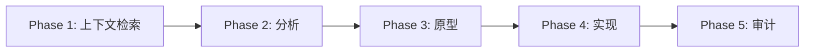

# Pi Agent

企业级 AI 编码代理系统，模块化架构。

**[English](README.md) | [中文](README.zh-CN.md)**

---

## 概述

Pi Agent 是一个用于软件开发的自主 AI 编排器，特性包括：

- **5 阶段工作流**：上下文检索 → 分析 → 原型 → 实现 → 审计
- **多模型编排**：无缝集成 Claude、Gemini 和专用工具
- **模块化架构**：30+ 技能、10+ 扩展、15+ 子代理
- **企业级协议**：代码主权、沙箱安全、SSOT 文档

## 快速开始

```bash
# 初始化文档结构
cd /path/to/your/project
bun ~/.pi/agent/skills/workhub/lib.ts init

# 使用工作流命令
/scout authentication flow      # 快速代码侦察
/analyze database schema        # 深度分析
/brainstorm caching strategy    # 设计探索
```

## 架构

```
Pi Agent
├── 核心系统
│   ├── 5 阶段工作流 (上下文 → 分析 → 原型 → 实现 → 审计)
│   ├── 多模型编排 (Claude, Gemini, 专用工具)
│   └── 企业级协议 (代码主权, 沙箱安全)
│
├── 扩展 (10+)                 → UI/UX 增强、自定义命令
├── 技能 (30+)                 → 可复用能力 (搜索、文档、工具)
├── 代理 (15+)                 → 专门子代理 (scout, planner, reviewer)
└── 提示词 (6)                 → 工作流模板
```

## 组件

### 🔌 扩展 (Extensions)

UI/UX 增强和自定义命令。[→ 详情](extensions/README.md)

**核心扩展：**
- `answer.ts` - 交互式 Q&A TUI (`Ctrl+.`)
- `qna.ts` - 编辑器 Q&A 提取 (`Ctrl+,`)
- `continue.ts` - 快速继续对话 (`Ctrl+Option+C`)
- `handoff.ts` - 上下文传递到新会话
- `subagent/` - 委派任务给专门代理
- `games/` - 小游戏框架 (贪吃蛇、2048、俄罗斯方块等)

**工具扩展：**
- `git-commit.ts` - 自动 git 提交
- `workflow-commands.ts` - 工作流命令 (`/scout`, `/analyze` 等)
- `insights-*.ts` - 会话洞察和报告
- `safety-gates.ts` - 破坏性操作前的安全检查

[→ 完整扩展列表](extensions/README.md)

### 🛠️ 技能 (Skills)

用于代码搜索、文档和工具的可复用能力。[→ 详情](skills/)

**代码搜索与分析：**
- `ace-tool` - 语义代码搜索
- `ast-grep` - AST 感知代码搜索/重写
- `codemap` - 代码流可视化

**文档与知识：**
- `workhub` - 文档管理 (Issues/PRs)
- `deepwiki` - GitHub 仓库文档
- `context7` - GitHub Issues/PRs 搜索
- `knowledge-base` - 知识管理系统

**网络与搜索：**
- `tavily-search-free` - 实时网络搜索
- `exa` - 高质量网络搜索
- `web-browser` - 浏览器自动化 (Chrome DevTools Protocol)

**开发工具：**
- `tmux` - 终端会话管理
- `project-planner` - 项目规划与文档
- `system-design` - 架构设计 (EventStorming)
- `improve-skill` - 从会话改进/创建技能

**专用工具：**
- `office-combo` - Microsoft Office 支持 (Excel, PPT, PDF, Word)
- `har-to-vue` - 将 HAR 文件转换为 Vue 代码
- `svg-logo-generator` - 生成 SVG 标志
- `mcp-to-skill` - 将 MCP 服务器封装为技能

[→ 完整技能列表及描述](skills/)

### 🤖 代理 (Agents)

用于不同任务的专门子代理。[→ 详情](agents/README-EXAMPLES.md)

**核心代理：**
- `scout` - 快速代码侦察 (只读)
- `worker` - 深度分析和实现
- `planner` - 5 阶段任务规划
- `reviewer` - 代码审查和质量保证
- `brainstormer` - 设计探索和构思
- `vision` - 视觉分析 (图像、视频、OCR、UI/UX)

**专用代理：**
- `security-reviewer` - 安全审计
- `simplifier` - 代码简化
- `system-design` - 架构设计

[→ 代理使用示例](agents/README-EXAMPLES.md)

### 📝 提示词 (Prompts)

不同场景的工作流模板。[→ 详情](prompts/)

- `init.md` - 初始会话设置
- `handoff.md` - 会话间上下文传递
- `scout-and-plan.md` - 侦察和规划
- `implement.md` - 实现工作流
- `implement-and-review.md` - 实现与审查
- `check-progress.md` - 进度检查

## 核心工作流

### 5 阶段工作流



**Phase 1: 上下文检索**（强制）
- 工具：`ace-tool`（语义）/ `ast-grep`（AST）/ `rg`（精确匹配）
- 策略：自然语言查询，递归检索
- 输出：完整的代码定义

**Phase 2: 分析与规划**（仅复杂任务）
- 模型：Gemini
- 输入：原始需求
- 输出：分步计划和伪代码

**Phase 3: 原型**（强制）
- 路线 A（前端/UI）：Gemini → Unified Diff
- 路线 B（后端/逻辑）：Gemini → Unified Diff
- 约束：禁止文件写入，仅 diff

**Phase 4: 实现**（强制）
- 将原型重构为生产代码
- 删除冗余，优化效率
- 最小作用域，审计副作用

**Phase 5: 审计与交付**（强制）
- 自动代码审查（Codex/Gemini）
- 审计通过后交付

### 工作流命令

| 命令 | 目的 | 代理 |
|---------|---------|-------|
| `/scout <查询>` | 快速代码侦察 | scout |
| `/analyze <主题>` | 深度代码分析 | worker |
| `/brainstorm <想法>` | 设计探索 | brainstormer |
| `/research <主题>` | 并行研究 | 多工具 |

## 设计原则

### 1. 代码主权
- 外部 AI 代码**仅作参考**
- 必须重构为精简高效的企业级代码
- 所有变更通过 **Unified Diff Patch**

### 2. 沙箱安全
- 外部模型**不能直接写入**
- 所有修改需要人工干预
- 强制 Phase 5 审计

### 3. SSOT (Single Source of Truth)
- 每个知识领域一个权威来源
- 引用优于复制
- 文件系统即记忆

### 4. Token 效率
- 信息密集的文档
- 引用链接而非重复
- 上下文保存路径，文件保存内容

## 最佳实践

### 1. 始终从项目根目录执行 workhub

```bash
# ✅ 正确
cd /path/to/your/project
bun ~/.pi/agent/skills/workhub/lib.ts create issue "任务"

# ❌ 错误（文档存储在错误位置）
~/.pi/agent/skills/workhub/lib.ts create issue "任务"
```

### 2. 选择正确的搜索工具

- **ace-tool**：语义搜索（概念、功能）
- **ast-grep**：AST 感知搜索（模式、结构）
- **rg (ripgrep)**：精确标识符/字面量匹配
- **fd**：文件/目录搜索（比 `find` 更快）

### 3. 复杂任务使用 workhub

- 开始前创建 Issue
- 执行期间更新 Issue 状态
- 完成后创建 PR
- 将 PR 关联到 Issue

### 4. 重构外部代码

- AI 生成的代码仅作参考
- 必须重构为精简高效的代码
- 应用设计模式和最佳实践

### 5. 长时间运行的任务使用 tmux

- 长时间编译/构建任务
- 交互式程序（Python REPL、gdb）
- 后台服务（开发服务器、数据库）
- 实时监控任务

## 配置

| 文件 | 目的 |
|------|---------|
| `APPEND_SYSTEM.md` | 系统提示词（代理指令） |
| `docs/system/SYSTEM.md` | 详细协议和工作流 |
| `settings.json` | 代理设置 |
| `models.json` | 模型配置 |
| `auth.json` | 认证凭据 |

## 文档结构

```
docs/
├── system/              # 系统协议文档
│   ├── SYSTEM.md        # 当前系统协议
│   └── VERSIONS.md      # 版本历史
├── guides/              # 使用指南
├── knowledge/           # 知识库
├── issues/              # 任务跟踪 (workhub)
└── pr/                  # 变更日志 (workhub)
```

## 示例

### 场景 1: 快速代码侦察

```bash
/scout authentication flow

# 返回：
# - 相关文件及行号范围
# - 关键函数和接口
# - 架构概述
```

### 场景 2: 深度代码分析

```bash
/analyze database schema

# 返回：
# - 完整的架构分析
# - 模式识别
# - 依赖映射
# - 改进建议
```

### 场景 3: 设计头脑风暴

```bash
/brainstorm caching strategy

# 返回：
# - 多种设计方案
# - 权衡分析
# - 实现考虑
```

## 参阅

- **系统提示词**：[APPEND_SYSTEM.md](APPEND_SYSTEM.md) - 代理指令和协议
- **工作流指南**：[docs/system/SYSTEM.md](docs/system/SYSTEM.md) - 详细工作流和协议
- **扩展指南**：[extensions/README.md](extensions/README.md) - 扩展开发
- **代理示例**：[agents/README-EXAMPLES.md](agents/README-EXAMPLES.md) - 代理使用模式
- **技能文档**：[skills/](skills/) - 各技能文档

## 许可证

用于专业软件开发的企业级 AI Agent 系统。
