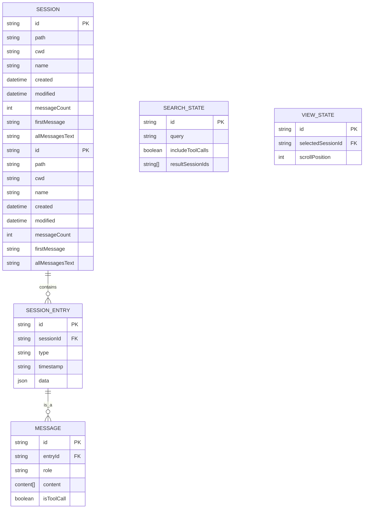
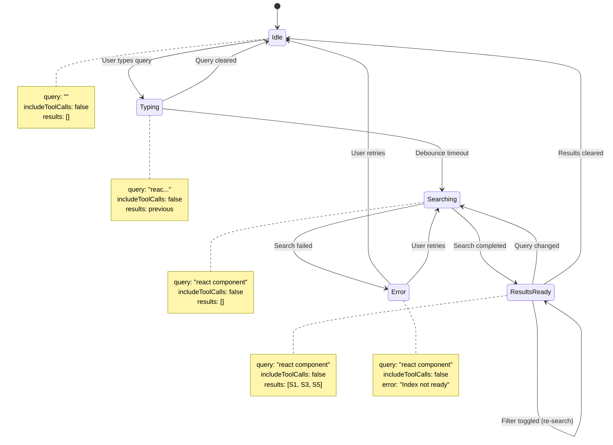
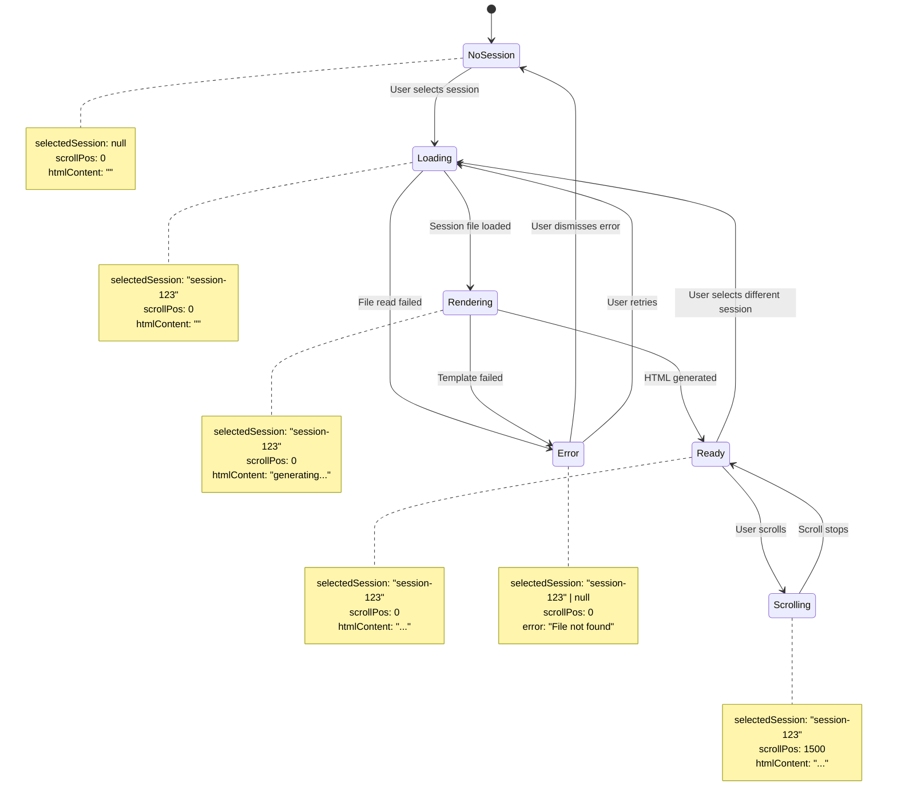
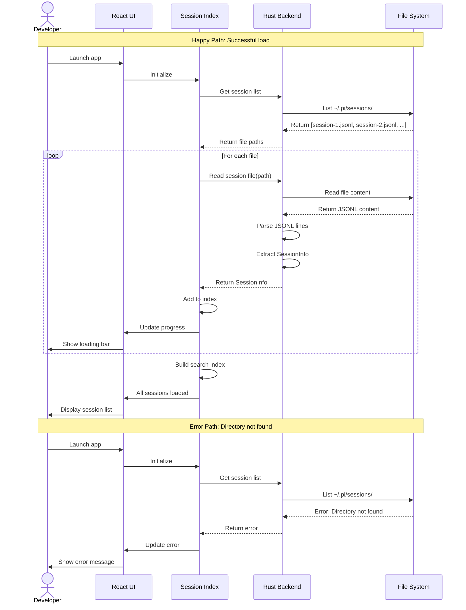
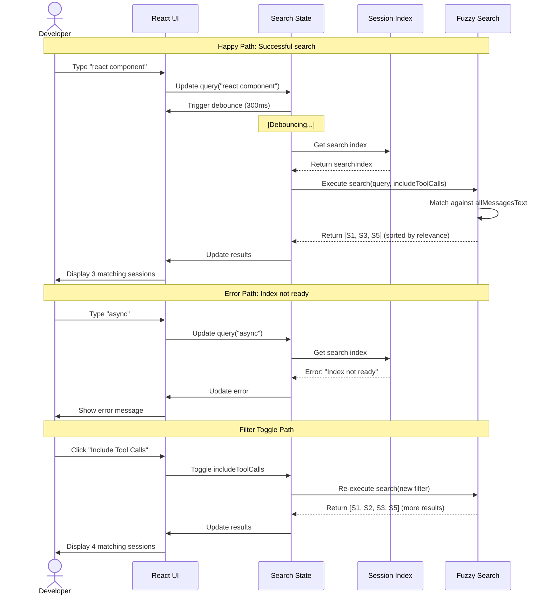
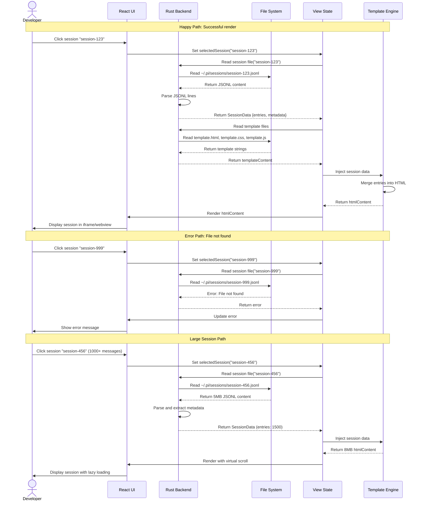

# Pi Session Manager - Design Catalog

## Overview

A standalone desktop application for managing Pi coding agent sessions, built with Tauri2. The application provides session browsing, fuzzy search across messages, and HTML rendering using Pi's existing templates.

**Technology Stack:**
- Frontend: React + TypeScript + Vite
- Backend: Rust (Tauri2)
- Data Source: JSONL files from `~/.pi/agent/sessions/`
- HTML Rendering: Pi's export-html templates

## Navigation

- [Requirements](#requirements) - Business goals, constraints, success criteria
- [Big Picture](#big-picture) - EventStorming overview
- [Processes](#processes) - Detailed process flows
- [Data Model](#data-model) - Entity relationships and state charts
- [Flows](#flows) - Sequence diagrams
- [Hotspots](#hotspots) - Open questions and decisions needed

---

## Requirements

### Business Goals
1. **Searchability**: Quick access to past conversations through fuzzy search
2. **Browseability**: View sessions using Pi's HTML export templates
3. **Independence**: Run as a separate application from Pi
4. **Performance**: Fast search and browsing experience

### Actors
| Actor | Description | Goals |
|-------|-------------|-------|
| Developer | Primary user using Pi | Find past conversations, review AI responses |

### Core Features
- FR-1: Session List (P0)
- FR-2: Search Messages (P0)
- FR-3: Render Session (P0)
- FR-4: Sort Sessions (P1)
- FR-5: Filter Tool Calls (P1)
- FR-6: Session Metadata (P1)

### Constraints
- Frontend: React + TypeScript + Vite
- Backend: Rust (Tauri2)
- Data: JSONL files only (no SQLite)
- Search: In-memory fuzzy search
- Rendering: Reuse Pi's HTML templates

---

## Big Picture

```mermaid
flowchart LR
    %% Style definitions
    classDef event fill:#ff9800,stroke:#e65100,color:#000
    classDef command fill:#2196f3,stroke:#0d47a1,color:#fff
    classDef actor fill:#ffeb3b,stroke:#f57f17,color:#000
    classDef system fill:#9c27b0,stroke:#4a148c,color:#fff
    classDef aggregate fill:#4caf50,stroke:#1b5e20,color:#fff
    classDef hotspot fill:#f44336,stroke:#b71c1c,color:#fff

    %% Actors
    Dev[Developer]:::actor

    %% Commands
    CmdLaunch[Launch App]:::command
    CmdSearch[Search Sessions]:::command
    CmdView[View Session]:::command
    CmdSort[Sort Sessions]:::command
    CmdToggle[Toggle Tool Calls]:::command

    %% Events
    EvtAppStarted[App Started]:::event
    EvtSessionsLoaded[Sessions Indexed]:::event
    EvtSearchExecuted[Search Executed]:::event
    EvtResultsFiltered[Results Filtered]:::event
    EvtSessionSelected[Session Selected]:::event
    EvtHTMLRendered[HTML Rendered]:::event
    EvtSortChanged[Sort Changed]:::event
    EvtFilterChanged[Filter Changed]:::event

    %% Aggregates
    AggSession[Session Index]:::aggregate
    AggSearch[Search State]:::aggregate
    AggView[View State]:::aggregate

    %% External Systems
    PiSessions[Pi Sessions Directory<br/>~/.pi/agent/sessions/]:::system
    PiTemplates[Pi HTML Templates<br/>template.html/css/js]:::system

    %% Hotspots
    Hot1[? Large session scale?]:::hotspot
    Hot2[? Search algorithm choice?]:::hotspot
    Hot3[? Template injection method?]:::hotspot

    %% Main Flow
    Dev --> CmdLaunch
    CmdLaunch --> EvtAppStarted
    EvtAppStarted -->|Read JSONL files| PiSessions
    PiSessions --> EvtSessionsLoaded
    EvtSessionsLoaded --> AggSession

    Dev --> CmdSearch
    CmdSearch --> EvtSearchExecuted
    EvtSearchExecuted -->|Query index| AggSession
    AggSession --> EvtResultsFiltered
    EvtResultsFiltered --> AggSearch

    Dev --> CmdView
    CmdView --> EvtSessionSelected
    EvtSessionSelected -->|Load session content| AggSession
    AggSession -->|Inject into template| PiTemplates
    PiTemplates --> EvtHTMLRendered
    EvtHTMLRendered --> AggView

    Dev --> CmdSort
    CmdSort --> EvtSortChanged
    EvtSortChanged -->|Reorder sessions| AggSession

    Dev --> CmdToggle
    CmdToggle --> EvtFilterChanged
    EvtFilterChanged -->|Update search scope| AggSearch

    %% Hotspot connections
    EvtSessionsLoaded -.question.- Hot1
    EvtSearchExecuted -.question.- Hot2
    EvtHTMLRendered -.question.- Hot3
```



### Key Events
1. **App Started** - Application launches and begins indexing
2. **Sessions Indexed** - All session files parsed and indexed
3. **Search Executed** - User performs a search query
4. **Results Filtered** - Search results returned
5. **Session Selected** - User clicks a session to view
6. **HTML Rendered** - Session rendered using Pi's templates
7. **Sort Changed** - User changes sort order
8. **Filter Changed** - User toggles tool call inclusion

---

## Processes

### Process 1: Load Sessions

```mermaid
flowchart TB
    %% Style definitions
    classDef event fill:#ff9800,stroke:#e65100,color:#000
    classDef command fill:#2196f3,stroke:#0d47a1,color:#fff
    classDef actor fill:#ffeb3b,stroke:#f57f17,color:#000
    classDef aggregate fill:#4caf50,stroke:#1b5e20,color:#fff
    classDef system fill:#9c27b0,stroke:#4a148c,color:#fff
    classDef hotspot fill:#f44336,stroke:#b71c1c,color:#fff

    %% Actors
    Dev[Developer]:::actor

    %% Commands
    CmdLaunch[Launch App]:::command

    %% Events
    EvtAppStarted[App Started]:::event
    EvtScanStarted[Directory Scan Started]:::event
    EvtFileFound[Session File Found]:::event
    EvtFileParsed[File Parsed]:::event
    EvtIndexed[Session Indexed]:::event
    EvtSessionsLoaded[All Sessions Indexed]:::event

    %% Aggregates
    AggIndex[Session Index<br/>{sessions, searchIndex}]:::aggregate
    AggProgress[Load Progress<br/>{loaded, total, percent}]:::aggregate

    %% External Systems
    PiSessions[Pi Sessions Directory<br/>~/.pi/agent/sessions/]:::system

    %% Hotspots
    Hot1[? Incremental loading?]:::hotspot
    Hot2[? Large file handling?]:::hotspot

    %% Main Flow
    Dev --> CmdLaunch
    CmdLaunch --> EvtAppStarted

    EvtAppStarted -->|Scan directory| PiSessions
    PiSessions --> EvtScanStarted
    EvtScanStarted --> AggProgress

    loop For each JSONL file
        PiSessions --> EvtFileFound
        EvtFileFound -->|Read file| PiSessions
        PiSessions --> EvtFileParsed
        EvtFileParsed -->|Extract metadata| AggIndex
        AggIndex --> EvtIndexed
        EvtIndexed -->|Update progress| AggProgress
    end

    EvtIndexed --> EvtSessionsLoaded
    EvtSessionsLoaded --> AggIndex

    %% Hotspot connections
    EvtFileParsed -.question.- Hot1
    EvtSessionsLoaded -.question.- Hot2

    %% State annotations
    AggProgress -.->|Initial| loaded: 0, total: 0, percent: 0%
    AggProgress -.->|Scanning| loaded: 5, total: 10, percent: 50%
    AggProgress -.->|Complete| loaded: 10, total: 10, percent: 100%

    AggIndex -.->|After load| sessions: [S1, S2, ..., S10]
    AggIndex -.->|Search index| searchIndex: {S1: "text1", S2: "text2", ...}
```

### Process 2: Search Sessions

```mermaid
flowchart TB
    %% Style definitions
    classDef event fill:#ff9800,stroke:#e65100,color:#000
    classDef command fill:#2196f3,stroke:#0d47a1,color:#fff
    classDef actor fill:#ffeb3b,stroke:#f57f17,color:#000
    classDef aggregate fill:#4caf50,stroke:#1b5e20,color:#fff
    classDef hotspot fill:#f44336,stroke:#b71c1c,color:#fff

    %% Actors
    Dev[Developer]:::actor

    %% Commands
    CmdInput[Type Search Query]:::command
    CmdToggle[Toggle Tool Calls]:::command

    %% Events
    EvtQueryChanged[Query Changed]:::event
    EvtSearchExecuted[Search Executed]:::event
    EvtResultsComputed[Results Computed]:::event
    EvtFilterToggled[Filter Toggled]:::event
    EvtResultsUpdated[Results Updated]:::event

    %% Aggregates
    AggSearch[Search State<br/>{query, includeToolCalls}]:::aggregate
    AggIndex[Session Index<br/>{sessions, searchIndex}]:::aggregate
    AggResults[Search Results<br/>{matchedSessions}]:::aggregate

    %% Hotspots
    Hot1[? Fuzzy search algorithm?]:::hotspot
    Hot2[? Debounce strategy?]:::hotspot

    %% Search Flow
    Dev --> CmdInput
    CmdInput --> EvtQueryChanged
    EvtQueryChanged -->|Update query| AggSearch

    AggSearch -->|Query ready| EvtSearchExecuted
    EvtSearchExecuted -->|Search in index| AggIndex
    AggIndex -->|Match sessions| EvtResultsComputed
    EvtResultsComputed -->|Update results| AggResults
    AggResults --> EvtResultsUpdated

    %% Filter Flow
    Dev --> CmdToggle
    CmdToggle --> EvtFilterToggled
    EvtFilterToggled -->|Toggle flag| AggSearch
    AggSearch -->|Re-execute search| EvtSearchExecuted

    %% Hotspot connections
    EvtSearchExecuted -.question.- Hot1
    EvtQueryChanged -.question.- Hot2

    %% State annotations
    AggSearch -.->|Initial state| query: ""
    AggSearch -.->|After typing| query: "react component"
    AggSearch -.->|Default| includeToolCalls: false

    AggResults -.->|Before search| matchedSessions: []
    AggResults -.->|After search| matchedSessions: [Session1, Session3, Session5]
```

### Process 3: Render Session

```mermaid
flowchart TB
    %% Style definitions
    classDef event fill:#ff9800,stroke:#e65100,color:#000
    classDef command fill:#2196f3,stroke:#0d47a1,color:#fff
    classDef actor fill:#ffeb3y,stroke:#f57f17,color:#000
    classDef aggregate fill:#4caf50,stroke:#1b5e20,color:#fff
    classDef system fill:#9c27b0,stroke:#4a148c,color:#fff
    classDef hotspot fill:#f44336,stroke:#b71c1c,color:#fff

    %% Actors
    Dev[Developer]:::actor

    %% Commands
    CmdSelect[Select Session]:::command
    CmdScroll[Scroll View]:::command

    %% Events
    EvtSessionSelected[Session Selected]:::event
    EvtSessionLoaded[Session Loaded]:::event
    EvtTemplateRead[Template Read]:::event
    EvtDataInjected[Data Injected]:::event
    EvtHTMLGenerated[HTML Generated]:::event
    EvtViewUpdated[View Updated]:::event

    %% Aggregates
    AggView[View State<br/>{selectedSession, scrollPos}]:::aggregate
    AggSession[Session Data<br/>{entries, metadata}]:::aggregate
    AggRender[Render State<br/>{htmlContent}]:::aggregate

    %% External Systems
    PiSessions[Pi Sessions Directory<br/>~/.pi/agent/sessions/]:::system
    PiTemplates[Pi HTML Templates<br/>template.html/css/js]:::system

    %% Hotspots
    Hot1[? Template injection method?]:::hotspot
    Hot2[? Large session rendering?]:::hotspot

    %% Render Flow
    Dev --> CmdSelect
    CmdSelect --> EvtSessionSelected
    EvtSessionSelected -->|Update selection| AggView

    AggView -->|Load from file| PiSessions
    PiSessions -->|Return JSONL content| EvtSessionLoaded
    EvtSessionLoaded -->|Parse entries| AggSession

    AggSession -->|Read template files| PiTemplates
    PiTemplates -->|Return template strings| EvtTemplateRead
    EvtTemplateRead -->|Inject session data| AggRender
    AggRender --> EvtDataInjected
    EvtDataInjected -->|Generate final HTML| EvtHTMLGenerated
    EvtHTMLGenerated -->|Update iframe/webview| EvtViewUpdated
    EvtViewUpdated --> AggView

    %% Scroll Flow
    Dev --> CmdScroll
    CmdScroll -->|Update scroll position| AggView

    %% Hotspot connections
    EvtDataInjected -.question.- Hot1
    EvtHTMLGenerated -.question.- Hot2

    %% State annotations
    AggView -.->|Before selection| selectedSession: null
    AggView -.->|After selection| selectedSession: "session-123"
    AggView -.->|Scrolling| scrollPos: 1500px

    AggSession -.->|Loaded| entries: [Msg1, Msg2, Tool1, Msg3, ...]
    AggSession -.->|Metadata| metadata: {id, cwd, created, modified, ...}

    AggRender -.->|Generated| htmlContent: "<html>...</html>"
```

---

## Data Model

### Entity-Relationship Diagram



### State Chart: Search State



### State Chart: View State



---

## Flows

### Sequence: Load Sessions



### Sequence: Search Sessions



### Sequence: Render Session



---

## Hotspots

These are open questions that need decisions before implementation:

### 🔴 HOTSPOT 1: Session Scale
**Question**: How many sessions will this system typically handle?

**Impact**:
- < 100 sessions: Simple in-memory indexing is fine
- 100-1000 sessions: Need efficient search structure
- > 1000 sessions: May need pagination, virtual scroll, incremental indexing

**Options**:
- A) Design for < 100 sessions (simplest)
- B) Design for 100-1000 sessions (balanced)
- C) Design for > 1000 sessions (complex)

### 🔴 HOTSPOT 2: Search Algorithm
**Question**: Which fuzzy search implementation to use?

**Options**:
- A) **fuse.js** - Popular, well-maintained, JS-based
- B) **flexsearch** - Faster, more features, but larger bundle
- C) **Custom Rust implementation** - Best performance, but more work
- D) **Simple includes() matching** - Fastest, but less accurate

**Trade-offs**:
| Option | Speed | Accuracy | Bundle Size | Complexity |
|--------|-------|----------|-------------|------------|
| fuse.js | Medium | High | 24KB | Low |
| flexsearch | Fast | High | 10KB | Medium |
| Rust | Very Fast | High | Native | High |
| includes() | Very Fast | Low | 0KB | Very Low |

### 🔴 HOTSPOT 3: Template Injection
**Question**: How to inject session data into Pi's HTML templates?

**Options**:
- A) **String interpolation** - Replace placeholders in HTML
- B) **DOM manipulation** - Parse HTML, insert nodes, serialize
- C) **Template engine** - Use Handlebars/Mustache
- D) **Data attribute approach** - Store data in data-* attributes, load via JS

**Trade-offs**:
| Option | Complexity | Flexibility | Performance |
|--------|------------|-------------|-------------|
| String interpolation | Low | Low | High |
| DOM manipulation | Medium | High | Medium |
| Template engine | Medium | Medium | Medium |
| Data attributes | High | High | Low |

### 🔴 HOTSPOT 4: Incremental Loading
**Question**: How to handle loading large session lists?

**Options**:
- A) **Load all at once** - Simple, but slow for large collections
- B) **Pagination** - Classic approach, but poor UX
- C) **Virtual scroll** - Best UX, but complex implementation
- D) **Progressive rendering** - Show initial set, load rest in background

### 🔴 HOTSPOT 5: Large Session Rendering
**Question**: How to render sessions with 1000+ messages?

**Options**:
- A) **Full HTML** - Generate full HTML (can be 10MB+)
- B) **Virtual scroll** - Only render visible messages
- C) **Lazy loading** - Load more on scroll
- D) **Chunking** - Render in chunks

---

## Next Steps

### 1. Hotspot Decisions
Before implementation, decide on:
- Session scale target (Hotspot 1)
- Search algorithm (Hotspot 2)
- Template injection approach (Hotspot 3)
- Incremental loading strategy (Hotspot 4)
- Large session rendering (Hotspot 5)

### 2. Implementation Phases
- **Phase 1** (Core): Session list + basic search + render
- **Phase 2** (Enhance): Sorting, filtering, better search
- **Phase 3** (Performance): Incremental loading, virtual scroll
- **Phase 4** (Polish): UI improvements, error handling

### 3. Technical Setup
- Initialize Tauri2 project with React + TypeScript + Vite
- Set up Rust backend commands
- Implement session file parsing
- Integrate Pi's HTML templates

---

## Design Summary

This design catalog provides a complete system design for the Pi Session Manager application, covering:

✅ **Requirements** - Business goals, constraints, success criteria
✅ **Big Picture** - EventStorming overview with key events and flows
✅ **Processes** - Detailed flows for loading, searching, and rendering
✅ **Data Model** - Entity relationships and state charts
✅ **Flows** - Sequence diagrams for critical interactions
✅ **Hotspots** - Open questions requiring decisions

**System Design Progress:**
- [x] Phase 1: Requirements (actors, constraints, goals identified)
- [x] Phase 2: Big Picture (EventStorming timeline created)
- [x] Phase 3: Processes (Critical processes detailed)
- [x] Phase 4: Data & Flows (ERD, state charts, sequences created)
- [x] Phase 5: Integration (Catalog assembled, next steps planned)

**Ready to proceed with implementation planning!** 🎉