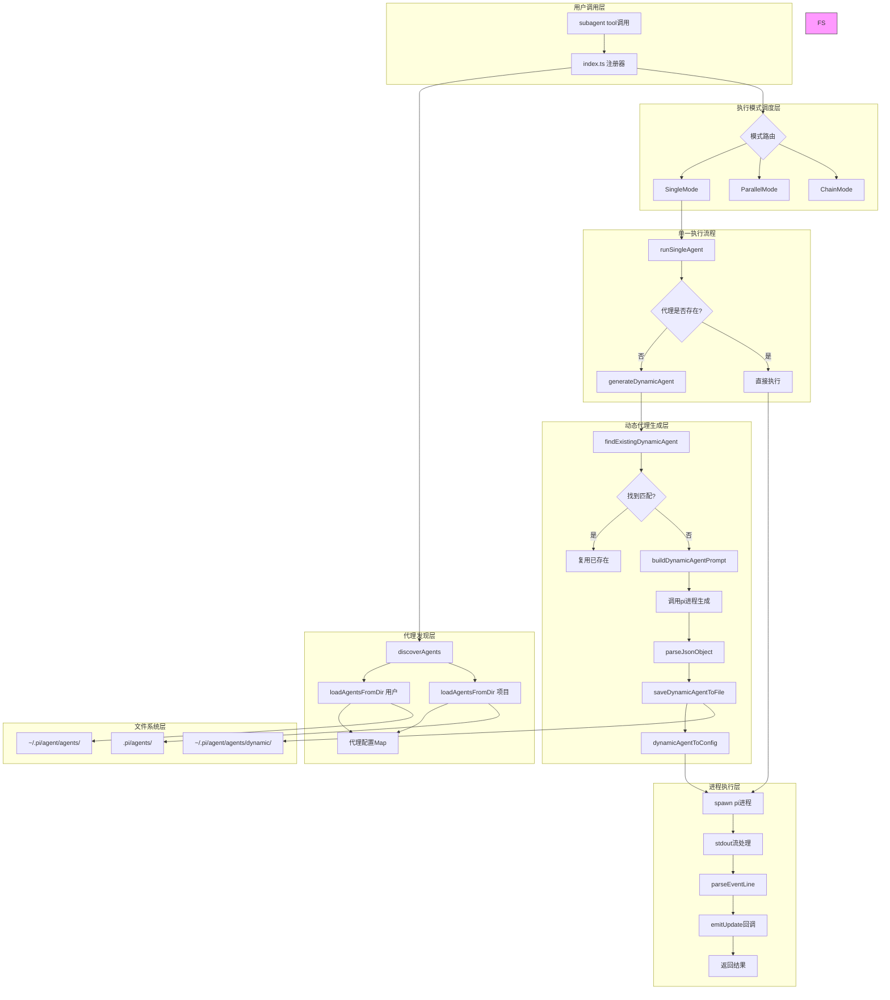
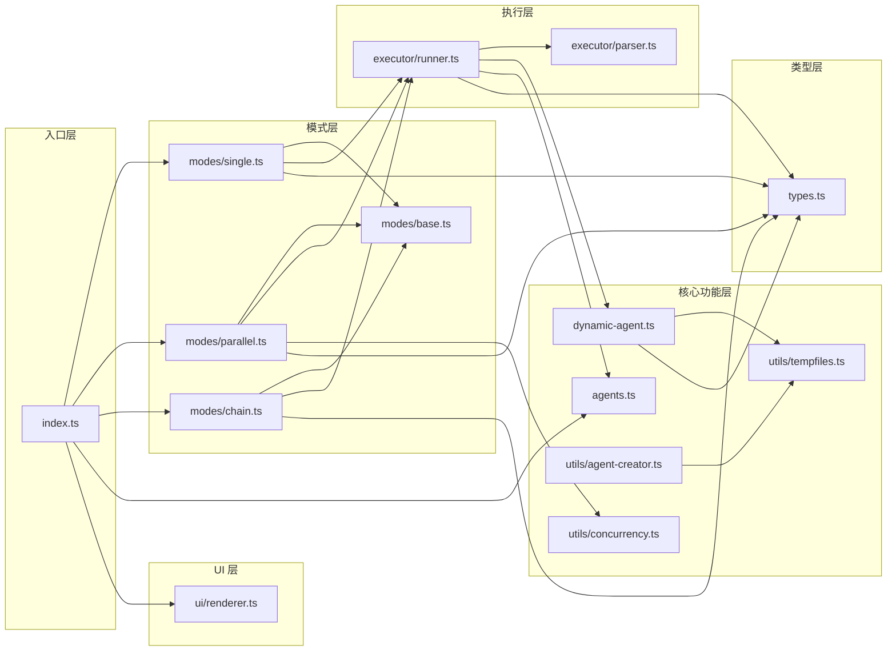

# Subagent 动态代理架构深度分析

## 1. 工作原理（架构与数据流）

### 1.1 整体架构图



### 1.2 详细数据流

#### Phase 1: 工具调用与参数解析
```
用户调用 → pi.registerTool() → execute() 
  ↓
解析 SubagentParamsSchema ({agent, task, tasks?, chain?})
  ↓
确定执行模式 (single/parallel/chain 互斥)
  ↓
discoverAgents(ctx.cwd, agentScope)
  ↓
返回 {agents[], projectAgentsDir}
```

#### Phase 2: 动态代理生成流程
```
runSingleAgent() → 查找代理
  ↓
[未找到] → generateDynamicAgent()
  ↓
  1. findExistingDynamicAgent() - 搜索已有动态代理
     - 读取 ~/.pi/agent/agents/dynamic/ 所有 .md 文件
     - 启动 pi 进程进行语义匹配
     - 返回匹配的 GeneratedAgentConfig 或 null
  ↓
  2. [无匹配] → buildDynamicAgentPrompt()
     - 构建 Chain-of-Thought 决策链提示词
     - 包含: 可用工具列表、可用技能列表、决策步骤
     - 要求输出 JSON: {name, description, systemPrompt, tools?}
  ↓
  3. 调用 pi 进程生成
     - spawn("pi", ["--mode", "json", "-p", "--no-session", ...])
     - 解析 stdout JSON 事件流
     - 捕获 message_delta (部分输出) → onProgress()
     - 捕获 message_end → 解析最终配置
  ↓
  4. 保存到文件系统
     - saveDynamicAgentToFile() → ~/.pi/agent/agents/dynamic/{name}.md
     - Frontmatter: name, description, tools
     - Body: systemPrompt
  ↓
  5. 转换为 AgentConfig
  ↓
[找到/生成] → 继续执行
```

#### Phase 3: 进程执行流程
```
准备执行参数
  ↓
构建 pi 进程参数:
  args = ["--mode", "json", "-p", "--no-session"]
  if model: args.push("--model", agent.model)
  if provider: args.push("--provider", agent.provider)
  if tools: args.push("--tools", tools.join(","))
  if systemPrompt: writeTempFile() → --append-system-prompt
  ↓
spawn("pi", args, {cwd, stdio: ["ignore", "pipe", "pipe"]})
  ↓
流处理循环:
  stdout.on("data") → buffer
  split("\n") → 逐行处理
  parseEventLine(line) → JSON 事件
  ↓
事件分发:
  - type === "message_end"
     → currentResult.messages.push(msg)
     → accumulateUsage()
     → emitUpdate()
  - type === "tool_result_end"
     → currentResult.messages.push(event.message)
     → emitUpdate()
  ↓
proc.on("close") → 解析最终 buffer
  ↓
返回 SingleResult {
  agent, agentSource, task, exitCode,
  messages, stderr, usage, startTime, endTime,
  status, stopReason, model
}
```

### 1.3 关键数据结构流转

```typescript
// 1. 用户输入
SubagentParams {
  agent: string
  task: string
  agentScope: "user" | "project" | "both"
}

// 2. 发现代理后
AgentConfig {
  name: string
  description: string
  systemPrompt: string
  tools?: string[]
  model?: string
  provider?: string
  source: "user" | "project" | "dynamic"
  filePath: string
}

// 3. 动态生成中段
GeneratedAgentConfig {
  name: string
  description: string
  systemPrompt: string
  tools?: string[]
  filePath?: string
  origin: "generated" | "matched"
  availableTools: string[]
  availableSkills: string[]
}

// 4. 执行结果
SingleResult {
  agent: string
  agentSource: AgentSource
  task: string
  exitCode: number
  messages: Message[]
  stderr: string
  usage: UsageStats
  status: "running" | "searching" | "generating" | "completed" | "error"
  startTime: number
  endTime?: number
}
```

---

## 2. 结构设计原因（设计决策）

### 2.1 为什么要分离动态生成到独立进程？

**理由 1: 上下文隔离**
- 动态代理生成需要独立的上下文窗口
- 避免主 Agent 的 token 占用
- 生成过程可以使用不同的模型/Provider

**理由 2: 故障隔离**
```typescript
// dynamic-agent.ts:549-547
const finish = (value: GeneratedAgentConfig | null) => {
  if (resolved) return;
  resolved = true;
  cleanupTempFiles(tmp.filePath, tmp.dir);
  resolve(value);
};
```
- 使用 `resolved` 标志防止重复解析
- 独立错误处理，不污染主流程

**理由 3: 超时控制**
```typescript
const timeout = setTimeout(() => finish(null), 180000); // 3 minutes
```
- 避免生成过程无限等待
- 3 分钟后自动结束，返回 null

### 2.2 为什么要使用 Markdown Frontmatter 存储代理配置？

**理由 1: 人类可读**
```markdown
---
name: "worker"
description: "General purpose worker agent"
tools: read, bash, edit
---

You are a worker agent...
```
- 配置和系统提示自然分离
- 易于手动编辑和版本控制

**理由 2: 扩展性**
```typescript
// agents.ts:104-125
const { frontmatter, body } = parseFrontmatter(content);
agents.push({
  name: frontmatter.name,
  description: frontmatter.description,
  tools: frontmatter.tools?.split(",").map(t => t.trim()),
  model: frontmatter.model,
  provider: frontmatter.provider,
  systemPrompt: body,  // 直接取正文
});
```
- 可以随意添加新字段 (model, provider 等)
- 向后兼容旧文件

**理由 3: 文件即记忆**
- 代理配置持久化到文件系统
- 支持项目级 `.pi/agents/` 目录
- 便于 git 追踪变更

### 2.3 为什么要实现三种执行模式？

**决策**: 策略模式的应用

```typescript
// modes/base.ts:20-23
export interface ExecutionMode {
  execute(ctx: ExecutionContext, params: any): Promise<ModeResult>;
}

const singleMode = new SingleMode();
const parallelMode = new ParallelMode();
const chainMode = new ChainMode();
```

**设计理由**:

1. **Single Mode** - 最常用场景
   - 单任务委派
   - 独立上下文
   - 简单直接

2. **Parallel Mode** - 提高并发效率
   ```typescript
   const MAX_PARALLEL_TASKS = 8;
   // parallel.ts:21-31
   if (tasks.length > MAX_PARALLEL_TASKS) {
     return {
       content: [{ type: "text", text: `Too many parallel tasks...` }],
     };
   }
   ```
   - 限制并发数防止资源耗尽
   - 使用 Promise.all 并行执行

3. **Chain Mode** - 支持数据流水线
   ```typescript
   // chain.ts:23-24
   const results: SingleResult[] = [];
   let previousOutput = "";
   ```
   - 支持 `{previous}` 占位符
   - 前一个代理的输出传递给下一个

### 2.4 为什么要实现智能复用机制？

**问题**: 频繁生成相同代理会浪费 token 和时间

**解决方案**:
```typescript
// dynamic-agent.ts:518-531
const existing = await findExistingDynamicAgent(agentName, task, onProgress);
if (existing) {
  onProgress({ stage: "done", text: `✓ Found existing "${agentName}" agent` });
  existing.availableTools = availableTools.map(t => t.name);
  existing.availableSkills = availableSkills.map(s => s.name);
  return existing;
}
```

**复用机制**:
1. 读取所有动态代理文件
2. 构建语义匹配提示词
3. 调用 AI 判断是否复用
4. 返回匹配的代理配置

**优势**:
- 节省 token 消耗
- 提高响应速度
- 促进代理质量迭代

### 2.5 为什么要分离工具和技能？

**区别**:
- **工具 (Tools)**: 通过 API 调用，在 Pi Agent 核心中注册
  ```typescript
  // frontmatter
  tools: read, bash, edit
  ```
- **技能 (Skills)**: 通过 CLI 调用，独立脚本
  ```typescript
  // dynamic-agent.ts:324
  "For code analysis tasks, use the ace-tool skill: `bun ~/.pi/agent/skills/ace-tool/client.ts search <query>`"
  ```

**设计理由**:
1. **工具** 是基础能力，需要高性能、低延迟
2. **技能** 是领域扩展，可以独立开发和部署
3. 清晰的职责分离，便于维护

### 2.6 为什么要支持三级作用域？

```typescript
export type AgentScope = "user" | "project" | "dynamic";
```

**设计理由**:

1. **user** (`~/.pi/agent/agents/`)
   - 全局可用的代理
   - 跨项目复用
   - 手动创建或提升

2. **project** (`.pi/agents/`)
   - 项目特定的代理
   - 包含项目领域知识
   - 代码库内版本控制

3. **dynamic** (`~/.pi/agent/agents/dynamic/`)
   - 自动生成的临时代理
   - 支持复用和提升
   - 作为"沙箱"环境

**安全机制**:
```typescript
// index.ts:109-130
if ((agentScope === "project" || agentScope === "both") && confirmProjectAgents) {
  const projectAgentsRequested = agents.filter(a => a.source === "project");
  if (projectAgentsRequested.length > 0) {
    const ok = await ctx.ui.confirm(
      "Run project-local agents?",
      `Agents: ${names}\nSource: ${dir}\n\nProject agents are repo-controlled.`
    );
    if (!ok) return { content: [{ type: "text", text: "Canceled" }]};
  }
}
```
- 项目代理需要用户确认
- 防止恶意仓库执行任意代理

---

## 3. 使用的模式（设计模式、惯用法）

### 3.1 策略模式 (Strategy Pattern)

**实现**: 三种执行模式可互换

```typescript
// modes/base.ts
export interface ExecutionMode {
  execute(ctx: ExecutionContext, params: any): Promise<ModeResult>;
}

// index.ts
const singleMode = new SingleMode();
const parallelMode = new ParallelMode();
const chainMode = new ChainMode();

// 路由逻辑
if (params.chain && params.chain.length > 0) {
  return chainMode.execute(executionContext, { chain: params.chain });
}
if (params.tasks && params.tasks.length > 0) {
  return parallelMode.execute(executionContext, { tasks: params.tasks });
}
if (params.agent && params.task) {
  return singleMode.execute(executionContext, { agent: params.agent, task: params.task });
}
```

**优点**:
- 开闭原则: 易于添加新模式
- 单一职责: 每个模式独立实现
- 运行时切换: 根据参数动态选择

### 3.2 工厂模式 (Factory Pattern)

**实现**: createAgent 函数根据模板创建代理

```typescript
// utils/agent-creator.ts:93-150
export function createAgent(options: CreateAgentOptions) {
  const scope = options.scope ?? "user";
  const agentDir = getAgentDir(scope);

  // 使用模板或自定义提示词
  let systemPrompt: string;
  if (options.customPrompt) {
    systemPrompt = options.customPrompt;
  } else if (options.template) {
    systemPrompt = AGENT_TEMPLATES[options.template];
  } else {
    systemPrompt = AGENT_TEMPLATES.worker;
  }

  // 构建 Frontmatter
  const frontmatter = `---\n${fields.join("\n")}\n---`;
  const content = `${frontmatter}\n\n${systemPrompt}`;

  // 写入文件
  const filePath = path.join(agentDir, `${safeName}.md`);
  fs.writeFileSync(filePath, content, "utf-8");
}
```

**模板系统**:
```typescript
const AGENT_TEMPLATES: Record<AgentTemplate, string> = {
  worker: "You are a worker agent with full capabilities...",
  scout: "You are a scout agent. Quickly investigate...",
  reviewer: "You are a code reviewer...",
  custom: "",
};
```

### 3.3 观察者模式 (Observer Pattern)

**实现 1**: 进度回调 (onProgress)

```typescript
// dynamic-agent.ts:130-135
export interface DynamicAgentGeneratorOptions {
  agentName: string;
  task: string;
  targetScope?: "user" | "project" | "dynamic";
  onProgress?: (progress: {
    stage: "search" | "create" | "save" | "error" | "done";
    text: string;
    details?: { ... }
  }) => void;
}

// 使用
const generated = await generateDynamicAgent({
  agentName,
  task,
  onProgress: (progress) => {
    switch (progress.stage) {
      case "search":
        emitUpdate("searching", `🔍 ${progress.text}`);
        break;
      case "create":
        emitUpdate("generating", `⚙️ ${progress.text}`);
        break;
    }
  }
});
```

**实现 2**: 结果更新回调 (onUpdate)

```typescript
// types.ts:68-70
export interface OnUpdateCallback {
  (partial: {
    content: Array<{ type: string; text?: string }>;
    details?: SubagentDetails;
  }): void;
}

// executor/runner.ts:191-197
const emitUpdate = () => {
  if (onUpdate) {
    onUpdate({
      content: [{ type: "text", text: "(running...)" }],
      details: makeDetails([currentResult]),
    });
  }
};
```

### 3.4 装饰器模式 (Decorator Pattern)

**实现**: 追加系统提示词

```typescript
// executor/runner.ts:165-174
let tmpPromptPath: string | null = null;

if (agent.systemPrompt.trim()) {
  const tmp = writePromptToTempFile(agent.name, agent.systemPrompt);
  tmpPromptDir = tmp.dir;
  tmpPromptPath = tmp.filePath;
  args.push("--append-system-prompt", tmpPromptPath);
}

args.push(`Task: ${effectiveTask}`);
```

**效果**:
- 代理的系统提示词作为"装饰器"
- 追加到基础提示词后
- 动态 agent 的元信息也被追加:
  ```typescript
  // executor/runner.ts:109-123
  const effectiveTask = isDynamicAgent
    ? [
        `[Dynamic agent "${agentName}" created and saved to ${filePath}]`,
        `Generation: generated from model`,
        `Available tools: ${tools}`,
        `Available skills: ${skills}`,
        `Original task: ${task}`,
      ].join("\n\n")
    : task;
  ```

### 3.5 生成器模式 (Builder Pattern)

**实现**: 构建动态代理生成提示词

```typescript
// dynamic-agent.ts:239-383
export function buildDynamicAgentPrompt(
  agentName: string,
  task: string,
  availableTools: ToolDescription[],
  availableSkills: SkillDescription[]
): string {
  const toolsList = availableTools.map(t =>
    `- **${t.name}**: ${t.description}\n  - Use when: ${t.useCase}`
  ).join("\n\n");

  const skillsList = availableSkills.map(s =>
    `- **${s.name}**: ${s.description}\n  - Use when: ${s.useCase}`
  ).join("\n\n");

  return `You are an Agent Generator...

**Agent Request:**
- Name: ${agentName}
- Task: ${task}

## Available Tools
${toolsList}

## Available Skills
${skillsList}

## Decision Chain (Chain of Thought)
### Step 1: Task Analysis
### Step 2: Tool Selection
...
`;
}
```

**特点**:
- 逐步构建复杂提示词
- 结构化输入（工具、技能列表）
- 清晰的阶段划分

### 3.6 适配器模式 (Adapter Pattern)

**实现 1**: GeneratedAgentConfig → AgentConfig

```typescript
// dynamic-agent.ts:650-661
export function dynamicAgentToConfig(
  generated: GeneratedAgentConfig,
  requestedName: string
): AgentConfig {
  return {
    name: generated.name || requestedName,
    description: generated.description || "Dynamic agent",
    systemPrompt: generated.systemPrompt,
    model: generated.model,
    tools: generated.tools,
    provider: generated.provider,
    source: "dynamic",  // 适配来源标识
    filePath: generated.filePath ?? "",
  };
}
```

**实现 2**: 解析 Frontmatter

```typescript
// agents.ts:18-51
function parseFrontmatter(content: string): {
  frontmatter: Record<string, string>;
  body: string;
} {
  const frontmatter: Record<string, string> = {};

  if (!normalized.startsWith("---")) {
    return { frontmatter, body: normalized };
  }

  const endIndex = normalized.indexOf("\n---", 3);
  const frontmatterBlock = normalized.slice(4, endIndex);
  const body = normalized.slice(endIndex + 4).trim();

  for (const line of frontmatterBlock.split("\n")) {
    const match = line.match(/^([\w-]+):\s*(.*)$/);
    if (match) {
      let value = match[2].trim();
      if ((value.startsWith('"') && value.endsWith('"'))) {
        value = value.slice(1, -1);
      }
      frontmatter[match[1]] = value;
    }
  }

  return { frontmatter, body };
}
```

### 3.7 懒加载模式 (Lazy Loading)

**实现**: 项目代理按需发现

```typescript
// index.ts:393-408
function showAgentList(ctx: any): void {
  // Re-discover agents to get the latest from the current directory
  const discovery = discoverAgents(ctx.cwd, "both");
  const projectAgents = discovery.agents.filter(a => a.source === "project");

  // Register any newly discovered project agents
  projectAgents.forEach(createAgentCommand);
  showAgentList(ctx);
}
```

**理由**:
- 首次加载时只注册用户代理
- 调用 `/sub` 时再扫描项目代理
- 避免不必要的文件系统操作

### 3.8 Pipeline Pattern (管道模式)

**实现**: Chain Mode 的数据传递

```typescript
// modes/chain.ts:23-38
for (const step of chain) {
  const result = await runSingleAgent({
    defaultCwd,
    agents,
    agentName: step.agent,
    // 替换 {previous} 占位符
    task: step.task.replace("{previous}", previousOutput),
    cwd: step.cwd,
    step: i + 1,
    signal,
    onUpdate,
    makeDetails,
  });

  results.push(result);
  previousOutput = getFinalOutput(result.messages);
}
```

**特点**:
- 串行执行多个代理
- 前一个输出作为后一个输入
- 支持占位符替换

### 3.9 Resilience Pattern (韧性模式)

**实现 1**: 超时保护

```typescript
// dynamic-agent.ts:561
const timeout = setTimeout(() => finish(null), 180000);

// dynamic-agent.ts:621-625
proc.on("close", () => {
  clearTimeout(timeout);
  finish(null);
});

proc.on("error", () => {
  clearTimeout(timeout);
  finish(null);
});
```

**实现 2**: 信号中断

```typescript
// executor/runner.ts:186-198
if (signal) {
  const killProc = () => {
    wasAborted = true;
    proc.kill("SIGTERM");
    setTimeout(() => {
      if (!proc.killed) proc.kill("SIGKILL");
    }, 5000);
  };

  if (signal.aborted) killProc();
  else signal.addEventListener("abort", killProc, { once: true });
}
```

### 3.10 惯用法

**惯用法 1**: Node.js Stream 处理

```typescript
// executor/runner.ts:156-163
proc.stdout.on("data", (data) => {
  buffer += data.toString();
  const lines = buffer.split("\n");
  buffer = lines.pop() || "";
  for (const line of lines) {
    processLine(line);
  }
});
```

**惯用法 2**: 临时文件清理

```typescript
// utils/tempfiles.ts:14-23
const tempDir = fs.mkdtempSync(path.join(os.tmpdir(), "pi-subagent-"));
const filePath = path.join(tempDir, `${prefix}.md`);
fs.writeFileSync(filePath, content, "utf-8");

// 使用后
function cleanupTempFiles(filePath: string | null, dir: string | null) {
  if (filePath) fs.unlinkSync(filePath);
  if (dir) fs.rmSync(dir, { recursive: true });
}
```

**惯用法 3**: JSON 防御性解析

```typescript
// dynamic-agent.ts:192-197
function parseJsonObject<T>(text: string): T | null {
  const match = text.match(/\{[\s\S]*\}/);
  if (!match) return null;
  try {
    return JSON.parse(match[0]) as T;
  } catch {
    return null;
  }
}
```

---

## 4. 依赖关系和交互

### 4.1 模块依赖图



### 4.2 关键交互序列

#### 交互 1: 完整的动态代理生成和执行

```typescript
// 1. 用户调用
subagent({ agent: "log-analyst", task: "分析日志..." })

// 2. index.ts: 执行
execute(_toolCallId, params, onUpdate, ctx, signal)
  ↓ discoverAgents(ctx.cwd, agentScope)
    ↓ 返回 { agents: [], projectAgentsDir }
  ↓ singleMode.execute(executionContext, { agent, task, ... })
    ↓ runSingleAgent({ defaultCwd, agents, agentName, task, ... })
      ↓ agents.find(a => a.name === agentName) → null
      ↓ generateDynamicAgent({ agentName, task, onProgress })
        ↓ findExistingDynamicAgent() → null
        ↓ buildDynamicAgentPrompt() → 长提示词
        ↓ spawn("pi", ["--mode", "json", "-p", ...])
          ↓ onProgress({ stage: "create", text: "生成中..." })
          ↓ 解析 message_delta / message_end
          ↓ saveDynamicAgentToFile() → ~/.pi/agent/agents/dynamic/
          ↓ return GeneratedAgentConfig
      ↓ dynamicAgentToConfig(generated, agentName)
        ↓ 返回 AgentConfig
      ↓ spawn("pi", ["--mode", "json", "-p", agent.systemPrompt])
        ↓ 处理 stdout JSON 事件
        ↓ onUpdate({ content, details })
      ↓ 返回 SingleResult
```

#### 交互 2: 代理发现和路由

```typescript
// index.ts
execute() {
  const discovery = discoverAgents(ctx.cwd, params.agentScope);

  // agents.ts:131-138
  discoverAgents(cwd, scope) {
    const userAgents = loadAgentsFromDir(userDir, "user");
    const projectAgents = loadAgentsFromDir(projectAgentsDir, "project");

    const agentMap = new Map<string, AgentConfig>();
    for (const agent of userAgents) agentMap.set(agent.name, agent);
    for (const agent of projectAgents) agentMap.set(agent.name, agent);

    return { agents: Array.from(agentMap.values()), projectAgentsDir };
  }

  // 路由到对应模式
  if (params.chain) return chainMode.execute(...);
  if (params.tasks) return parallelMode.execute(...);
  if (params.agent && params.task) return singleMode.execute(...);
}
```

#### 交互 3: 进程信号处理

```typescript
// executor/runner.ts
let wasAborted = false;

// 设置信号监听
if (signal) {
  const killProc = () => {
    wasAborted = true;
    proc.kill("SIGTERM");
    setTimeout(() => {
      if (!proc.killed) proc.kill("SIGKILL");
    }, 5000);
  };

  if (signal.aborted) killProc();
  else signal.addEventListener("abort", killProc, { once: true });
}

// 进程退出
proc.on("close", (code) => {
  if (wasAborted) throw new Error("Subagent was aborted");
  currentResult.exitCode = code ?? 0;
  return currentResult;
});
```

#### 交互 4: Frontmatter 解析

```typescript
// agents.ts:18-51
function parseFrontmatter(content: string) {
  const frontmatter: Record<string, string> = {};

  if (!content.startsWith("---")) {
    return { frontmatter, body: content };
  }

  const endIndex = content.indexOf("\n---", 3);
  const frontmatterBlock = content.slice(4, endIndex);
  const body = content.slice(endIndex + 4).trim();

  for (const line of frontmatterBlock.split("\n")) {
    const match = line.match(/^([\w-]+):\s*(.*)$/);
    if (match) {
      let value = match[2].trim();
      if (value.startsWith('"') && value.endsWith('"')) {
        value = value.slice(1, -1);
      }
      frontmatter[match[1]] = value;
    }
  }

  return { frontmatter, body };
}

// 在 loadAgentsFromDir 中使用
export function loadAgentsFromDir(dir: string, source: AgentSource) {
  const content = fs.readFileSync(filePath, "utf-8");
  const { frontmatter, body } = parseFrontmatter(content);

  agents.push({
    name: frontmatter.name,
    description: frontmatter.description,
    tools: frontmatter.tools?.split(",").map(t => t.trim()),
    systemPrompt: body,
    source,
    filePath,
  });
}
```

### 4.3 外部依赖

| 依赖 | 用途 | 导入位置 |
|------|------|----------|
| `node:fs` | 文件系统操作 | 全局 |
| `node:path` | 路径处理 | 全局 |
| `node:os` | 操作系统信息 | agents.ts, dynamic-agent.ts |
| `node:child_process` | 进程执行 | executor/runner.ts, dynamic-agent.ts |
| `@sinclair/typebox` | 模式验证 | index.ts |
| `@mariozechner/pi-agent-core` | 核心类型 | index.ts |
| `@mariozechner/pi-ai` | AI 相关类型 | index.ts |

### 4.4 关键数据流边界

**边界 1: 用户界面 → 工具执行**
```
用户输入
  ↓ JSON Schema 验证 (TypeBox)
  ↓ SubagentParams
  ↓ 工具 execute()
  ↓ OnUpdateCallback (实时推送到 UI)
```

**边界 2: 动态生成器 → AI 模型**
```
构建提示词
  ↓ 写入临时文件
  ↓ spawn("pi", ...)
  ↓ JSON 模式输出
  ↓ parseJsonObject()
  ↓ GeneratedAgentConfig
```

**边界 3: 执行器 → 子进程**
```
AgentConfig
  ↓ 转换为命令行参数
  ↓ spawn()
  ↓ stdout 流 (JSON 事件)
  ↓ 解析事件
  ↓ SingleResult
```

### 4.5 循环依赖分析

**无循环依赖**:
- 所有模块形成清晰的 DAG (有向无环图)
- 类型层 (types.ts) 被所有模块依赖
- 入口层 (index.ts) 依赖模式层和核心功能层
- 模式层依赖执行层
- 执行层依赖核心功能层
- UI 层独立，仅用于渲染

**依赖反转原则应用**:
- `ExecutionMode` 接口定义执行契约
- 具体模式类实现接口
- 主入口通过接口调用，不依赖具体实现

---

## 5. 总结

### 5.1 架构优势

1. **灵活性**: 三种执行模式适应不同场景
2. **扩展性**: 易于添加新模式、新代理
3. **隔离性**: 独立进程执行，上下文隔离
4. **韧性**: 超时保护、信号中断、错误恢复
5. **可观测性**: 实时进度回调、详细结果结构

### 5.2 设计亮点

1. **动态代理** — 即时生成，无需手动配置
2. **智能复用** — 语义匹配，避免重复生成
3. **三级作用域** — 用户、项目、动态分级管理
4. **Markdown Frontmatter** — 人机可读的配置格式
5. **链式决策** — CoT 提示词指导 AI 生成

### 5.3 潜在改进方向

1. **缓存机制**: 缓存已生成的代理，减少磁盘 I/O
2. **版本控制**: 支持代理版本管理和回退
3. **性能监控**: 添加代理执行时间和 token 消耗统计
4. **依赖分析**: 自动检测代理间的依赖关系
5. **测试框架**: 添加单元测试和集成测试
