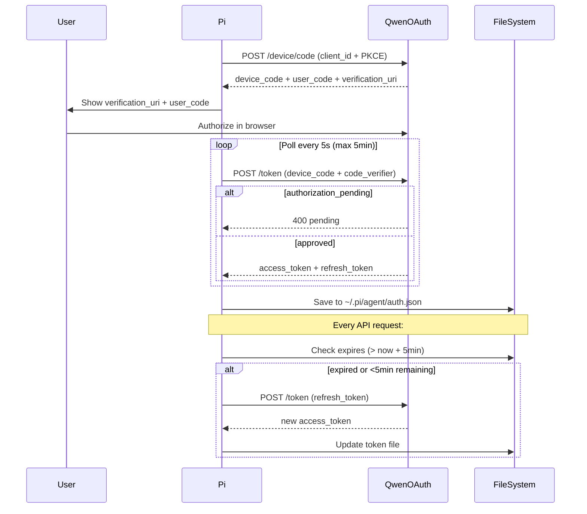

# Qwen OAuth Provider

Qwen OAuth 2.0 provider with automatic token fallback and hardcoded model pricing.

## Token Storage Priority (Automatic Fallback)

1. **`~/.pi/agent/auth.json`** (pi native, like kilo) - HIGHEST
2. **`~/.qwen/oauth_creds.json`** (Qwen CLI)
3. **`~/.cli-proxy-api/qwen-*.json`** (CLIProxyAPI) - LOWEST

The token resolver automatically falls back through all sources without errors.

## Models

| Model ID | Name | Input ($/1M) | Output ($/1M) | Context Window |
|----------|------|--------------|---------------|----------------|
| `coder-model` | Qwen 3.5 Plus | 0.40 | 1.20 | 256K |
| `vision-model` | Qwen Vision | 2.00 | 6.00 | 256K |

## Usage

### Login

```bash
# In pi session
/login-qwen
```

### Manual Token Refresh

```bash
cd ~/.pi/agent/extensions/model-providers
bun token-refresh.ts qwen
```

### View Providers

```bash
# In pi session
/providers
```

## OAuth Flow



## Implementation Details

### Token Resolver

The `buildQwenTokenResolverCommand()` generates a Node.js script that:
1. Checks `~/.pi/agent/auth.json['qwen-oauth']` (pi native)
2. Falls back to `~/.qwen/oauth_creds.json` (Qwen CLI)
3. Falls back to `~/.cli-proxy-api/qwen-*.json` (CLIProxyAPI)
4. Tries to refresh if expired
5. Uses any available token (even expired) as last resort
6. Exits silently if no credentials found (no errors)

### OAuth Constants

From [CLIProxyAPI](https://github.com/router-for-me/CLIProxyAPI):

```typescript
const QWEN_OAUTH = {
  deviceCodeEndpoint: "https://chat.qwen.ai/api/v1/oauth2/device/code",
  tokenEndpoint: "https://chat.qwen.ai/api/v1/oauth2/token",
  clientId: "f0304373b74a44d2b584a3fb70ca9e56",
  scope: "openid profile email model.completion",
};
```

### PKCE Flow

The code_verifier is generated once during device code initiation and reused for all polling requests. This ensures the PKCE flow works correctly.

## References

- [CLIProxyAPI Qwen OAuth](https://github.com/router-for-me/CLIProxyAPI/tree/main/internal/auth/qwen)
- [Kilo Provider Extension](https://github.com/mrexodia/kilo-pi-provider)
- [Qwen Model Pricing](https://help.aliyun.com/zh/model-studio/pricing)
- [OAuth 2.0 Device Code Flow](https://oauth.net/2/grant-types/device-code/)
