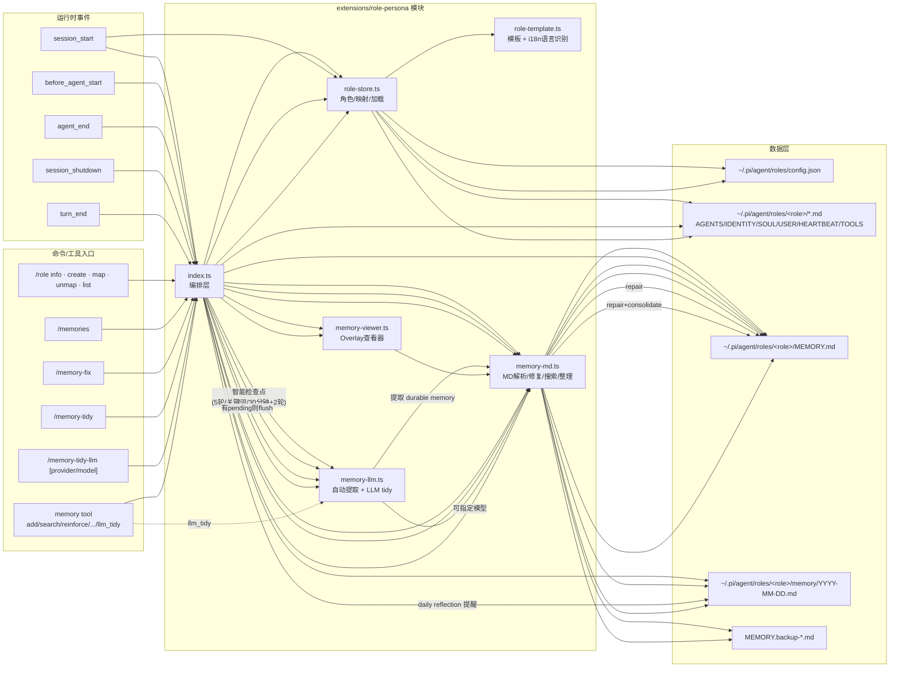

# Role Persona Extension 全貌架构

> 目标：给出 `extensions/role-persona/` 的模块关系、运行时逻辑、命令与数据流。

## 1) Mermaid 全景图



## 2) JSON Canvas 结构（jsoncanvs）

```canvas
{
  "nodes": [
    { "id": "idx", "type": "text", "x": 0, "y": 0, "width": 260, "height": 120, "text": "index.ts\n编排层\n- 事件注册\n- 命令注册\n- memory tool 注册" },

    { "id": "store", "type": "text", "x": 320, "y": -120, "width": 260, "height": 120, "text": "role-store.ts\n角色与映射\n- createRole\n- load/save config\n- loadRolePrompts" },
    { "id": "tpl", "type": "text", "x": 640, "y": -120, "width": 260, "height": 120, "text": "role-template.ts\ni18n模板\n- resolveTemplateLanguage\n- getDefaultPrompts" },

    { "id": "mmd", "type": "text", "x": 320, "y": 40, "width": 260, "height": 140, "text": "memory-md.ts\nMD记忆核心\n- parse/repair\n- search/reinforce\n- consolidate\n- applyLlmTidyPlan" },
    { "id": "mllm", "type": "text", "x": 640, "y": 40, "width": 260, "height": 140, "text": "memory-llm.ts\nLLM记忆逻辑\n- runAutoMemoryExtraction\n- runLlmMemoryTidy\n- 指定模型" },
    { "id": "mview", "type": "text", "x": 320, "y": 220, "width": 260, "height": 120, "text": "memory-viewer.ts\nOverlay查看器\n- 过滤: all/L/P/E\n- 键盘滚动" },

    { "id": "ev", "type": "text", "x": -320, "y": -40, "width": 260, "height": 180, "text": "运行时事件\n- session_start\n- before_agent_start\n- agent_end\n- session_shutdown\n- turn_end" },

    { "id": "cmd", "type": "text", "x": -320, "y": 180, "width": 260, "height": 220, "text": "命令/工具入口\n- /role ...\n- /memories\n- /memory-fix\n- /memory-tidy\n- /memory-tidy-llm [model]\n- memory tool(...)" },

    { "id": "cfg", "type": "text", "x": 960, "y": -140, "width": 260, "height": 100, "text": "roles/config.json\ncwd -> role mapping" },
    { "id": "rolefiles", "type": "text", "x": 960, "y": -20, "width": 260, "height": 120, "text": "roles/<role>/*.md\nAGENTS/IDENTITY/SOUL/USER/..." },
    { "id": "mem", "type": "text", "x": 960, "y": 140, "width": 260, "height": 120, "text": "roles/<role>/MEMORY.md\n结构化记忆区" },
    { "id": "daily", "type": "text", "x": 960, "y": 280, "width": 260, "height": 100, "text": "roles/<role>/memory/YYYY-MM-DD.md\n每日记忆" },
    { "id": "bak", "type": "text", "x": 960, "y": 400, "width": 260, "height": 80, "text": "MEMORY.backup-*.md\n修复/整理备份" }
  ],
  "edges": [
    { "id": "e1", "fromNode": "idx", "toNode": "store", "label": "调用" },
    { "id": "e2", "fromNode": "store", "toNode": "tpl", "label": "取模板" },
    { "id": "e3", "fromNode": "idx", "toNode": "mmd", "label": "读写记忆" },
    { "id": "e4", "fromNode": "idx", "toNode": "mllm", "label": "自动提取/LLM tidy" },
    { "id": "e5", "fromNode": "idx", "toNode": "mview", "label": "/memories" },

    { "id": "e6", "fromNode": "ev", "toNode": "idx", "label": "事件驱动" },
    { "id": "e7", "fromNode": "cmd", "toNode": "idx", "label": "命令/工具" },

    { "id": "e8", "fromNode": "store", "toNode": "cfg", "label": "load/save" },
    { "id": "e9", "fromNode": "store", "toNode": "rolefiles", "label": "load prompts" },

    { "id": "e10", "fromNode": "mmd", "toNode": "mem", "label": "repair/consolidate/search" },
    { "id": "e11", "fromNode": "mmd", "toNode": "daily", "label": "append daily" },
    { "id": "e12", "fromNode": "mmd", "toNode": "bak", "label": "backup" },

    { "id": "e13", "fromNode": "mllm", "toNode": "mmd", "label": "apply tidy plan" },
    { "id": "e14", "fromNode": "mview", "toNode": "mmd", "label": "read model" }
  ]
}
```

## 3) 智能记忆触发策略（当前实现）

- 非每轮触发，使用 checkpoint：
  - 5 轮累计
  - 结束意图关键词（结束/总结/退出/...）
  - 30 分钟且累计至少 2 轮
  - 会话关闭时有 pending 则兜底 flush
