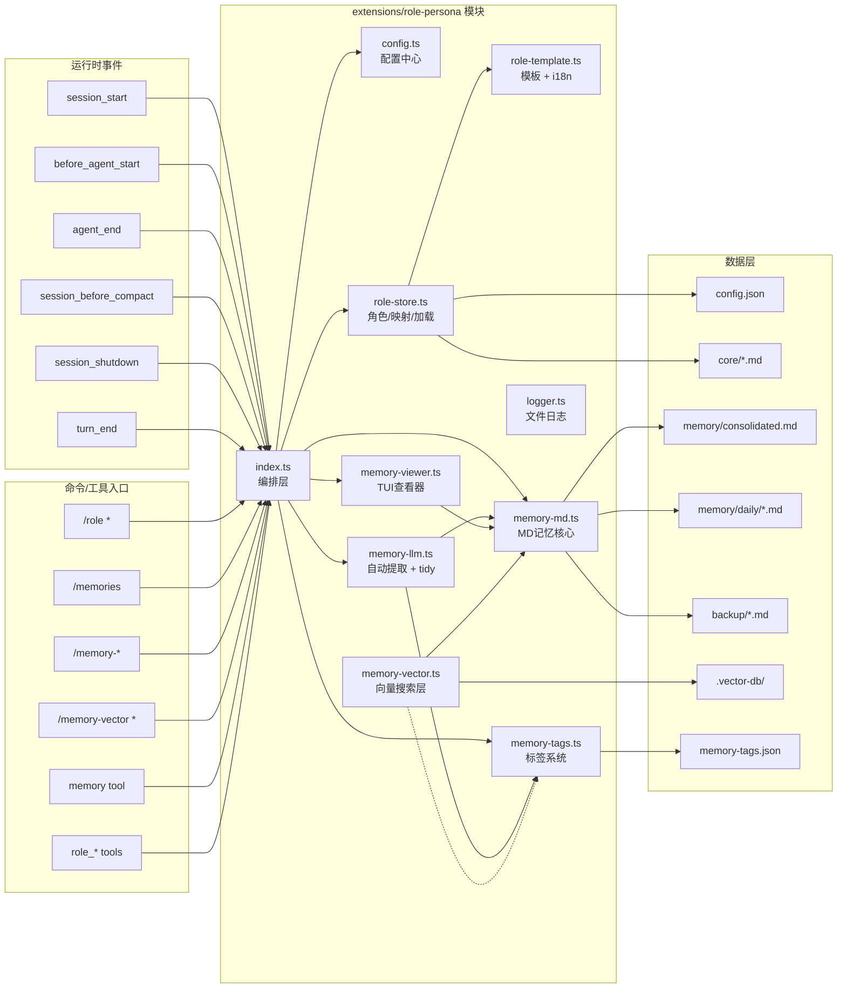

# Role Persona Extension 全貌架构

> 目标：给出 `extensions/role-persona/` 的模块关系、运行时逻辑、命令与数据流。

## 1) 模块依赖图

```
                    ┌─────────────────┐
                    │   Pi Core       │
                    │  (事件系统)      │
                    └────────┬────────┘
                             │
                             ▼
┌────────────────────────────────────────────────────────────────────┐
│                         index.ts (编排层)                           │
│  ┌─────────────┐ ┌─────────────┐ ┌─────────────┐ ┌─────────────┐  │
│  │ session_    │ │  before_    │ │  agent_end  │ │ session_    │  │
│  │ _start      │ │agent_start  │ │             │ │ _shutdown   │  │
│  └─────────────┘ └─────────────┘ └─────────────┘ └─────────────┘  │
│  ┌─────────────┐ ┌─────────────┐ ┌─────────────┐ ┌─────────────┐  │
│  │/role * cmd  │ │ /memories   │ │/memory-* cmd│ │ memory tool │  │
│  └─────────────┘ └─────────────┘ └─────────────┘ └─────────────┘  │
└────────┬───────────────────────────────────────────────────────────┘
         │           │           │           │
         ▼           ▼           ▼           ▼
┌────────────────────────────────────────────────────────────────────┐
│                     核心模块层                                      │
│                                                                     │
│   ┌───────────────┐   ┌───────────────┐   ┌───────────────┐        │
│   │  role-store   │   │ role-template │   │    config     │        │
│   │   (210 loc)   │   │   (370 loc)   │   │   (272 loc)   │        │
│   │               │   │               │   │               │        │
│   │ • CWD→角色映射 │   │ • i18n检测    │   │ • 三级配置     │        │
│   │ • 创建/加载   │   │ • 默认模板    │   │ • 环境变量     │        │
│   │ • 目录迁移    │   │ • 语言解析    │   │ • 热重载       │        │
│   └───────┬───────┘   └───────────────┘   └───────────────┘        │
│           │                                                         │
│   ┌───────▼───────┐   ┌───────────────┐   ┌───────────────┐        │
│   │   memory-md   │   │  memory-llm   │   │  memory-tags  │        │
│   │  (1111 loc)   │   │   (417 loc)   │   │   (682 loc)   │        │
│   │               │   │               │   │               │        │
│   │ • 解析/写入   │   │ • 自动提取    │   │ • LLM自动打标 │        │
│   │ • 搜索/强化   │   │ • LLM tidy   │   │ • 标签索引    │        │
│   │ • 修复/合并   │   │ • 模型选择    │   │ • 标签云      │        │
│   └───────┬───────┘   └───────┬───────┘   └───────────────┘        │
│           │                   │                                     │
│   ┌───────▼───────┐   ┌───────▼───────┐   ┌───────────────┐        │
│   │ memory-viewer │   │ memory-vector │   │    logger     │        │
│   │   (214 loc)   │   │   (595 loc)   │   │   (77 loc)    │        │
│   │               │   │               │   │               │        │
│   │ • TUI查看器   │   │ • LanceDB     │   │ • 文件日志    │        │
│   │ • 过滤/滚动   │   │ • Embedding   │   │ • 分级输出    │        │
│   │ • Markdown渲染│   │ • 混合搜索    │   │ • 自动清理    │        │
│   └───────────────┘   └───────────────┘   └───────────────┘        │
└────────────────────────────────────────────────────────────────────┘
         │                   │                   │
         ▼                   ▼                   ▼
┌────────────────────────────────────────────────────────────────────┐
│                       数据层                                        │
│                                                                     │
│  ~/.pi/agent/roles/                                                 │
│  ├── config.json                    # CWD→角色映射                  │
│  │                                                                  │
│  └── <role>/                                                        │
│      ├── core/                                                      │
│      │   ├── agents.md              # 工作空间规则                  │
│      │   ├── identity.md            # 身份定义                      │
│      │   ├── soul.md                # 核心人格                      │
│      │   ├── user.md                # 用户画像                      │
│      │   ├── tools.md               # 工具偏好                      │
│      │   ├── heartbeat.md           # 主动任务                      │
│      │   └── constraints.md         # 硬约束                        │
│      │                                                              │
│      ├── memory/                                                    │
│      │   ├── consolidated.md        # 长期记忆 (canonical)          │
│      │   └── daily/YYYY-MM-DD.md    # 每日记忆                      │
│      │                                                              │
│      ├── context/                   # 会话上下文                    │
│      ├── skills/                    # 激活的技能                    │
│      ├── archive/                   # 归档                          │
│      └── .vector-db/                # 向量索引 (可选)               │
└────────────────────────────────────────────────────────────────────┘
```

## 2) Mermaid 数据流图


```mermaid
flowchart LR
  subgraph M["extensions/role-persona 模块"]
    IDX["index.ts<br/>编排层"]
    CFG["config.ts<br/>配置中心"]
    STORE["role-store.ts<br/>角色/映射/加载"]
    TPL["role-template.ts<br/>模板 + i18n"]
    MMD["memory-md.ts<br/>MD记忆核心"]
    MLLM["memory-llm.ts<br/>自动提取 + tidy"]
    MTAGS["memory-tags.ts<br/>标签系统"]
    MVIEW["memory-viewer.ts<br/>TUI查看器"]
    MVEC["memory-vector.ts<br/>向量搜索层"]
    LOG["logger.ts<br/>文件日志"]
  end

  subgraph E["运行时事件"]
    S1["session_start"]
    S2["before_agent_start"]
    S3["agent_end"]
    S4["session_before_compact"]
    S5["session_shutdown"]
    S6["turn_end"]
  end

  subgraph C["命令/工具入口"]
    R1["/role *"]
    R2["/memories"]
    R3["/memory-*"]
    R4["/memory-vector *"]
    T1["memory tool"]
    T2["role_* tools"]
  end

  subgraph D["数据层"]
    F1["config.json"]
    F2["core/*.md"]
    F3["memory/consolidated.md"]
    F4["memory/daily/*.md"]
    F5["backup/*.md"]
    F6[".vector-db/"]
    F7["memory-tags.json"]
  end

  %% 内部依赖
  IDX --> CFG
  IDX --> STORE
  IDX --> MMD
  IDX --> MLLM
  IDX --> MVIEW
  IDX --> MTAGS
  STORE --> TPL
  MLLM --> MMD
  MLLM --> MTAGS
  MVIEW --> MMD
  MVEC --> MMD
  MVEC -.-> MTAGS

  %% 事件流
  S1 --> IDX
  S2 --> IDX
  S3 --> IDX
  S4 --> IDX
  S5 --> IDX
  S6 --> IDX

  %% 命令流
  R1 --> IDX
  R2 --> IDX
  R3 --> IDX
  R4 --> IDX
  T1 --> IDX
  T2 --> IDX

  %% 数据持久化
  STORE --> F1
  STORE --> F2
  MMD --> F3
  MMD --> F4
  MMD --> F5
  MVEC --> F6
  MTAGS --> F7
```

## 3) 事件流水线详解

### 3.1 会话启动 (session_start)

```
session_start
    ↓
loadConfig() ─────────────────────┐
    ↓                              │
resolveRoleForCwd(cwd)             │
    ↓                              │
┌──────────────────────────────────┤
│ 角色已映射?                      │
│  ├── YES → 使用该角色            │
│  └── NO  → 使用 default 角色     │
└──────────────────────────────────┘
    ↓
loadRolePrompts(role)
    ↓
┌──────────────────────────────────────┐
│ 加载 core/ 目录（按优先级）           │
│ 1. core/agents.md                    │
│ 2. core/soul.md                      │
│ 3. core/user.md                      │
│ 4. core/identity.md                  │
│ 5. core/tools.md                     │
│ 6. core/heartbeat.md                 │
│ 7. core/constraints.md               │
└──────────────────────────────────────┘
    ↓
migrateLegacyFiles() ──→ 自动迁移旧文件
    ↓
setStatus(`Role: ${roleName}`)
```

### 3.2 对话前准备 (before_agent_start)

```
before_agent_start
    ↓
isFirstUserMessage?
    ├── YES → 完整加载策略
    │            ↓
    │   ┌──────────────────────────────┐
    │   │ 1. loadHighPriorityMemories()│
    │   │    → [3x]+ 高频记忆          │
    │   │                              │
    │   │ 2. loadMemoryOnDemand(query) │
    │   │    → 基于查询搜索相关记忆     │
    │   │                              │
    │   │ 3. 最近2天日记               │
    │   │                              │
    │   │ 4. autoRecall() (向量启用时) │
    │   │    → 语义搜索召回            │
    │   └──────────────────────────────┘
    │
    └── NO  → 轻量加载
                 ↓
            仅最近2天日记
    ↓
注入 system prompt:
  "## 📁 FILE LOCATIONS
   ...绝对路径列表..."
```

### 3.3 对话结束后 (agent_end)

```
agent_end
    ↓
shouldFlushAutoMemory?
    ├── YES → runAutoMemoryExtraction()
    │            ↓
    │   ┌──────────────────────────────┐
    │   │ 1. 收集最近 N 轮对话         │
    │   │ 2. 调用 LLM 提取 durable记忆 │
    │   │ 3. 写入 consolidated.md      │
    │   │ 4. 追加 daily/YYYY-MM-DD.md  │
    │   │ 5. 更新向量索引 (如启用)     │
    │   └──────────────────────────────┘
    └── NO  → 跳过
```

**触发条件**：
- `pendingTurns >= 5`
- 含结束关键词（结束/总结/exit/summary...）
- `>= 30分钟` 且 `turns >= 2`

### 3.4 上下文压缩时 (session_before_compact)

```
session_before_compact
    ↓
构建压缩提示词 + memory提取指令
    ↓
LLM 调用（同一次！）
    ↓
解析响应：
┌─────────────────────────────────────────┐
│ <summary>                               │
│   压缩后的对话摘要                      │
│ </summary>                              │
│                                         │
│ <memory>                                │
│   {"learnings": [...],                  │
│    "preferences": [...],                │
│    "events": [...]}                     │
│ </memory>                               │
└─────────────────────────────────────────┘
    ↓
提取 <memory> JSON → 解析并写入文件
    ↓
剥离 <memory> 块 → 返回干净 summary 给 Pi

【零额外 LLM 调用】
```

### 3.5 会话关闭时 (session_shutdown)

```
session_shutdown
    ↓
有 pending auto-extract?
    ├── YES → 快速 flush（15s 超时）
    └── NO  → 跳过
    ↓
flushVectorIndex() ──→ 确保向量索引写入
    ↓
disposeVectorMemory() ──→ 释放资源
```

## 4) 记忆系统架构

### 4.1 三层记忆

```
┌─────────────────────────────────────────────────────────────┐
│                        L3 · 运行时                          │
│  ┌───────────────┐  ┌───────────────┐  ┌───────────────┐   │
│  │ memoryLog[]   │  │   VectorDB    │  │  Tag Index    │   │
│  │ (会话内操作)   │  │  (语义索引)   │  │ (快速分类)    │   │
│  └───────────────┘  └───────────────┘  └───────────────┘   │
└─────────────────────────────────────────────────────────────┘
                            │
                            ▼
┌─────────────────────────────────────────────────────────────┐
│                       L2 · 结构化存储                        │
│                                                             │
│   memory/consolidated.md                                    │
│   ┌─────────────┬─────────────┬─────────────┬─────────────┐ │
│   │ High Priority│   Normal   │    New     │ Preferences │ │
│   │    [3x+]    │   [1-2x]   │   [0x]     │             │ │
│   └─────────────┴─────────────┴─────────────┴─────────────┘ │
│                                                             │
│   memory-tags.json ──→ 标签索引                             │
│   .vector-db/ ───────→ 向量索引 (consolidated + daily)      │
└─────────────────────────────────────────────────────────────┘
                            │
                            ▼
┌─────────────────────────────────────────────────────────────┐
│                        L1 · 原始记录                         │
│                                                             │
│   memory/daily/YYYY-MM-DD.md                                │
│   ┌───────────────────────────────────────────────────────┐ │
│   │ ## [HH:MM] LESSON                                     │ │
│   │ 学到的内容...                                          │ │
│   │                                                       │ │
│   │ ## [HH:MM] PREFERENCE                                 │ │
│   │ [Category] 偏好...                                    │ │
│   │                                                       │ │
│   │ ## [HH:MM] EVENT                                      │ │
│   │ 事件详情...                                            │ │
│   └───────────────────────────────────────────────────────┘ │
└─────────────────────────────────────────────────────────────┘
```

### 4.2 搜索策略对比

| 搜索类型 | 实现 | 适用场景 | 复杂度 |
|----------|------|----------|--------|
| substring | `indexOf` | 精确匹配 | O(n) |
| Jaccard | token 重叠度 | 模糊匹配 | O(n*m) |
| Vector | OpenAI Embedding | 语义相似 | O(1) API |
| Hybrid | keyword + vector → RRF | 综合搜索 | O(n) + API |

## 5) 配置系统

### 5.1 三级优先级

```
┌─────────────────────────────────────────┐
│  1. 环境变量 (ROLE_*)                   │
│     ROLE_AUTO_MEMORY=true               │
│     ROLE_VECTOR_MEMORY=false            │
│     ROLE_EXTERNAL_READONLY=false        │
└─────────────────────────────────────────┘
                   ↓
┌─────────────────────────────────────────┐
│  2. 配置文件 (pi-role-persona.jsonc)   │
│     {                                   │
│       "autoMemory": { "enabled": true },│
│       "vectorMemory": { "enabled": false }│
│     }                                   │
└─────────────────────────────────────────┘
                   ↓
┌─────────────────────────────────────────┐
│  3. 内置默认值 (config.ts)              │
│     autoMemory.enabled = true           │
│     vectorMemory.enabled = false        │
└─────────────────────────────────────────┘
```

### 5.2 关键配置项

```typescript
interface Config {
  autoMemory: {
    enabled: boolean;           // 总开关
    model: string;              // 提取模型
    batchTurns: number;         // 累计轮数触发
    intervalMs: number;         // 时间触发
    maxItems: number;           // 单次最大提取
    contextOverlap: number;     // flush 时回溯消息数
  };
  memory: {
    onDemandSearch: {
      enabled: boolean;         // 按需搜索
      maxResults: number;       // 最大返回数
      minScore: number;         // 最小匹配分
      alwaysLoadHighPriority: boolean; // 始终加载高频记忆
    };
  };
  vectorMemory: {
    enabled: boolean;           // 向量记忆开关
    model: string;              // embedding 模型
    autoRecall: boolean;        // 自动召回
    autoIndex: boolean;         // 自动索引
    hybridSearch: boolean;      // 混合搜索
    recallLimit: number;        // 召回数量
  };
  externalReadonly: {
    enabled: boolean;           // 外部记忆服务
    baseUrl: string;            // 服务地址
    timeoutMs: number;          // 超时
    topK: number;               // 查询条数
  };
}
```

## 6) 命令与工具映射

### 6.1 命令清单

| 命令 | 处理函数 | 依赖模块 | 权限 |
|------|----------|----------|------|
| `/role info` | `showRoleInfo()` | role-store | User |
| `/role create [name]` | `createRoleCmd()` | role-store, role-template | User |
| `/role map [role]` | `mapRoleCmd()` | role-store | User |
| `/role unmap` | `unmapRoleCmd()` | role-store | User |
| `/role list` | `listRolesCmd()` | role-store | User |
| `/memories` | `showMemoriesCmd()` | memory-viewer, memory-md | User |
| `/memory-tags [q]` | `showMemoryTagsCmd()` | memory-tags | User |
| `/memory-log` | `showMemoryLogCmd()` | index (internal) | User |
| `/memory-fix` | `fixMemoryCmd()` | memory-md | User |
| `/memory-tidy` | `tidyMemoryCmd()` | memory-md | User |
| `/memory-tidy-llm` | `tidyMemoryLlmCmd()` | memory-llm, memory-md | User |
| `/memory-vector stats` | `vectorStatsCmd()` | memory-vector | User |
| `/memory-vector rebuild` | `vectorRebuildCmd()` | memory-vector | User |

### 6.2 Tool API

```typescript
// Memory Tool - 记忆管理（consolidated.md + daily/*.md）
memory({
  action: "add_learning" | "add_preference" | "reinforce" | 
          "search" | "list" | "consolidate" | "repair" | 
          "llm_tidy" | "vector_rebuild" | "vector_stats",
  content?: string,      // for add_learning, add_preference
  category?: string,     // for add_preference
  query?: string,        // for search, reinforce
  model?: string,        // for llm_tidy
  id?: string            // for reinforce
}): Promise<MemoryResult>

// Role CRUD Tools - 角色文件操作
role_read({ path?: string, maxChars?: number }): Promise<string>
role_write({ path: string, content: string, mode?: "overwrite" | "append" }): Promise<void>
role_list({ path?: string, recursive?: boolean }): Promise<string[]>
role_search({ query: string, maxResults?: number }): Promise<SearchResult[]>  // 全文搜索角色目录
```

## 7) 文件规模统计

```
Module              Lines    Purpose
─────────────────────────────────────────────────────
index.ts            1,446    编排层：事件、命令、tools
memory-md.ts        1,111    MD记忆核心
memory-tags.ts        682    标签系统
memory-vector.ts      595    向量搜索（可选）
config.ts             272    配置中心
role-store.ts         210    角色存储
memory-viewer.ts      214    TUI查看器
memory-llm.ts         417    LLM提取
role-template.ts      370    i18n模板
logger.ts              77    文件日志
─────────────────────────────────────────────────────
Total               ~5,400   9 modules
```

## 8) 相关文档

| 文档 | 内容 |
|------|------|
| [README.md](./README.md) | 用户文档，快速入门 |
| [HANDOFF.md](./HANDOFF.md) | 实现交接，架构决策 |
| [CHANGELOG.md](./CHANGELOG.md) | 变更日志 |
| [CONFIG-MIGRATION.md](./CONFIG-MIGRATION.md) | 配置迁移指南 |
| [TAG_SYSTEM_DESIGN.md](./TAG_SYSTEM_DESIGN.md) | 标签系统设计 |
| [docs/ai-runtime-comparison.md](./docs/ai-runtime-comparison.md) | 与 ai-runtime 对比 |
