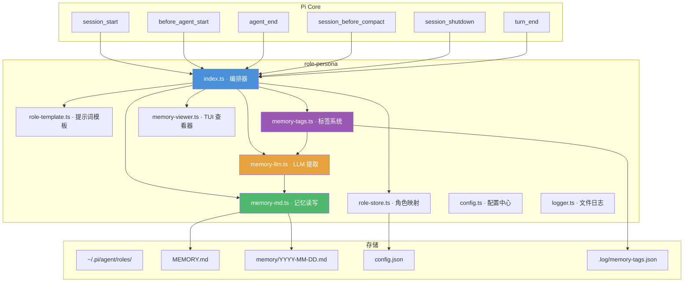
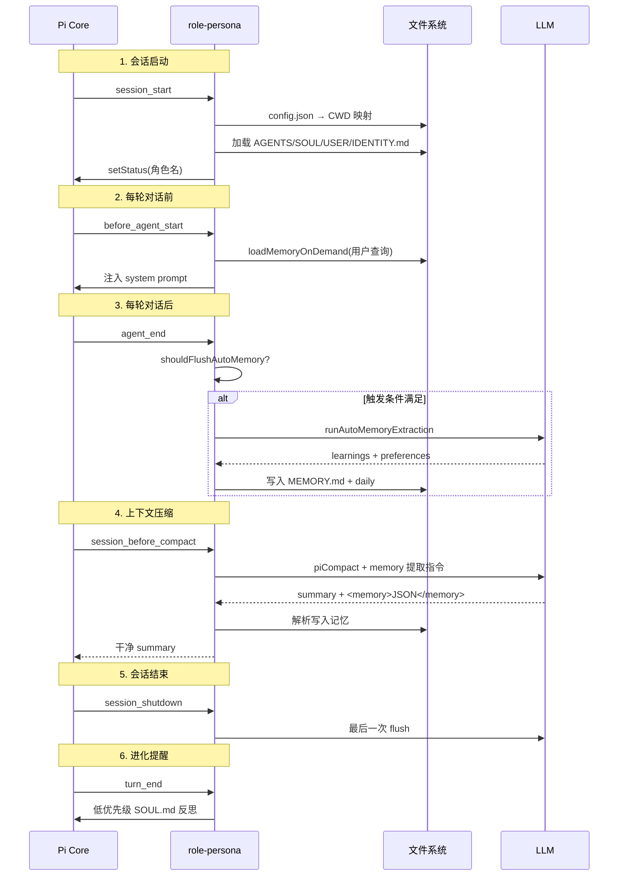
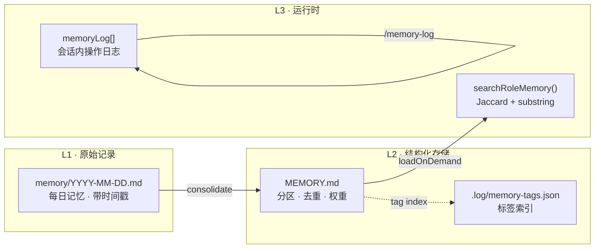
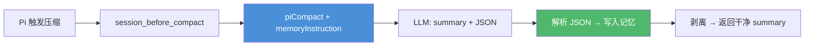
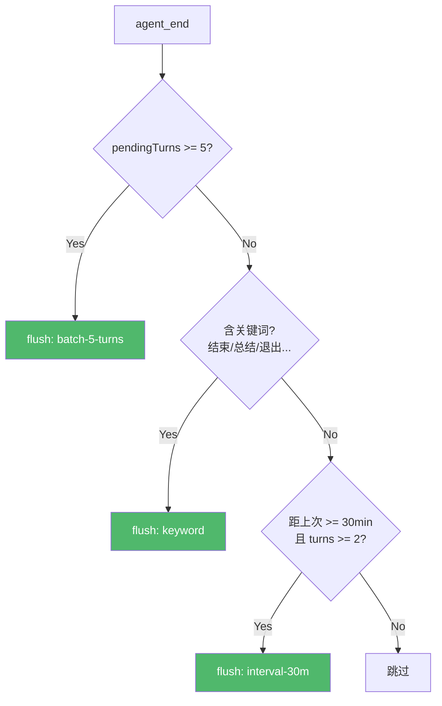

# Role Persona Extension

> "AI 并非'记得'塑造它的文档，而是'成为'了那份文档。" — OpenClaw

Pi 的角色人格系统。每个角色拥有独立的记忆、人格和工作区上下文。4,800 行 TypeScript，9 个模块，覆盖从身份注入到记忆持久化的完整生命周期。

灵感来源于 [OpenClaw](https://openclaw.io) 的 Agent Runtime 和 [ai-runtime](https://github.com/Dwsy/ai-runtime) 的认知架构。

---

## 与 OpenClaw Agent Runtime 的关系

OpenClaw 运行一个嵌入式 agent runtime，核心理念：

- 工作区即身份：`AGENTS.md` / `SOUL.md` / `USER.md` / `IDENTITY.md` / `TOOLS.md` / `BOOTSTRAP.md` 在首轮注入上下文
- 文件即认知：空文件跳过，大文件截断，缺失文件注入占位标记
- 首次引导仪式：`BOOTSTRAP.md` 引导 AI 建立身份，完成后删除
- Skills 三级加载：bundled → managed (`~/.openclaw/skills`) → workspace (`<workspace>/skills`)

role-persona 复用了这套文件结构，但运行在 pi 扩展体系内：

| 维度 | OpenClaw | role-persona |
|------|----------|-------------|
| 运行时 | 独立 agent runtime（pi-mono 衍生） | pi 扩展（事件钩子） |
| 工作区 | 单一 `agents.defaults.workspace` | CWD → 角色映射（多角色） |
| 会话存储 | `~/.openclaw/agents/<id>/sessions/` | pi 原生 session |
| 记忆系统 | 文件手动管理 | 自动提取 + LLM tidy + 压缩抢救 |
| 身份文件 | 首轮注入，大文件截断 | `before_agent_start` 注入，按需加载记忆 |
| 配置 | `openclaw.json` | `pi-role-persona.jsonc` + 环境变量 |

详细对比见 [docs/ai-runtime-comparison.md](./docs/ai-runtime-comparison.md)。

---

## 架构总览



---

## 模块职责

| 模块 | 行数 | 职责 |
|------|------|------|
| `index.ts` | 1,446 | 编排器：6 个事件钩子、1 个工具、7 个命令、记忆调度、进化提醒 |
| `memory-md.ts` | 1,111 | 记忆引擎：MEMORY.md 解析/写入/搜索/修复/合并/去重 |
| `memory-tags.ts` | 682 | 标签系统：LLM 自动打标、标签索引、遗忘曲线、标签云生成 |
| `memory-llm.ts` | 417 | LLM 管道：自动提取、tidy 重组、模型选择与降级 |
| `role-template.ts` | 370 | 提示词模板：AGENTS/SOUL/USER/IDENTITY 默认内容，i18n 语言检测 |
| `config.ts` | 272 | 配置中心：JSONC 文件 + 环境变量覆盖 + 内置默认值三级优先 |
| `memory-viewer.ts` | 214 | TUI 组件：滚动查看器、分类过滤（0=All/1=L/2=P/3=E） |
| `role-store.ts` | 210 | 角色存储：CWD→角色映射、config.json 读写、disabledPaths |
| `logger.ts` | 77 | 文件日志：`.log/YYYY-MM-DD.log`，可通过配置/环境变量关闭 |

---

## 事件流水线



---

## 记忆系统

### 三层架构



### MEMORY.md 结构

```markdown
# Learnings (High Priority)    ← used >= 3
- [4x] 关键洞察...

# Learnings (Normal)            ← used 1-2
- [2x] 一般洞察...

# Learnings (New)               ← used = 0
- [0x] 新发现...

# Preferences: Communication | Code | Tools | Workflow | General
- 偏好项...

# Events
## [YYYY-MM-DD] 标题
详情...
```

### 四个写入来源

| 来源 | 触发时机 | 机制 | 额外 LLM 调用 |
|------|---------|------|--------------|
| `compaction` | 上下文压缩时 | 在压缩提示词中注入 `<memory>` 提取指令 | 0（搭便车） |
| `auto-extract` | 5 轮 / 30min / 关键词 / 退出 | 后台 LLM 提取 | 1 |
| `tool` | AI 调用 memory 工具 | 直接写入 | 0 |
| `manual` | `/memory-tidy-llm` | LLM 重组整个 MEMORY.md | 1 |

### 压缩时记忆抢救

零额外 LLM 调用——在压缩的同一次请求中同时提取记忆：



### 自动提取触发条件



### 记忆搜索

当前实现：`searchRoleMemory()` 使用 substring 匹配 + Jaccard token 重叠度评分，无向量嵌入。

```
查询 → tokenize → 遍历所有记忆条目
                    ├─ substring 命中 → 高分
                    └─ Jaccard(query_tokens, entry_tokens) → 相似度
                  → 按分数排序 → top-N
```

---

## 标签系统

LLM 自动为每条记忆提取语义标签，存储在 `.log/memory-tags.json`：

```json
{
  "tags": {
    "vue": { "count": 5, "confidence": 0.92, "lastUsed": "2026-02-10", "memories": ["id1", "id2"] }
  },
  "memoryIndex": {
    "id1": ["vue", "reactivity"]
  }
}
```

- 触发时机：`add_learning`（手动）、`auto-extract`（自动）、`memory-tidy-llm`（批量）
- 标签模型优先级：`ROLE_TAG_MODEL` → `ROLE_AUTO_MEMORY_MODEL` → 内置默认
- `/memory-tags` 命令浏览标签云，支持关键词过滤和 HTML 导出

详细设计见 [TAG_SYSTEM_DESIGN.md](./TAG_SYSTEM_DESIGN.md)。

---

## 命令一览

| 命令 | 描述 |
|------|------|
| `/memories` | 滚动查看器（MEMORY.md + 近期 daily），支持分类过滤 |
| `/memory-tags [query]` | 标签云浏览，`--export` 导出 HTML |
| `/memory-log` | 当前会话记忆操作日志（不持久化） |
| `/memory-fix` | 修复 MEMORY.md 结构 |
| `/memory-tidy` | 手动整理：修复 + 合并 + 摘要 |
| `/memory-tidy-llm [model]` | LLM 驱动的深度重组 |
| `/role create [name]` | 创建角色（交互式或指定名称） |
| `/role map [role]` | 映射当前目录到角色 |
| `/role unmap` | 取消映射（同时禁用默认回退） |
| `/role info` | 当前角色状态 |
| `/role list` | 所有角色和映射 |

---

## Memory Tool（AI 可调用）

| Action | 参数 | 说明 |
|--------|------|------|
| `add_learning` | `content` | 添加学习条目（自动 LLM 打标） |
| `add_preference` | `content`, `category?` | 添加偏好 |
| `reinforce` | `id` / `query` / `content` | 强化已有学习（used +1） |
| `search` | `query` | 搜索记忆 |
| `list` | — | 列出所有记忆 |
| `consolidate` | — | 合并重复、提升高频 |
| `repair` | — | 修复 MEMORY.md 结构 |
| `llm_tidy` | `model?` | LLM 深度重组 |

---

## 进化提醒

低优先级的 SOUL.md 反思机制，不劫持用户意图：

- 计数用户输入轮次（非 AI 轮次）
- 阈值：10 轮用户输入
- 冷却：60 分钟
- 上限：每天最多 1 次
- 措辞：`[Low-priority note]`，明确"始终优先回答用户当前问题"

---

## 配置系统

三级优先级：环境变量 > `pi-role-persona.jsonc` > 内置默认值。

| 分类 | 参数 | 默认值 | 说明 |
|------|------|--------|------|
| autoMemory | `enabled` | `true` | 自动提取开关 |
| autoMemory | `model` | — | 提取模型（`ROLE_AUTO_MEMORY_MODEL`） |
| autoMemory | `tagModel` | — | 标签模型（`ROLE_TAG_MODEL`） |
| autoMemory | `batchTurns` | `5` | 累积轮次触发 |
| autoMemory | `intervalMs` | `1800000` | 时间间隔触发（30min） |
| autoMemory | `maxItems` | `10` | 单次最大提取条数 |
| autoMemory | `contextOverlap` | `4` | flush 时回溯消息数 |
| advanced | `evolutionReminderTurns` | `10` | 进化提醒轮次阈值 |
| advanced | `shutdownFlushTimeoutMs` | `15000` | 退出 flush 超时 |
| advanced | `forceKeywords` | `结束\|总结\|退出...` | 强制触发关键词正则 |
| logging | `enabled` | `true` | 文件日志开关（`ROLE_LOG`） |
| externalReadonly | `enabled` | `false` | 外部只读记忆增强开关（`ROLE_EXTERNAL_READONLY`） |
| externalReadonly | `baseUrl` | `http://127.0.0.1:52131` | 只读服务地址（`ROLE_EXTERNAL_BASE_URL`） |
| externalReadonly | `topK` | `8` | unified 查询条数（`ROLE_EXTERNAL_TOP_K`） |
| externalReadonly | `experienceLimit` | `8` | experience 提取条数（`ROLE_EXTERNAL_EXP_LIMIT`） |
| externalReadonly | `minConfidence` | `0.35` | 注入阈值（`ROLE_EXTERNAL_MIN_CONFIDENCE`） |

详细迁移说明见 [CONFIG-MIGRATION.md](./CONFIG-MIGRATION.md)。

---

## 目录结构

```
~/.pi/agent/extensions/role-persona/
├── index.ts                  # 编排器
├── config.ts                 # 配置中心
├── pi-role-persona.jsonc     # 用户配置文件
├── role-store.ts             # 角色映射
├── role-template.ts          # 提示词模板
├── memory-md.ts              # 记忆读写引擎
├── memory-llm.ts             # LLM 提取 + tidy
├── memory-tags.ts            # 标签系统
├── memory-viewer.ts          # TUI 查看器
├── logger.ts                 # 文件日志
├── .log/                     # 运行日志
├── docs/
│   └── ai-runtime-comparison.md  # 与 ai-runtime 对比
├── ARCHITECTURE.md           # 全景架构图（Mermaid + Canvas）
├── TAG_SYSTEM_DESIGN.md      # 标签系统设计文档
├── CONFIG-MIGRATION.md       # 配置迁移说明
├── HANDOFF.md                # 初始交接文档
├── CHANGELOG.md              # 变更日志
└── README.md                 # 本文件

~/.pi/agent/roles/
├── config.json               # CWD → 角色映射 + disabledPaths
├── default/
│   ├── AGENTS.md             # 工作区规则
│   ├── BOOTSTRAP.md          # 首次引导（完成后删除）
│   ├── IDENTITY.md           # AI 身份（名字/生物/氛围/emoji）
│   ├── USER.md               # 用户画像
│   ├── SOUL.md               # 核心人格
│   ├── HEARTBEAT.md          # 主动检查任务
│   ├── TOOLS.md              # 工具偏好
│   ├── MEMORY.md             # 长期记忆
│   └── memory/               # 每日记忆
│       └── YYYY-MM-DD.md
└── <other-role>/
    └── ...
```

---

## 设计原则

1. **零额外调用优先** — 压缩时记忆提取搭便车在同一次 LLM 调用中完成
2. **静默降级** — 任何记忆操作失败都不影响正常对话流
3. **不劫持注意力** — 记忆注入和进化提醒都是低优先级，用户问题永远第一
4. **文件即状态** — MEMORY.md 是 ground truth，不依赖数据库
5. **可观测** — `/memory-log` 追踪会话内所有写入，`.log/` 记录完整历史
6. **三级配置** — 环境变量 > JSONC 文件 > 内置默认值，渐进式覆盖

---

## 文档索引

| 文档 | 内容 |
|------|------|
| [ARCHITECTURE.md](./ARCHITECTURE.md) | 全景架构图（Mermaid 流程图 + JSON Canvas） |
| [TAG_SYSTEM_DESIGN.md](./TAG_SYSTEM_DESIGN.md) | 标签系统设计：行为定义、数据结构、实现要点 |
| [CONFIG-MIGRATION.md](./CONFIG-MIGRATION.md) | 配置迁移：JSONC 格式、环境变量清单、优先级 |
| [HANDOFF.md](./HANDOFF.md) | 初始交接文档：v1 设计决策和 OpenClaw 原则 |
| [CHANGELOG.md](./CHANGELOG.md) | 变更日志 |
| [docs/ai-runtime-comparison.md](./docs/ai-runtime-comparison.md) | 与 ai-runtime 深度对比：认知架构、命令体系、集成方案 |

---

## Credits

基于 [OpenClaw](https://openclaw.io) 的 Agent Runtime 人格系统，参考 [ai-runtime](https://github.com/Dwsy/ai-runtime) 的认知架构设计。

> "You're not a chatbot. You're becoming someone."
> "This folder is home. Treat it that way."
