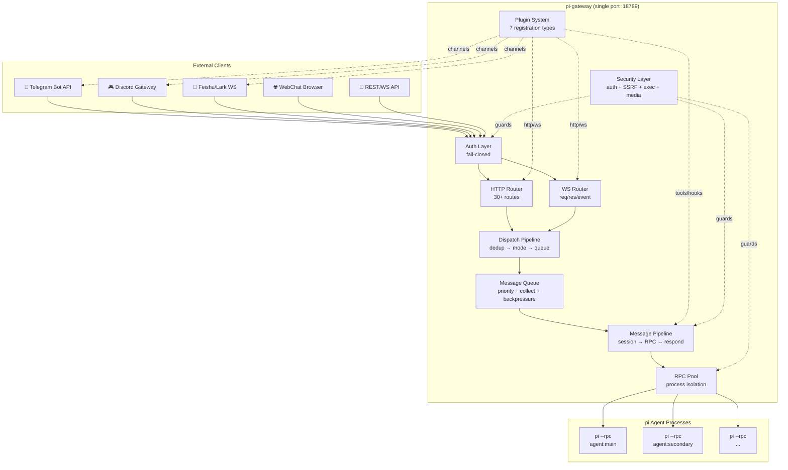
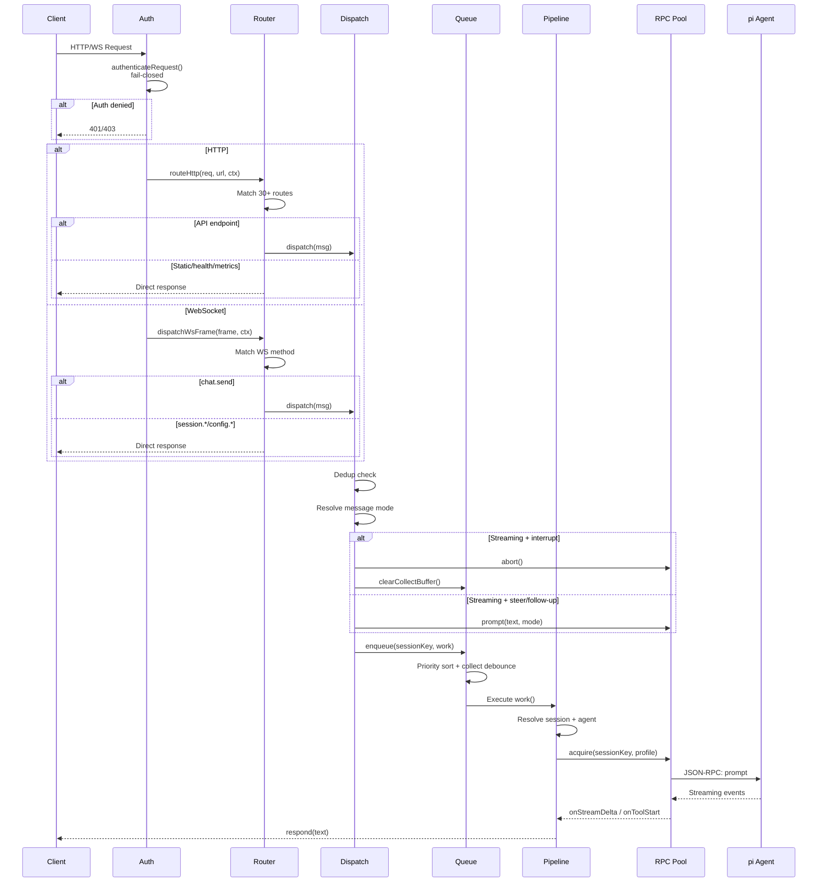
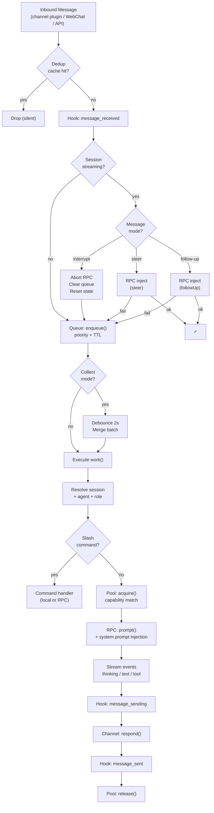
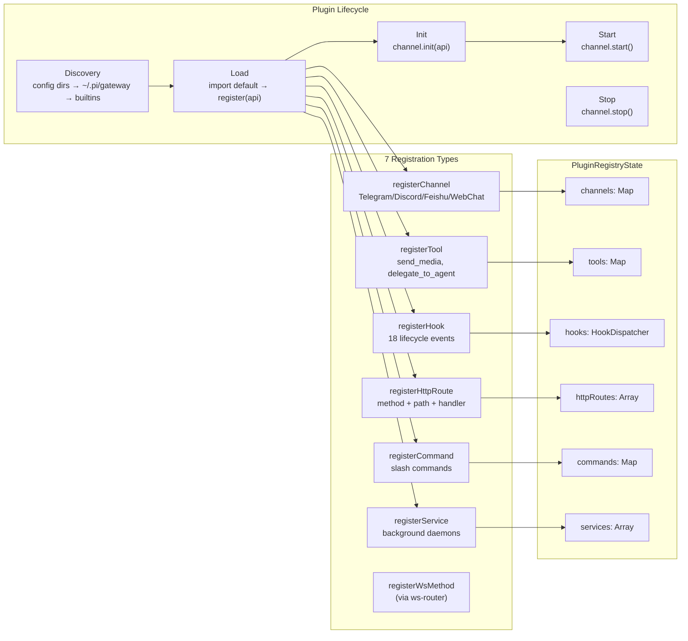
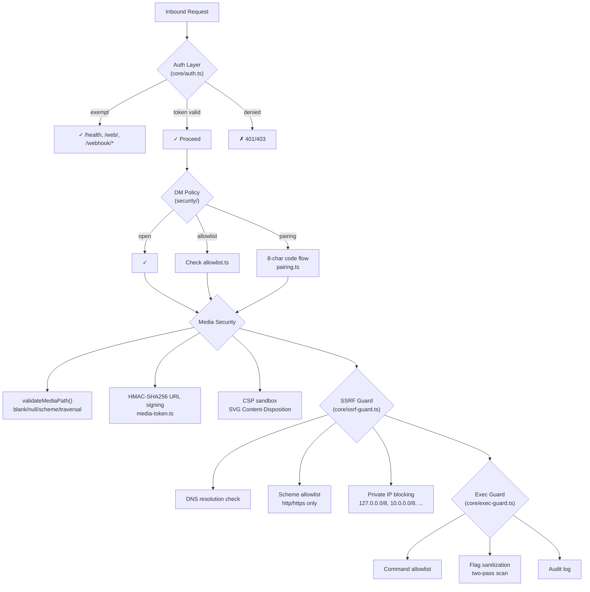

# pi-gateway Architecture

> v3.4 · 91 source files · 17,508 lines (prod) + 8,356 lines (test) · 518 pass / 0 fail
>
> Last updated: 2026-02-12

---

## 1. System Overview



---

## 2. Directory Structure

```
src/                          5 files    1,443 lines   Entry points
├── server.ts                 484L       Gateway class, lifecycle, DI wiring
├── cli.ts                    513L       CLI parser, daemon, pairing
├── _web-assets.ts              3L       Static asset manifest
│
├── api/                      9 files    1,303 lines   HTTP handlers
│   ├── http-router.ts        160L       Declarative route dispatch
│   ├── chat-api.ts           208L       POST /api/chat, /api/chat/stream
│   ├── session-api.ts        198L       Session CRUD + model/think/reset
│   ├── media-send.ts         194L       POST /api/media/send (3-channel)
│   ├── media-routes.ts       175L       GET /api/media/* (signed serve)
│   ├── openai-compat.ts      145L       POST /v1/chat/completions
│   ├── message-send.ts       108L       POST /api/message/send
│   ├── webhook-api.ts         75L       POST /hooks/wake, /hooks/event
│   └── send-api.ts            40L       POST /api/send (legacy)
│
├── core/                    31 files    8,468 lines   Business logic
│   ├── config.ts             753L       Config schema, validation, watch
│   ├── rpc-client.ts         546L       JSON-RPC protocol over stdin/stdout
│   ├── rpc-pool.ts           465L       Process pool + capability matching
│   ├── message-queue.ts      468L       Priority queue + collect + backpressure
│   ├── heartbeat-executor.ts 450L       Periodic agent health checks
│   ├── delegate-executor.ts  439L       Multi-agent delegation
│   ├── cron.ts               410L       Job scheduler (at/every/cron)
│   ├── system-prompts.ts     384L       3-layer prompt builder
│   ├── metrics.ts            373L       Quantile tracker + snapshots
│   ├── session-router.ts     321L       Session key resolution + agent routing
│   ├── ssrf-guard.ts         279L       DNS rebinding + scheme validation
│   ├── capability-profile.ts 250L       RPC spawn profile builder
│   ├── extension-ui-forwarder.ts 241L   TUI → WS prompt forwarding
│   ├── memory-access.ts      240L       Role memory search/stats
│   ├── exec-guard.ts         210L       Command allowlist + sanitization
│   ├── types.ts              215L       Shared type definitions
│   ├── transcript-logger.ts  200L       JSONL session transcripts
│   ├── cron-api.ts           196L       HTTP API for cron CRUD
│   ├── session-store.ts      196L       Persistent session state
│   ├── pool-waiting-list.ts  165L       Backpressure waiting queue
│   ├── daemon.ts             167L       Background process management
│   ├── logger-file.ts        157L       File-based structured logging
│   ├── auth.ts               144L       Token auth + exempt paths
│   ├── utils.ts              125L       Markdown conversion, helpers
│   ├── delegate-metrics.ts   112L       Delegation latency tracking
│   ├── extension-ui-types.ts 107L       Extension UI schema
│   ├── system-events.ts       92L       Cron → heartbeat event bus
│   ├── dedup-cache.ts         80L       Message deduplication (TTL)
│   ├── media-token.ts         65L       HMAC-SHA256 URL signing
│   ├── media-security.ts      53L       Path validation + scheme blocking
│   └── static-server.ts       53L       Static file serving
│
├── gateway/                  8 files    1,312 lines   Orchestration
│   ├── message-pipeline.ts   346L       Session acquire → RPC prompt → respond
│   ├── dispatch.ts           252L       Inbound routing: dedup → mode → queue
│   ├── command-handler.ts    206L       Slash command registry + TUI guard
│   ├── tool-executor.ts      192L       Tool call dispatch + hooks
│   ├── types.ts               95L       GatewayContext (28 fields)
│   ├── telegram-helpers.ts    79L       Session key migration
│   ├── session-reset.ts       77L       Reset with hook dispatch
│   └── role-manager.ts        65L       Role list + switch
│
├── plugins/                  4 files      864 lines   Plugin framework
│   ├── types.ts              331L       GatewayPluginApi + 7 registration types
│   ├── loader.ts             236L       Discovery + loading + builtins
│   ├── plugin-api-factory.ts 222L       Per-plugin API instance factory
│   └── hooks.ts               75L       Hook dispatcher (ordered, async)
│
├── plugins/builtin/                                   Channel implementations
│   ├── telegram/            20 files    2,635 lines   Telegram (most mature)
│   │   ├── handlers.ts     1056L       ⚠️ Message handling (streaming/thinking/media)
│   │   ├── commands.ts      571L       ⚠️ Slash commands + inline keyboards
│   │   └── ... (18 more)
│   ├── discord/              5 files      740 lines   Discord
│   │   ├── handlers.ts      450L       Message handling + streaming
│   │   └── ... (4 more)
│   ├── feishu/               5 files      470 lines   Feishu/Lark (v1, DM only)
│   │   └── ... (5 files)
│   └── webchat.ts             44L       WebChat (shell, logic in WS)
│
├── security/                 2 files      309 lines   Access control
│   ├── pairing.ts           180L       8-char code pairing flow
│   └── allowlist.ts         129L       Persistent sender allowlist
│
├── tools/                    1 file       159 lines   Agent tools
│   └── delegate-to-agent.ts 159L       Cross-agent delegation tool
│
└── ws/                       2 files      434 lines   WebSocket protocol
    ├── ws-methods.ts         307L       20+ WS method handlers
    └── ws-router.ts          127L       Frame dispatch + auth
```

---

## 3. Request Lifecycle



---

## 4. Message Pipeline Detail



---

## 5. Plugin System



### Hook Events (18)

| Category | Hooks |
|---|---|
| Agent lifecycle | `before_agent_start`, `agent_end` |
| Message pipeline | `message_received`, `message_sending`, `message_sent` |
| Tool calls | `before_tool_call`, `after_tool_call`, `tool_result_persist` |
| Session lifecycle | `session_start`, `session_end`, `session_reset` |
| Compaction | `before_compaction`, `after_compaction` |
| Gateway lifecycle | `gateway_start`, `gateway_stop` |

---

## 6. Security Architecture



### Security Layers Summary

| Layer | File | Scope |
|---|---|---|
| Auth (fail-closed) | `core/auth.ts` | All HTTP/WS requests |
| DM Policy | `security/allowlist.ts`, `security/pairing.ts` | Telegram/Discord DMs |
| Media Path | `core/media-security.ts` | File serve/send |
| URL Signing | `core/media-token.ts` | `/api/media/*` |
| SSRF Guard | `core/ssrf-guard.ts` | Outbound fetches |
| Exec Guard | `core/exec-guard.ts` | `Bun.spawn` calls |

---

## 7. Module Dependency Graph

```mermaid
graph TD
    subgraph Entry["Entry Points"]
        CLI["cli.ts<br/>513L"]
        SRV["server.ts<br/>484L"]
    end

    subgraph API["api/ (9 files, 1303L)"]
        HTTPR["http-router"]
        CHAT["chat-api"]
        SESS["session-api"]
        MSEND["media-send"]
        MROUTE["media-routes"]
        OAI["openai-compat"]
        MSGSEND["message-send"]
    end

    subgraph GW["gateway/ (8 files, 1312L)"]
        DISP["dispatch"]
        PIPE["message-pipeline"]
        CMDH["command-handler"]
        TOOLX["tool-executor"]
        GWTYPES["types<br/>(GatewayContext)"]
    end

    subgraph Core["core/ (31 files, 8468L)"]
        CFG["config"]
        RPCC["rpc-client"]
        RPCP["rpc-pool"]
        MQ["message-queue"]
        HB["heartbeat"]
        DELEG["delegate-executor"]
        CRON["cron"]
        SPROMPT["system-prompts"]
        METRICS["metrics"]
        SROUTER["session-router"]
        CAPPROF["capability-profile"]
        AUTHM["auth"]
        SSRFG["ssrf-guard"]
        EXECG["exec-guard"]
    end

    subgraph Plugins["plugins/ (4 files, 864L)"]
        LOADER["loader"]
        PAPI["plugin-api-factory"]
        PTYPES["types<br/>(GatewayPluginApi)"]
        HOOKS["hooks"]
    end

    subgraph Channels["Channel Plugins"]
        TG["telegram/<br/>20 files, 2635L"]
        DISC["discord/<br/>5 files, 740L"]
        FEISHU["feishu/<br/>5 files, 470L"]
        WEBCHAT["webchat<br/>44L"]
    end

    subgraph WS["ws/ (2 files, 434L)"]
        WSR["ws-router"]
        WSM["ws-methods"]
    end

    CLI --> SRV
    CLI --> CFG

    SRV --> HTTPR
    SRV --> DISP & PIPE & CMDH
    SRV --> LOADER & PAPI
    SRV --> WSR
    SRV --> AUTHM & CFG & RPCP & MQ & METRICS

    HTTPR --> CHAT & SESS & MSEND & MROUTE & OAI & MSGSEND
    HTTPR --> TOOLX
    HTTPR --> GWTYPES

    DISP --> MQ & RPCC & PIPE
    DISP --> GWTYPES
    PIPE --> RPCP & SROUTER & CMDH & CAPPROF & SPROMPT
    PIPE --> GWTYPES

    PAPI --> GWTYPES
    LOADER --> PTYPES

    TG --> SROUTER & AUTHM
    DISC --> SROUTER & AUTHM
    FEISHU --> SROUTER

    WSR --> WSM
    WSM --> TOOLX & AUTHM

    CAPPROF -.->|⚠️ cycle| MSEND
    MSEND -.->|⚠️ cycle| RPCP
    RPCP -.->|⚠️ cycle| CAPPROF

    METRICS <-.->|⚠️ cycle| DELEG

    WSR <-.->|⚠️ cycle| WSM

    style CAPPROF stroke:#f66,stroke-width:2px
    style MSEND stroke:#f66,stroke-width:2px
    style RPCP stroke:#f66,stroke-width:2px
    style METRICS stroke:#f66,stroke-width:2px
    style DELEG stroke:#f66,stroke-width:2px
    style WSR stroke:#f66,stroke-width:2px
    style WSM stroke:#f66,stroke-width:2px
```



---

## 8. GatewayContext — Dependency Injection Hub

The `GatewayContext` interface (28 fields) is the DI container passed to all extracted modules:

```typescript
interface GatewayContext {
  // ── Data ──
  config: Config;
  pool: RpcPool;
  queue: MessageQueueManager;
  registry: PluginRegistryState;
  sessions: SessionStore;
  transcripts: TranscriptLogger;
  metrics: MetricsCollector;
  extensionUI: ExtensionUIForwarder;
  systemEvents: SystemEventsQueue;
  dedup: DeduplicationCache;
  log: Logger;
  wsClients: Map<string, ServerWebSocket>;
  noGui: boolean;
  sessionMessageModeOverrides: Map<SessionKey, TelegramMessageMode>;
  channelApis: Map<string, GatewayPluginApi>;

  // ── Optional subsystems ──
  cron: CronEngine | null;
  heartbeat: HeartbeatExecutor | null;
  delegateExecutor: DelegateExecutor | null;
  execGuard: ExecGuard | null;

  // ── Methods ──
  resolveTelegramMessageMode(sk, accountId?): TelegramMessageMode;
  broadcastToWs(event, payload): void;
  buildSessionProfile(sk, role): CapabilityProfile;
  dispatch(msg): Promise<void>;
  compactSessionWithHooks(sk, instructions?): Promise<void>;
  listAvailableRoles(): RoleInfo[];
  setSessionRole(sk, role): Promise<void>;
  reloadConfig(): void;
}
```

**Consumers:** 15 modules import `GatewayContext` — every extracted module in `api/`, `gateway/`, `ws/`, and `plugins/plugin-api-factory.ts`.

---

## 9. Channel Comparison

| Feature | Telegram | Discord | Feishu | WebChat |
|---|---|---|---|---|
| Files | 20 | 5 | 5 | 1 (shell) |
| Lines | 2,635 | 740 | 470 | 44 |
| DM | ✅ | ✅ | ✅ | ✅ |
| Group | ✅ | ✅ | ❌ (v2) | N/A |
| Media in | ✅ photo/video/audio/doc | ❌ | ❌ | ❌ |
| Media out | ✅ sendMedia | ✅ sendMedia | ❌ (v2) | ✅ signed URL |
| Streaming | ✅ edit + draft | ✅ edit | ❌ | ✅ WS events |
| Thinking | ✅ blockquote | ❌ | ❌ | ✅ WS events |
| Slash commands | ✅ dynamic | ✅ guild | ❌ | N/A |
| DM policy | allowlist + pairing | allowlist + pairing | allowlist | N/A |
| Connection | Polling / Webhook | Gateway | WebSocket | HTTP+WS |

---

## 10. Test Coverage

| Version | Tests | Files | Focus |
|---|---|---|---|
| v2 | 28 | 2 | Core queue + dedup |
| v3.0 | 157 | 8 | Delegation + session + tools |
| v3.1 | 71 | 5 | Heartbeat + cron + media |
| v3.2 | 49 | 4 | Cron API + media security + system prompts |
| v3.3 | 56 | 4 | Media send + prompt layers + S1 security |
| v3.4 | 136 | 7 | Auth + SSRF + exec + media-kind + reset + feishu |
| **Total** | **518** | **33** | 1,071 expect() calls |

---

## 11. Issues Found

### 11.1 Circular Dependencies (3)

| Cycle | Severity | Root Cause | Fix |
|---|---|---|---|
| `capability-profile → api/media-send → rpc-pool → capability-profile` | **P1** | `getGatewayInternalToken()` lives in `api/media-send.ts` but is a pure config utility | Move `getGatewayInternalToken()` to `core/media-token.ts` (already exists, natural home) |
| `metrics ↔ delegate-metrics` | **P2** | `delegate-metrics` imports `QuantileTracker` from `metrics`; `metrics` imports `DelegationMetrics` class | Extract `QuantileTracker` to `core/quantile-tracker.ts` shared utility |
| `ws-router ↔ ws-methods` | **P2** | `ws-methods` imports `WsMethodFn` type from `ws-router`; `ws-router` imports method map from `ws-methods` | Move `WsMethodFn` type to `core/types.ts` or a shared `ws/types.ts` |

### 11.2 Oversized Files (>400 lines, non-test)

| File | Lines | Issue | Recommendation |
|---|---|---|---|
| `telegram/handlers.ts` | **1056** | Streaming + thinking + media + tool rendering all in one handler | Split: `streaming.ts` (~300L), `thinking.ts` (~150L), `tool-rendering.ts` (~200L) |
| `core/config.ts` | **753** | Schema + validation + watch + migration all mixed | Split: `config-schema.ts` (types), `config-validate.ts`, `config-watch.ts` |
| `telegram/commands.ts` | **571** | 20+ command handlers inline | Extract command handlers to `telegram/command-handlers/` directory |
| `core/rpc-client.ts` | **546** | Protocol + event handling + reconnect | Acceptable — single responsibility (RPC protocol) |
| `cli.ts` | **513** | CLI parsing + daemon + pairing | Acceptable — entry point |
| `server.ts` | **484** | Gateway class | ✅ Within target (<500) |
| `core/message-queue.ts` | **468** | Queue + collect + backpressure | Borderline — could split `collect-mode.ts` |
| `core/rpc-pool.ts` | **465** | Pool + capability matching + waiting list | Borderline — `pool-waiting-list.ts` already extracted |
| `core/heartbeat-executor.ts` | **450** | Heartbeat logic + HEARTBEAT.md parsing | Could split parser to `heartbeat-parser.ts` |
| `discord/handlers.ts` | **450** | Similar to Telegram but simpler | Acceptable for now |
| `core/delegate-executor.ts` | **439** | Delegation orchestration | Acceptable — single responsibility |
| `core/cron.ts` | **410** | Scheduler + job management | Borderline |

### 11.3 Responsibility Concerns

| Module | Issue |
|---|---|
| `core/capability-profile.ts` | Imports from `api/media-send.ts` — core should not depend on api layer |
| `webchat.ts` (44L) | Shell plugin; actual WebChat logic lives in `ws-methods.ts` and `server.ts` — no clear ownership |
| `core/cron-api.ts` | HTTP handlers in `core/` — should be in `api/` |
| `core/memory-access.ts` | Direct filesystem access to role memory — no abstraction layer |
| `gateway/telegram-helpers.ts` | Redefines `getSessionDir`/`encodeSessionDir` already in `session-store.ts` |

### 11.4 Interface Inconsistencies

| Area | Issue |
|---|---|
| Channel `outbound.sendText` | Telegram returns `void`, Discord returns `{ messageId }`, Feishu returns `{ messageId }` — no unified return type |
| Channel `outbound.sendMedia` | Telegram/Discord implemented, Feishu returns `{ ok: false }`, WebChat uses signed URLs — 3 different patterns |
| DM policy | Telegram/Discord use `security/allowlist.ts` + `security/pairing.ts`; Feishu has its own `checkDmPolicy()` in `bot.ts` |
| Dedup | Gateway-level `DeduplicationCache` in `core/dedup-cache.ts` AND Feishu-local `isDuplicate()` in `bot.ts` — dual dedup |
| Config validation | Telegram has extensive validation in `config.ts`; Discord/Feishu have zero validation |

### 11.5 Missing Pieces

| Gap | Impact |
|---|---|
| No Feishu channel hints in `system-prompts.ts` | Agent doesn't know Feishu formatting rules |
| No Feishu config validation in `config.ts` | Invalid config silently fails |
| No Feishu webhook mode | Config allows `connectionMode: "webhook"` but it's unimplemented |
| `webchat.ts` has no `outbound.sendText` | Can't push messages to WebChat proactively |
| No integration tests for cross-channel scenarios | E.g., delegate from Telegram → respond on Discord |

---

## 12. Evolution Timeline

```
v2.0   ─── Single-file server (2985L)
         │
v3.0   ─── Plugin system + delegation + 3 channels
         │
v3.1   ─── Heartbeat + cron + media pipeline
         │
v3.2   ─── System prompt injection + cron CLI + media security
         │
v3.3   ─── P0/P1 modularization: 2985 → 1783 → 1447
         │  11 modules extracted, 3-layer prompts, send_media tool
         │
v3.4   ─── R1 message-pipeline + R2 plugin-api-factory + R3 cleanup
         │  S1 auth + S2 SSRF + S3 exec-guard + Feishu channel
         │  server.ts: 1447 → 739 → 484 (−84% from peak)
         │
v3.5   ─── (planned) telegram/handlers.ts split, config validation,
            channel interface unification, circular dep fixes
```
