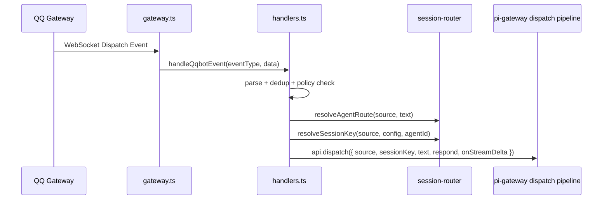
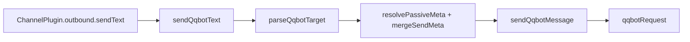

# QQBot Implementation Architecture

> 面向实现与维护者的 QQBot 通道落地架构说明。
> 对应代码：`src/plugins/builtin/qqbot/`

---

## 1. 定位

`qqbot` 是 `pi-gateway` 的内置 `ChannelPlugin`，负责把 QQ 官方机器人协议接入统一消息管线。

它的职责不是重新实现一套独立的会话系统，而是把 QQBot 的协议细节收敛在插件内部，再通过 `api.dispatch()` 接到现有的 session/router/RPC pipeline。

核心特点：

- 入站走 QQBot Gateway WebSocket
- 出站走 QQBot 官方 HTTP API
- 目标寻址统一编码为 `target` 字符串
- 私聊、群聊、频道消息都复用同一条网关消息管线
- 支持基于 markdown 的 QQBot 消息按钮出站
- 支持基础 `INTERACTION_CREATE` 按钮事件 ACK 与 keyboard 回调解析
- 流式回复不依赖官方编辑接口，而是通过“删旧重发”模拟

---

## 2. 模块边界

```
src/plugins/builtin/qqbot/
├── index.ts       # ChannelPlugin 入口，注册能力、生命周期、streaming/security 适配
├── config.ts      # QQBot 配置解析，环境变量/secret file 回填与默认值收敛
├── types.ts       # 配置、事件、target、runtime 等类型定义
├── api.ts         # access token、HTTP request、gateway URL、发送/撤回/上传
├── gateway.ts     # WebSocket 连接、identify、heartbeat、reconnect
├── handlers.ts    # 入站事件解析、去重、权限检查、dispatch 接线
├── outbound.ts    # target 编解码、被动回复元数据合并、文本发送
├── media.ts       # 媒体发送与 upload fallback 逻辑
├── actions.ts     # delete/edit/history 动作能力适配
└── streaming.ts   # ChannelStreamingAdapter，基于 delete + resend 模拟流式编辑
```

分层原则：

- `index.ts` 只做组装，不承载协议细节
- `gateway.ts` 只关心 WSS 生命周期，不负责业务路由
- `handlers.ts` 负责“事件 -> pi-gateway 入站消息”转换
- `outbound.ts` 负责“统一 target -> QQBot 发送语义”转换，包括文本、markdown+keyboard 出站
- `api.ts` 负责“已确定意图 -> 官方接口请求”

这种拆分让协议修正、业务路由、发送策略三类改动彼此独立，维护成本更低。

---

## 3. 运行时对象

运行时状态统一挂在 `QqbotPluginRuntime` 上，由 `index.ts` 在 `init()` 时创建。

### 3.1 关键字段

- `channelCfg`: 已解析并带默认值的 QQBot 配置
- `api`: `GatewayPluginApi`，用于接入核心消息管线
- `intents`: 当前 identify 使用的 intents 位掩码
- `token`: access token 缓存，含过期时间
- `ws` / `seq` / `sessionId`: gateway 会话状态
- `heartbeatTimer` / `reconnectTimer`: 长连接维护状态
- `dedup`: 入站消息去重缓存
- `replyState`: 被动回复链路中的 `msg_id/event_id/msg_seq` 状态缓存
- `streamPlaceholders`: 流式占位消息缓存
- `disposed`: stop 后阻止 reconnect 的开关

### 3.2 生命周期

1. `init()`
   - 解析 `channels.qqbot`
   - 创建 runtime
   - 装配 `streaming` 与 `security` 适配器
   - 校验凭证是否存在

2. `start()`
   - 调用 `startQqbotGateway()` 建立 WSS 连接
   - 注册 dispatch 回调，把事件交给 `handleQqbotEvent()`

3. `stop()`
   - 关闭 gateway
   - 清空 reply/streaming 缓存
   - 释放 runtime

---

## 4. 配置接线

QQBot 配置已经完整接入配置类型、schema、validator、example 与 builtin loader。

### 4.1 配置入口

- `src/core/config.ts`
- `src/core/config-schema.ts`
- `src/core/config-validator.ts`
- `src/plugins/loader.ts`
- `pi-gateway.jsonc.example`

### 4.2 当前支持的配置项

```jsonc
{
  "channels": {
    "qqbot": {
      "enabled": true,
      "appId": "...",
      "clientSecret": "...",
      "clientSecretFile": "...",
      "dmPolicy": "pairing",
      "allowFrom": ["*"],
      "groupPolicy": "disabled",
      "groupAllowFrom": [],
      "requireMention": true,
      "role": "ops",
      "model": "...",
      "thinkingLevel": "medium",
      "textChunkLimit": 1500,
      "passiveReplyOnly": false,
      "streaming": {
        "enabled": true,
        "editThrottleMs": 1200,
        "streamStartChars": 80
      }
    }
  }
}
```

### 4.3 已消费的配置

当前运行时已经实际消费：

- `enabled`
- `appId`
- `clientSecret`
- `clientSecretFile`
- `dmPolicy`
- `allowFrom`
- `groupPolicy`
- `groupAllowFrom`
- `requireMention`
- `role`
- `model`
- `thinkingLevel`
- `textChunkLimit`
- `passiveReplyOnly`
- `streaming.enabled`
- `streaming.editThrottleMs`
- `streaming.streamStartChars`

其中 `role` / `model` / `thinkingLevel` 不在插件内手工分支，而是通过 `MessageSource.channel = "qqbot"` 接入 `session-router.ts` 的通用 channel 级解析逻辑。

### 4.4 配置行为说明

- `textChunkLimit` 现在会作用于 QQBot 文本出站分片，并在运行时被限制到平台上限 `1500`
- `passiveReplyOnly` 现在会阻止缺少 `msg_id/event_id` 上下文的主动发送
- `keyboard` 出站通过 markdown + `keyboard` payload 映射到 QQBot 官方按钮协议
- 流式占位与删旧重发链路会显式跳过文本分片，避免中间态消息被拆成多条

### 4.5 校验规则

`config-validator.ts` 目前额外校验：

- 开启 `qqbot` 时必须提供有效 `appId`
- 开启 `qqbot` 时必须提供 `clientSecret` 或 `clientSecretFile`
- 当 `dmPolicy = "open"` 时，`allowFrom` 必须包含 `"*"`

---

## 5. 入站链路

### 5.1 总流程



### 5.2 Gateway 连接职责

`gateway.ts` 负责：

- 通过 `GET /gateway` 获取 WSS 地址
- 建立 WebSocket 连接
- 收到 `op=10` 后启动 heartbeat
- 发送 `op=2 identify`
- 在 `READY` 事件中记录 `sessionId` 与 `botId`
- 连接关闭后自动重连

当前 identify 使用的 intents 为：

- `1 << 25`: C2C / Group @ 消息
- `1 << 12`: Direct Message
- `1 << 30`: Guild 公域消息

### 5.3 事件解析

`handlers.ts` 当前识别四类消息事件：

- `C2C_MESSAGE_CREATE`
- `GROUP_AT_MESSAGE_CREATE`
- `AT_MESSAGE_CREATE`
- `DIRECT_MESSAGE_CREATE`
- `INTERACTION_CREATE`（按钮点击）

解析结果统一收敛为 `QqbotMessageContext`，最重要的标准化字段包括：

- `peerType`
- `chatType`
- `chatId`
- `senderId`
- `messageId`
- `eventId`
- `guildId`
- `channelId`
- `mentionedBot`
- `attachments`

### 5.4 去重与过滤

在真正 dispatch 之前，插件会做三层过滤：

1. 去重
   - key 形式：`eventType:messageId`
   - TTL：30 分钟
   - 最大容量：1000

2. 空消息过滤
   - 文本为空且无附件时直接丢弃

3. 访问策略过滤
   - DM 走 `dmPolicy + allowFrom + pairing`
   - 群/频道走 `groupPolicy + groupAllowFrom + requireMention`

### 5.5 pairing 行为

当 `dmPolicy = pairing` 且发送者未授权时：

- 调用 `createPairingRequest("qqbot", senderId, senderName, "default")`
- 生成一次性配对码
- 直接通过 QQBot 回复 pairing 提示
- 不进入 agent 主消息管线

### 5.6 MessageSource 构造

入站消息最终被转换为 `MessageSource`：

- `channel` 固定为 `qqbot`
- `chatType` 根据上下文落到 `dm` / `group` / `channel`
- `guildId` 用于频道会话隔离
- 对 `DIRECT_MESSAGE_CREATE`，采用 `chatType = channel`，并把 `guildId` 放进 `threadId`

这样做的目的，是让 QQ 频道私信和 QQ 频道公域消息都能复用 `resolveSessionKey()` 的 channel 路由分支，而不是为 QQBot 单独造一套 session key 规则。

---

## 6. Session 与 Target 模型

QQBot 的复杂点不在消息文本，而在“目标定位信息”分散在不同协议字段里。当前实现用两层模型解决这个问题。

### 6.1 第一层：MessageSource

`MessageSource` 面向 `pi-gateway` 内核，解决的是：

- 该消息属于哪条 session
- 该消息应该路由到哪个 agent
- 该消息继承哪个 role/model/thinkingLevel

### 6.2 第二层：QqbotTarget

`QqbotTarget` 面向 QQ 官方 API，解决的是：

- 该回复要发到哪里
- 是否要带 `msg_id` 或 `event_id`
- 当前被动回复序号 `msg_seq` 应该是多少

结构如下：

```typescript
interface QqbotTarget {
  peerType: "c2c" | "group" | "guild" | "dm";
  id: string;
  guildId?: string;
  channelId?: string;
  msgId?: string;
  eventId?: string;
  msgSeq?: number;
}
```

### 6.3 target 编码格式

`outbound.ts` 使用统一字符串格式在插件边界上传递 target：

- `c2c|<openid>|msg=<msgId>|seq=1`
- `group|<group_openid>|msg=<msgId>|seq=1`
- `guild|<channel_id>|guild=<guild_id>|channel=<channel_id>|msg=<msgId>|seq=1`
- `dm|<guild_id>|guild=<guild_id>|channel=<channel_id>|msg=<msgId>|seq=1`

注意：

- `id` 是主路由字段
- `guildId/channelId` 用于补足 guild 和频道私信上下文
- `msgId/eventId/msgSeq` 只用于回复语义，不属于 base target 身份

### 6.4 base target 与 replyState

为了处理 QQBot 的被动回复约束，实现里区分了：

- 完整 target：带 `msgId/eventId/msgSeq`
- base target：剥离回复元数据后的稳定会话目标

`replyState` 以 base target 为 key，缓存：

- 最近一次可继续回复的 `msgId`
- 最近一次可继续回复的 `eventId`
- 下一个 `msgSeq`

这样无论回复是来自 `respond()`、`sendText()` 还是媒体发送，都能沿用同一条被动回复链。

---

## 7. 出站链路

### 7.1 文本发送

文本发送的调用链：



`sendQqbotText()` 负责两件最关键的事：

- 从 `replyState` 或 `opts.channelMeta` 里恢复被动回复元数据
- 发送成功后把 `msgSeq + 1` 写回 `replyState`

### 7.2 官方发送路由

`api.ts` 根据 `peerType` 自动选择不同 REST endpoint：

- `c2c` -> `/v2/users/{openid}/messages`
- `group` -> `/v2/groups/{group_openid}/messages`
- `guild` -> `/channels/{channel_id}/messages`
- `dm` -> `/dms/{guild_id}/messages`

### 7.3 被动回复元数据

QQBot 某些场景要求回复链显式带上：

- `msg_id`
- `event_id`
- `msg_seq`

当前策略是：

- 优先使用显式传入的 `opts.channelMeta`
- 否则回退到 `replyState`
- 每次成功发送后自增 `msg_seq`

这种做法让插件既能在收到事件后被动回复，也能在后续流式/重发链路中保持协议连续性。

---

## 8. 媒体、编辑、删除与流式

### 8.1 媒体发送

`media.ts` 的策略是按目标类型分流：

- `c2c` / `group`
  - 先调 `/files` 上传
  - 再以 `msg_type=7` 发送媒体消息

- `guild` / `dm`
  - 当前没有走官方文件上传链路
  - 回退为文本说明：`[media] <caption>`

这是一种务实折中：先保证能力矩阵不虚标，再把不完整支持明确暴露为 fallback 行为。

### 8.2 删除

`actions.ts` 把 delete 能力映射到 `deleteQqbotMessage()`，并继续按 `peerType` 选择对应删除接口。

能力矩阵中因此声明：

- `delete = true`
- `deletable = true`

### 8.3 编辑

QQBot 官方没有通用 patch/edit API，因此：

- `editMessage()` 明确返回 unsupported
- 能力矩阵声明 `edit = false`、`editable = false`

### 8.4 流式实现

由于缺少原生 edit，当前流式能力通过“占位消息 + 删除 + 重发”实现：

1. 累积文本达到阈值后先发占位消息
2. 下一次 delta 到来时删除旧占位消息
3. 发送新的完整累积文本
4. 重复直到最终 `respond()` 发出最终版正文

节流参数来自：

- `streaming.editThrottleMs`
- `streaming.streamStartChars`

这让 `qqbot` 能在能力矩阵中声明 `streaming = true`，但语义更接近 `post-edit`，而不是原生编辑流。

---

## 9. 与核心框架的接点

### 9.1 Plugin Loader

`src/plugins/loader.ts` 已把 `qqbot` 加入 builtin 列表，因此它和 `telegram` / `discord` / `feishu` 一样，属于内置插件发现路径的一部分。

### 9.2 ChannelPlugin 能力声明

`index.ts` 中的能力声明决定了网关如何理解这个通道：

- 支持 direct / group / media / security / streaming
- 不支持 reactions / editable / history
- rich content 为 `none`
- history 仅保留 `postChannelMessage` / `fetchChannelInfo` 的有限矩阵声明

### 9.3 security adapter

`index.ts` 同时挂载了 `security` 适配器，用来向系统暴露：

- DM policy
- allowFrom
- 是否支持 pairing
- accountId

这样外围工具和状态展示层可以复用统一安全语义，而不是理解 QQ 协议本身。

### 9.4 通用路由继承

QQBot 没有自己实现 role/model/thinkingLevel 解析，而是复用 `session-router.ts` 中的 generic channel fallback：

- `config.channels.qqbot.role`
- `config.channels.qqbot.model`
- `config.channels.qqbot.thinkingLevel`

这符合现有框架模式，也减少了插件特判。

---

## 10. 已知限制与后续演进

### 10.1 当前限制

- guild / 频道私信媒体仍是文本 fallback，不是完整上传链路
- `readHistory()` 尚未实现
- `editMessage()` 只能通过 streaming fallback 间接模拟，不支持真正 patch
- reconnect 目前是固定 3 秒重连，还没有更细的退避和恢复策略

### 10.2 建议的后续方向

1. 补齐 `textChunkLimit` 的统一 chunking
2. 把 `passiveReplyOnly` 接进 outbound guard
3. 继续完善 guild / dm 媒体能力
4. 给 gateway reconnect 增加指数退避与 observability
5. 增加更强的集成测试，覆盖 `msg_id/event_id/msg_seq` 连续回复场景

---

## 11. 维护建议

维护这个插件时，优先遵守下面的边界：

- 改协议字段时先看 `types.ts` 与 `handlers.ts`
- 改发送行为时先看 `outbound.ts`，不要直接在业务代码里拼 payload
- 改 HTTP endpoint 时只动 `api.ts`
- 改 session/agent 路由时尽量通过 `MessageSource` 接入框架，不要在插件里复制路由规则
- 遇到 QQ 协议限制时，优先在能力矩阵里如实声明，而不是在文档里假装支持

这份实现的目标不是“把 QQBot 特性堆满”，而是让 QQBot 在 `pi-gateway` 里成为一个结构清晰、可测试、可继续迭代的新通道。
