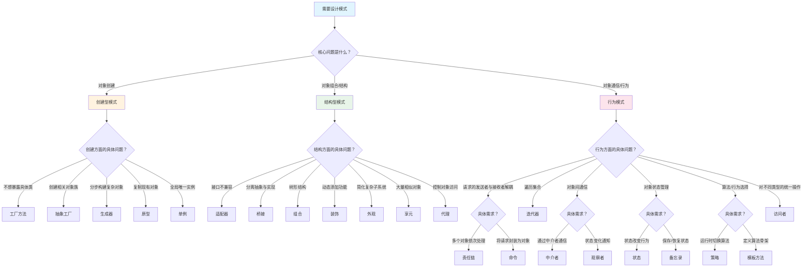
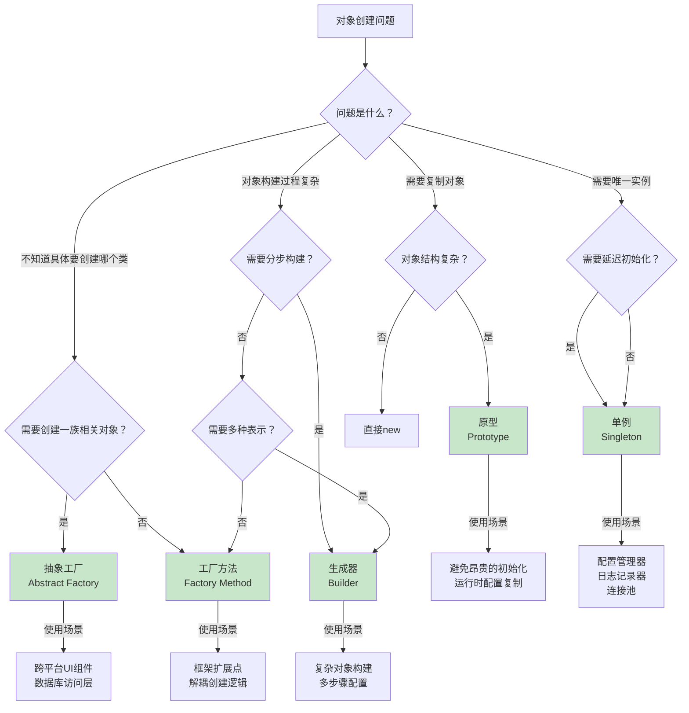
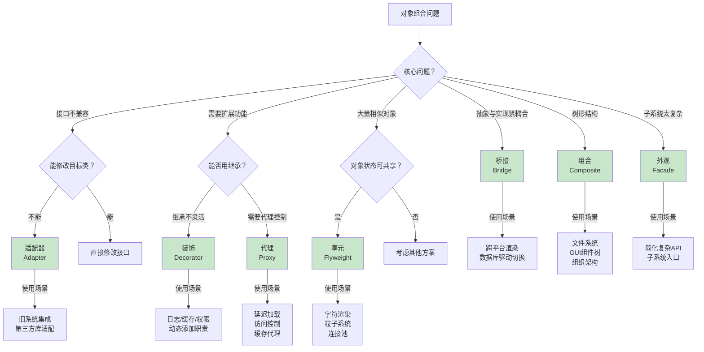
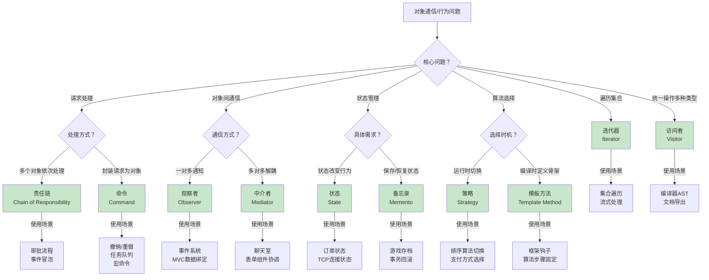
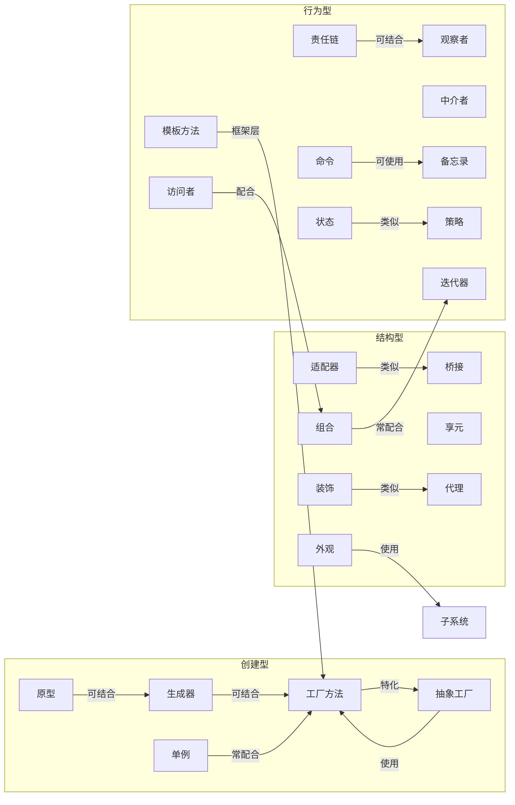

# 设计模式指南

基于 Refactoring.Guru 的 22 种经典设计模式中文参考手册。

## 使用方式

1. **识别问题类型** - 通过总体路由定位问题领域
2. **选择模式** - 通过决策树选择合适的设计模式
3. **参考实现** - 查看详细文档和代码示例

---

## 总体决策路由

---

## 创建型模式决策树

---

## 结构型模式决策树

---

## 行为模式决策树

---

## 模式关系图

---

## 详细参考

- `references/creational.md` - 创建型模式详解
- `references/structural.md` - 结构型模式详解
- `references/behavioral.md` - 行为模式详解

## 设计原则

1. **开闭原则** - 对扩展开放，对修改关闭
2. **单一职责** - 一个类只做一件事
3. **依赖倒置** - 依赖抽象而非具体
4. **接口隔离** - 使用小而专的接口
5. **里氏替换** - 子类可以替换父类
6. **合成复用** - 优先组合而非继承
