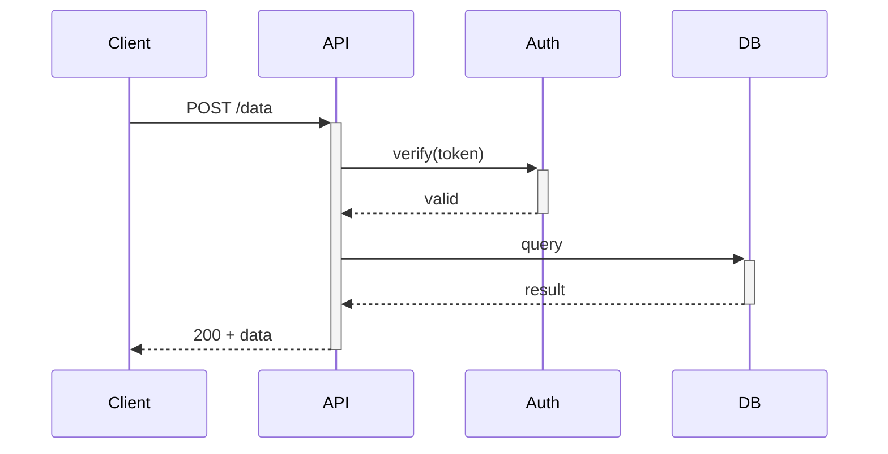
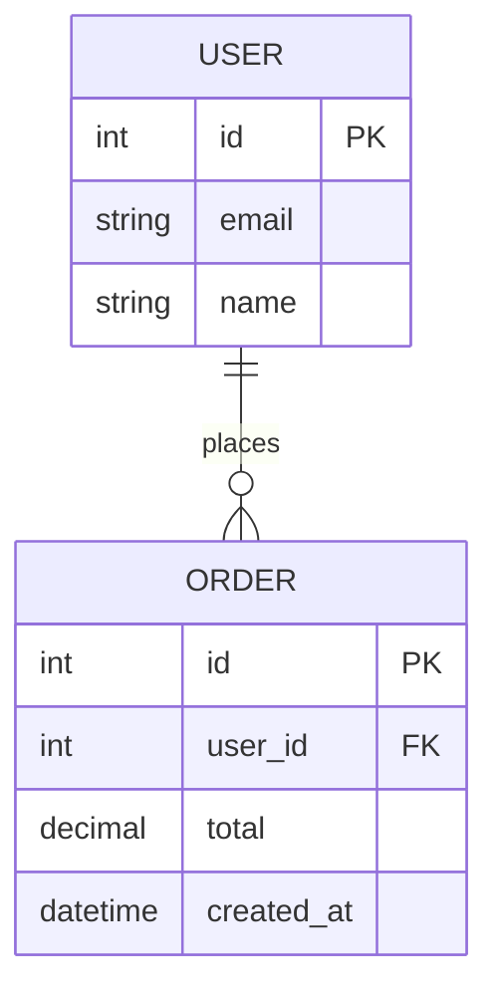
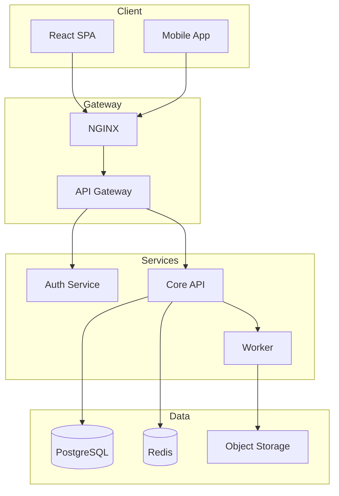
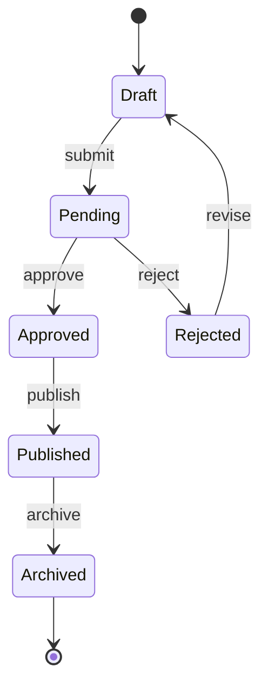
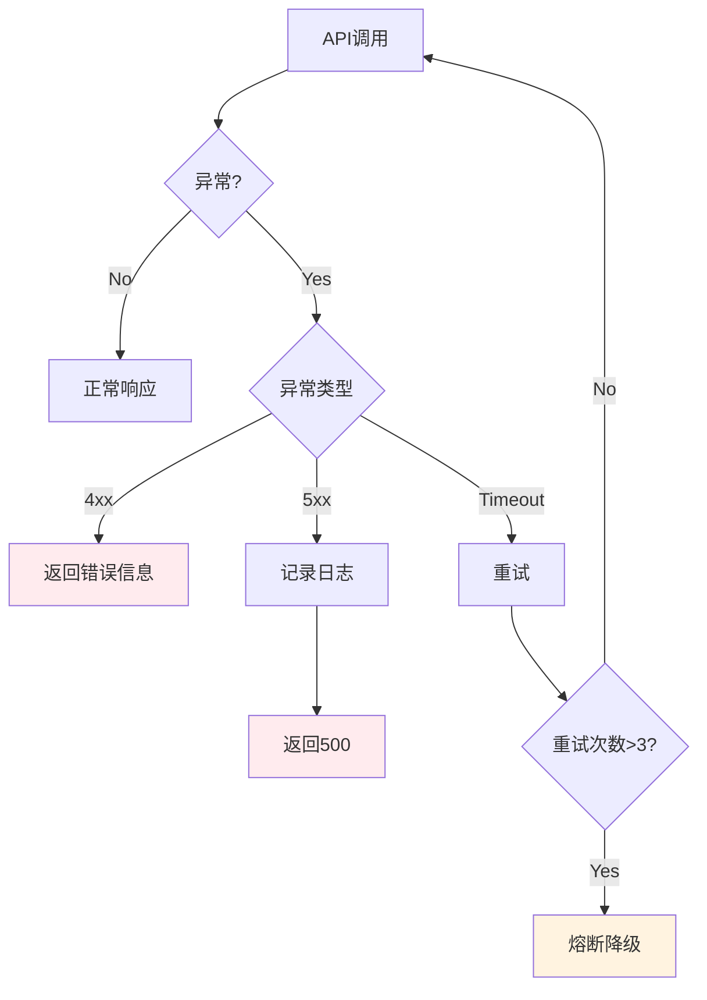
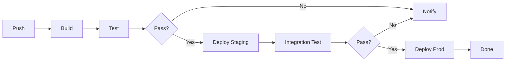
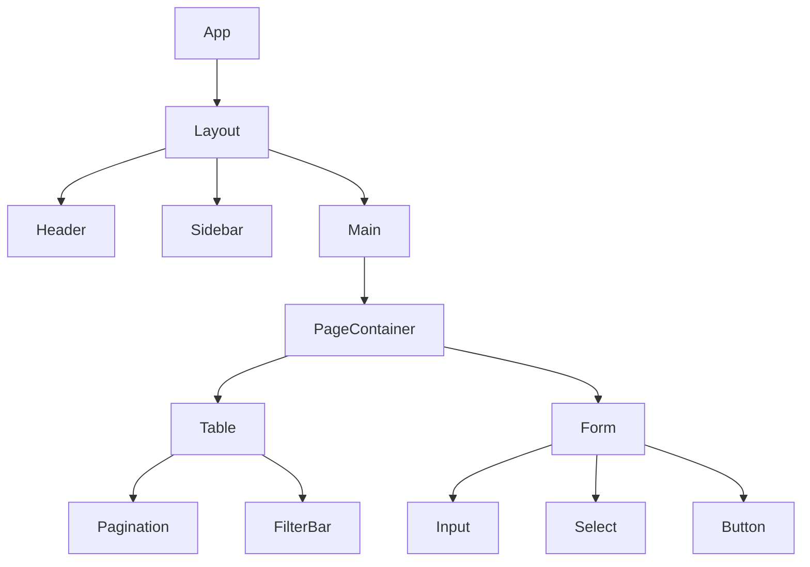
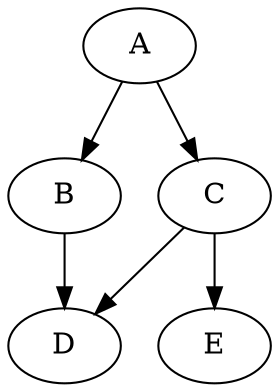
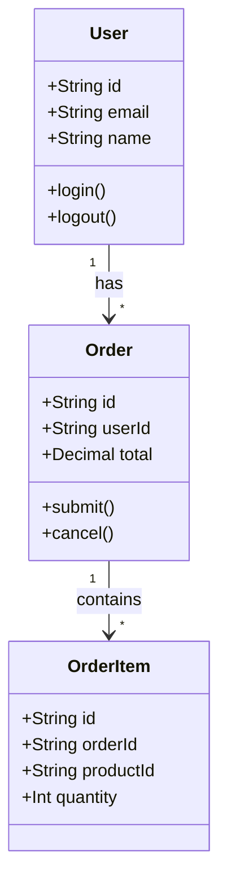

# Enhanced Markdown Output Skill

让大模型输出充分利用 Markdown Viewer 扩展渲染能力的内容。

## 核心原则

> **人类可读性优先** —— 选择让读者理解最快的呈现方式，而非最炫技的方式。

---

## 渲染能力速查

| 能力 | 语法标记 | 最佳场景 | 复杂度 |
|------|---------|---------|--------|
| **Mermaid** | `mermaid` | 流程、架构、时序、类图 | ★☆☆ |
| **Vega-Lite** | `vega-lite` | 数据可视化、统计图表 | ★★☆ |
| **Canvas** | `canvas` | 思维导图、知识图谱 | ★★☆ |
| **DOT** | `dot` | 复杂关系、依赖树、状态机 | ★★☆ |
| **Infographic** | `infographic` | 统计图表、进度展示 | ★☆☆ |
| **LaTeX** | `$...$` / `$$...$$` | 数学公式、方程 | ★☆☆ |
| **合并表格** | HTML `colspan/rowspan` | 复杂报表、跨行跨列 | ★☆☆ |
| **内联 HTML** | `<tag>` | 样式增强、彩色标签 | ★☆☆ |

> 不确定具体语法？去 `~/dev/ai/markdown-viewer-extension/docs/features/` 查对应文档。

---

## 路由决策树

```
内容类型判断
│
├─► 有数据要展示？
│   ├─ 时间序列/对比 → Vega-Lite 图表
│   ├─ 占比/分布 → Infographic 饼图/柱状图
│   └─ 简单统计 → 表格
│
├─► 有流程/步骤？
│   ├─ 线性流程 (A→B→C) → Mermaid flowchart LR
│   ├─ 复杂分支 (多条件判断) → Mermaid flowchart TD
│   ├─ 系统交互 → Mermaid sequenceDiagram
│   └─ 代码执行流程 → 代码块 + 注释
│
├─► 有架构/组件关系？
│   ├─ 简单层级 → Mermaid graph TD
│   ├─ 复杂拓扑 → DOT graph
│   ├─ 云服务架构 → drawio (如需要精确图标)
│   └─ 概念关联 → Canvas 思维导图
│
├─► 有数学/算法？
│   ├─ 行内公式 → `$E=mc^2$`
│   ├─ 方程组 → `$$...$$` 块
│   └─ 算法步骤 → 编号列表 + 关键行 LaTeX
│
└─► 纯文本内容？
    ├─ 重点突出 → HTML `<mark>`, `<span style="color:">`
    ├─ 状态标签 → HTML `<span style="background:">badge</span>`
    └─ 结构清晰 → 标准 Markdown 层级
```

---

## 渐进式文档策略（全栈开发版）

根据文档用途和读者角色选择复杂度层级：

| 层级 | 目标读者 | 文档形式 | 图表密度 | 示例场景 |
|------|---------|---------|---------|---------|
| **L1-草稿** | 自己/AI | 速记要点 | 0% | 需求梳理、BUG记录 |
| **L2-讨论** | 团队成员 | 结构化描述 | 20% | PRD评审、技术方案讨论 |
| **L3-交付** | 跨团队协作 | 完整文档+关键图 | 40% | API文档、部署指南 |
| **L4-存档** | 未来维护者 | 全面可视化 | 60%+ | 架构文档、运维手册 |

### 渐进判定标准

```
问题 → 回答 → 决策

是否需要快速迭代？
├─ 是 → L1-草稿（纯文本速记）
└─ 否 → 继续

是否需要多人讨论？
├─ 是 → L2-讨论（结构化+Mermaid流程）
└─ 否 → 继续

是否需要长期维护？
├─ 是 → L4-存档（完整图表+版本记录）
└─ 否 → L3-交付（关键路径可视化）
```

---

## 编程场景模板路由

### 路由总览

```
开发阶段 → 文档类型 → 推荐渲染方式

需求分析
├─ 用户故事 → 文本 + 验收清单
├─ 业务流程 → Mermaid flowchart
└─ 数据流图 → Mermaid sequenceDiagram

架构设计
├─ 系统架构 → Mermaid graph TB / drawio
├─ 模块关系 → DOT digraph
├─ ERD设计 → Mermaid erDiagram
└─ 技术选型 → 对比表格 + Infographic卡片

编码实现
├─ API设计 → Mermaid sequenceDiagram
├─ 状态机 → Mermaid stateDiagram
├─ 类图 → Mermaid classDiagram
└─ 错误处理 → Mermaid flowchart（异常分支标注红）

测试部署
├─ 测试策略 → DOT图（覆盖路径）
├─ CI/CD流程 → Mermaid flowchart LR
├─ 部署架构 → Mermaid graph TB
└─ 性能基准 → Vega-Lite对比图

运维监控
├─ 告警策略 → 表格 + 条件样式
├─ 故障处理 → Mermaid flowchart（决策树）
└─ 监控大屏 → Infographic仪表板
```

---

## 场景模板库

### 1. API 响应说明（L2-L3）

**❌ 纯文本描述**
```
接口先验证token，然后检查权限，最后返回数据
```

**✅ Mermaid 时序图**


---

### 2. 数据库 ERD（L3-L4）



---

### 3. 系统架构图（L3-L4）



---

### 4. 状态机设计（L2-L3）



---

### 5. 错误处理流程（L3-L4）



---

### 6. CI/CD 部署流程（L3-L4）



---

### 7. 技术选型对比（L2-L3）

| 方案 | 性能 | 生态 | 学习成本 | 维护成本 | 推荐度 |
|------|------|------|---------|---------|--------|
| **A: React** | ★★★★☆ | ★★★★★ | ★★★☆☆ | ★★★★☆ | <span style="background:#4caf50;color:white;padding:2px 8px;border-radius:4px;">首选</span> |
| **B: Vue** | ★★★★☆ | ★★★★☆ | ★★★★☆ | ★★★★★ | <span style="background:#2196f3;color:white;padding:2px 8px;border-radius:4px;">备选</span> |
| **C: Svelte** | ★★★★★ | ★★★☆☆ | ★★★★★ | ★★★☆☆ | <span style="background:#9e9e9e;color:white;padding:2px 8px;border-radius:4px;">观察</span> |

---

### 8. 性能基准对比（L3-L4）

```vega-lite
{
  "data": {"values": [
    {"framework": "React", "ops": 45000, "memory": 45},
    {"framework": "Vue", "ops": 52000, "memory": 38},
    {"framework": "Svelte", "ops": 68000, "memory": 28},
    {"framework": "Solid", "ops": 72000, "memory": 25}
  ]},
  "encoding": {
    "x": {"field": "framework", "type": "ordinal"},
    "y": {"field": "ops", "type": "quantitative", "title": "ops/sec"}
  },
  "layer": [
    {"mark": "bar", "encoding": {"color": {"value": "#4a90d9"}}},
    {"mark": {"type": "text", "dy": -5}, "encoding": {"text": {"field": "ops"}}}
  ]
}
```

---

### 9. 前端组件层级（L2-L3）



---

### 10. API 路由表（L3-L4）

```html
<table>
  <tr>
    <th>Method</th>
    <th>Path</th>
    <th>Auth</th>
    <th>Rate Limit</th>
    <th>描述</th>
  </tr>
  <tr>
    <td><span style="background:#4caf50;color:white;padding:2px 6px;border-radius:3px;">GET</span></td>
    <td><code>/api/users</code></td>
    <td>✓</td>
    <td>100/min</td>
    <td>列表查询</td>
  </tr>
  <tr>
    <td><span style="background:#2196f3;color:white;padding:2px 6px;border-radius:3px;">POST</span></td>
    <td><code>/api/users</code></td>
    <td>✓</td>
    <td>10/min</td>
    <td>创建用户</td>
  </tr>
  <tr>
    <td><span style="background:#ff9800;color:white;padding:2px 6px;border-radius:3px;">PATCH</span></td>
    <td><code>/api/users/:id</code></td>
    <td>✓ Admin</td>
    <td>20/min</td>
    <td>部分更新</td>
  </tr>
</table>
```

---

### 11. 模块依赖说明（L2-L3）

**❌ 文字罗列**
```
A依赖B和C，B依赖D，C依赖D和E
```

**✅ DOT 依赖图**


---

### 12. 监控仪表板（L4）

**✅ Infographic 柱状图**
```infographic
infographic column-chart
data
  title 生产环境关键指标
  items
    - label 可用性
      value 99.95
    - label P50延迟
      value 42
    - label P99延迟
      value 128
    - label 活跃告警
      value 3
```

**✅ Infographic 进度图（项目完成度）**
```infographic
infographic progress-chart
data
  title Sprint 进度
  items
    - label API开发
      value 100
    - label 前端联调
      value 75
    - label 测试覆盖
      value 60
    - label 文档编写
      value 30
```

**✅ Infographic 饼图（资源占比）**
```infographic
infographic pie-chart
data
  title 服务器资源分布
  items
    - label Web服务
      value 45
    - label 数据库
      value 30
    - label 缓存
      value 15
    - label 队列
      value 10
```

---

### 13. 复杂表格报表（L3-L4）

**✅ HTML 合并表格**
```html
<table>
  <tr><th rowspan="2">模块</th><th colspan="2">性能</th></tr>
  <tr><th>CPU</th><th>内存</th></tr>
  <tr><td>Core</td><td>15%</td><td>256MB</td></tr>
</table>
```

---

### 14. 类图设计（L3-L4）



---

### 15. 代码审查清单（L2-L3）

| 检查项 | 状态 | 说明 |
|--------|------|------|
| 代码风格符合规范 | <span style="color:#4caf50;">✓ Pass</span> | ESLint 无警告 |
| 单元测试覆盖 >80% | <span style="color:#ff9800;">⚠ Warn</span> | 当前 72% |
| 无 console.log | <span style="color:#4caf50;">✓ Pass</span> | - |
| 敏感信息未硬编码 | <span style="color:#4caf50;">✓ Pass</span> | - |
| 文档已更新 | <span style="color:#f44336;">✗ Fail</span> | README 未同步 |

---

## 渐进式增强策略（按交付物类型）

| 交付阶段 | 策略 | 图表类型 | 示例 |
|---------|------|---------|------|
| **初稿** | 纯文本速记 | 无 | 要点列表、TODO |
| **讨论稿** | 结构化 + 流程图 | Mermaid flow/sequence | PRD、技术方案 |
| **评审稿** | 完整图表 + 标注 | ERD、架构图、状态机 | 设计评审 |
| **终稿** | 全面可视化 | 图表 + 数据 + 样式 | 上线文档 |

---

## 避坑指南

| 坑 | 解决方案 |
|---|---------|
| 图表太宽被截断 | Vega-Lite 加 `"width": 400` |
| Mermaid 中文乱码 | 引号包裹 `"中文"` |
| 复杂图表维护难 | 优先用简单流程图，复杂的上 Canvas |
| 表格列不对齐 | 用 HTML `<table>` 替代 Markdown 表格 |
| 公式不渲染 | 检查 `$` 是否配对，块级用 `$$` |

---

## 快速参考路径

需要具体语法示例时，读取：
- `~/dev/ai/markdown-viewer-extension/docs/features/diagrams/mermaid.md`
- `~/dev/ai/markdown-viewer-extension/docs/features/diagrams/vega.md`
- `~/dev/ai/markdown-viewer-extension/demo/test-full.md` (综合示例)
