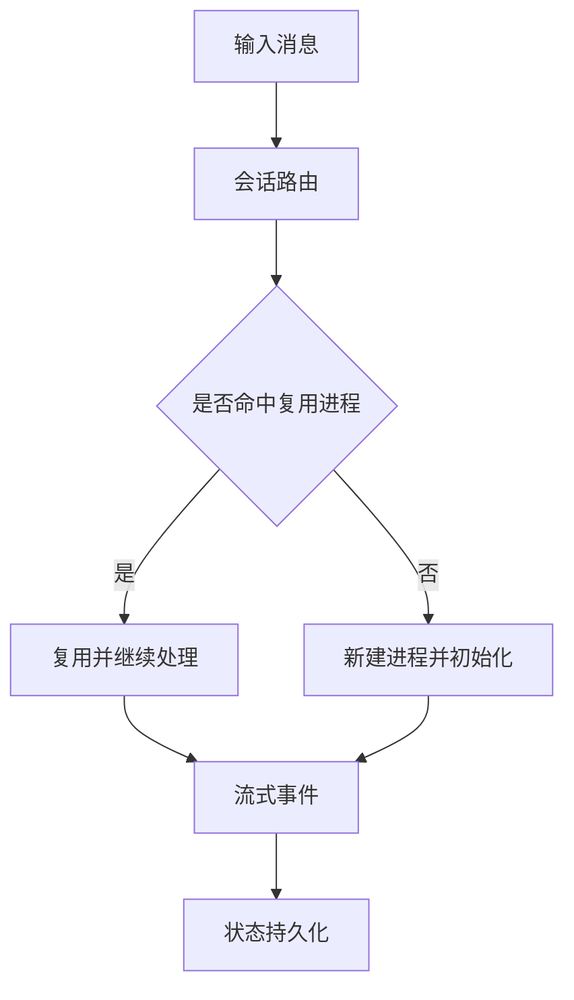

# Mermaid Flow Image Skill

## 适用场景
- 用户要求：
  - “生成 mermaid 流程图”
  - “简化流程图”
  - “详细中文版本”
  - “导出图片并发送”

## 输出策略
1. **先结构化**：把流程拆成阶段（输入 / 路由 / 处理 / 状态 / 异常）。
2. **再选粒度**：
   - 简化版：≤ 12 个节点，突出主路径。
   - 详细版：按子图（subgraph）分层，覆盖关键分支与状态回写。
3. **中文优先**：节点文案用中文，技术关键词可中英混排。
4. **可渲染优先**：
   - 节点文字尽量加引号，避免 Mermaid 保留字符导致解析失败。
   - 避免在节点内直接使用未转义的 `< > /` 组合。

## 图片导出规范
- 默认输出路径：`./media/images/<name>.png`
- Mermaid 源文件：`./media/images/<name>.mmd`
- 使用脚本：`./scripts/python/render_mermaid_kroki.py`
- 高分辨率：将 `scale` 设为 `2` 或 `3`

示例命令（Python 方式）：
```bash
python3 ./scripts/python/render_mermaid_kroki.py \
  ./media/images/rpc-flow.mmd \
  ./media/images/rpc-flow.png \
  3
```

## Mermaid 模板（详细中文）


## 交付检查清单
- [ ] Mermaid 语法可渲染
- [ ] 中文标签清晰无歧义
- [ ] 主分支与异常分支都可见
- [ ] 产出 PNG 并成功发送
