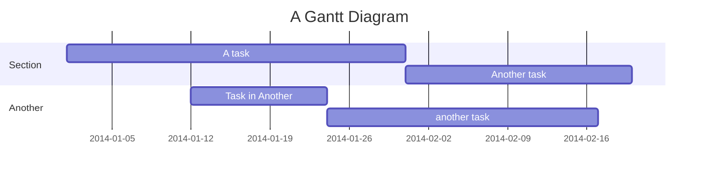
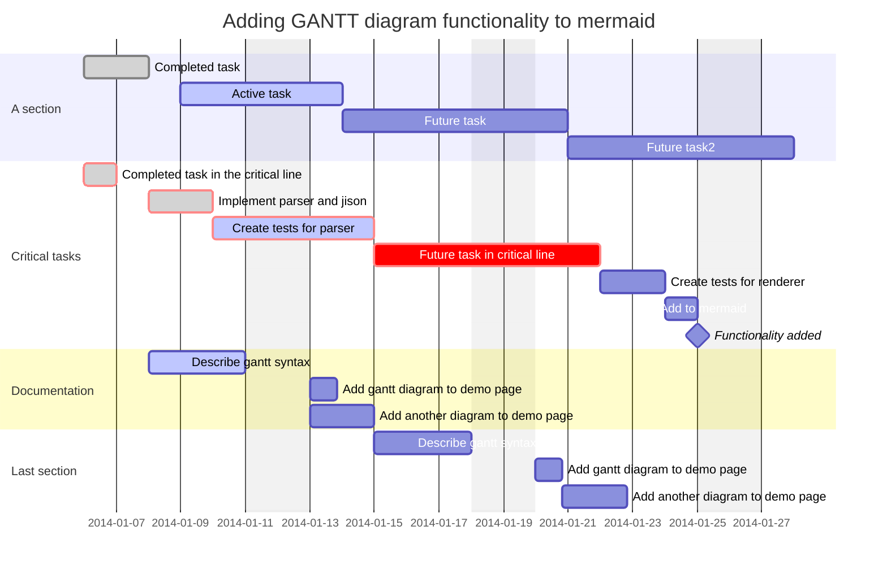
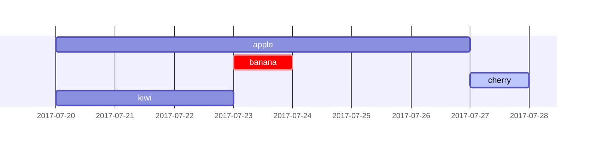
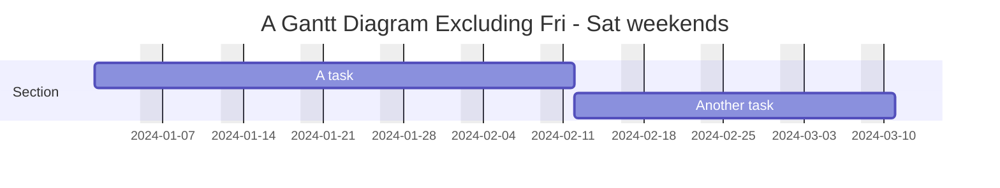
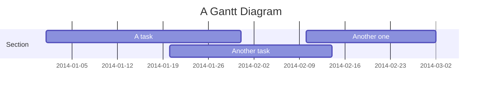
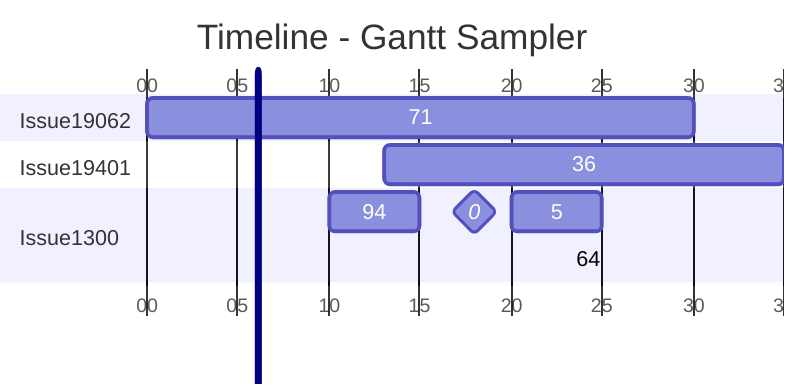

> 快照：<https://pele.run/examples/gantt> · Pele 1.13.0 · 抓取于 2026-11-04。内容原样保留，未做删改。

```mermaid
gantt
    title A Gantt Diagram
    dateFormat YYYY-MM-DD
    section Section
        A task          :a1, 2014-01-01, 30d
        Another task    :after a1, 20d
    section Another
        Task in Another :2014-01-12, 12d
        another task    :24d
```

```mermaid
gantt
    dateFormat  YYYY-MM-DD
    title       Adding GANTT diagram functionality to mermaid
    excludes    weekends
    %% (`excludes` accepts specific dates in YYYY-MM-DD format, days of the week ("sunday") or "weekends", but not the word "weekdays".)

    section A section
    Completed task            :done,    des1, 2014-01-06,2014-01-08
    Active task               :active,  des2, 2014-01-09, 3d
    Future task               :         des3, after des2, 5d
    Future task2              :         des4, after des3, 5d

    section Critical tasks
    Completed task in the critical line :crit, done, 2014-01-06,24h
    Implement parser and jison          :crit, done, after des1, 2d
    Create tests for parser             :crit, active, 3d
    Future task in critical line        :crit, 5d
    Create tests for renderer           :2d
    Add to mermaid                      :until isadded
    Functionality added                 :milestone, isadded, 2014-01-25, 0d

    section Documentation
    Describe gantt syntax               :active, a1, after des1, 3d
    Add gantt diagram to demo page      :after a1  , 20h
    Add another diagram to demo page    :doc1, after a1  , 48h

    section Last section
    Describe gantt syntax               :after doc1, 3d
    Add gantt diagram to demo page      :20h
    Add another diagram to demo page    :48h
```

```mermaid
gantt
    apple :a, 2017-07-20, 1w
    banana :crit, b, 2017-07-23, 1d
    cherry :active, c, after b a, 1d
    kiwi   :d, 2017-07-20, until b c
```

```mermaid
gantt
    title A Gantt Diagram Excluding Fri - Sat weekends
    dateFormat YYYY-MM-DD
    excludes weekends
    weekend friday
    section Section
        A task          :a1, 2024-01-01, 30d
        Another task    :after a1, 20d
```

```mermaid
gantt
    dateFormat HH:mm
    axisFormat %H:%M
    Initial milestone : milestone, m1, 17:49, 2m
    Task A : 10m
    Task B : 5m
    Final milestone : milestone, m2, 18:08, 4m
```

```mermaid
gantt
    dateFormat HH:mm
    axisFormat %H:%M
    Initial vert : vert, v1, 17:30, 2m
    Task A : 3m
    Task B : 8m
    Final vert : vert, v2, 17:58, 4m
```

```mermaid
gantt
  tickInterval 1week
  weekday monday
```

```mermaid
---
displayMode: compact
---
gantt
    title A Gantt Diagram
    dateFormat  YYYY-MM-DD

    section Section
    A task           :a1, 2014-01-01, 30d
    Another task     :a2, 2014-01-20, 25d
    Another one      :a3, 2014-02-10, 20d
```

```mermaid
gantt
    title A Gantt Diagram
    %% This is a comment
    dateFormat YYYY-MM-DD
    section Section
        A task          :a1, 2014-01-01, 30d
        Another task    :after a1, 20d
    section Another
        Task in Another :2014-01-12, 12d
        another task    :24d
```

```mermaid
gantt
    title Git Issues - days since last update
    dateFormat X
    axisFormat %s
    section Issue19062
    71   : 0, 71
    section Issue19401
    36   : 0, 36
    section Issue193
    34   : 0, 34
    section Issue7441
    9    : 0, 9
    section Issue1300
    5    : 0, 5
```

```mermaid
---
    # Frontmatter config, YAML comments
    title: Ignored if specified in chart
    displayMode: compact     #gantt specific setting but works at this level too
    config:
#        theme: forest
#        themeCSS: " #item36 { fill: CadetBlue } "
        themeCSS: " // YAML supports multiline strings using a newline markers: \n
            #item36 { fill: CadetBlue }       \n

            // Custom marker workaround CSS from forum (below)    \n
            rect[id^=workaround] { height: calc(100% - 50px) ; transform: translate(9px, 25px); y: 0; width: 1.5px; stroke: none; fill: red; }   \n
            text[id^=workaround] { fill: red; y: 100%; font-size: 15px;}
        "
        gantt:
            useWidth: 400
            rightPadding: 0
            topAxis: true  #false
            numberSectionStyles: 2
---
gantt
    title Timeline - Gantt Sampler
    dateFormat YYYY
    axisFormat %y
    %% this next line doesn't recognize 'decade' or 'year', but will silently ignore
    tickInterval 1decade

    section Issue19062
    71   :            item71, 1900, 1930
    section Issue19401
    36   :            item36, 1913, 1935
    section Issue1300
    94   :            item94, 1910, 1915
    5    :            item5,  1920, 1925
    0    : milestone, item0,  1918, 1s
    9    : vert,              1906, 1s   %% not yet official
    64   : workaround,        1923, 1s   %% custom CSS object https://github.com/mermaid-js/mermaid/issues/3250
```
