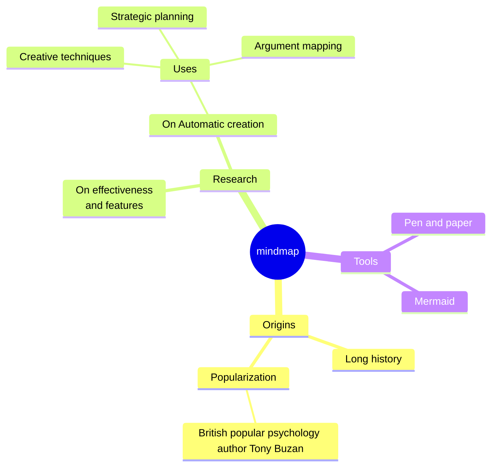
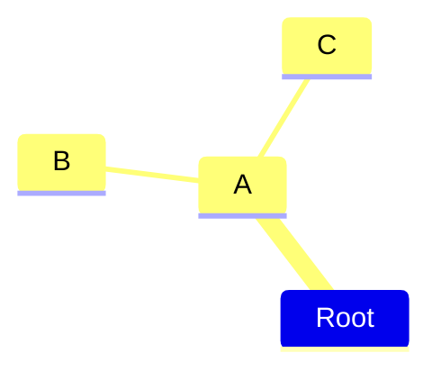
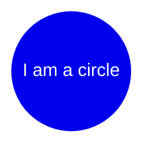
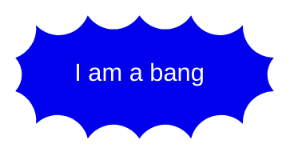
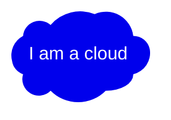
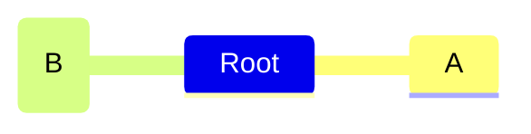
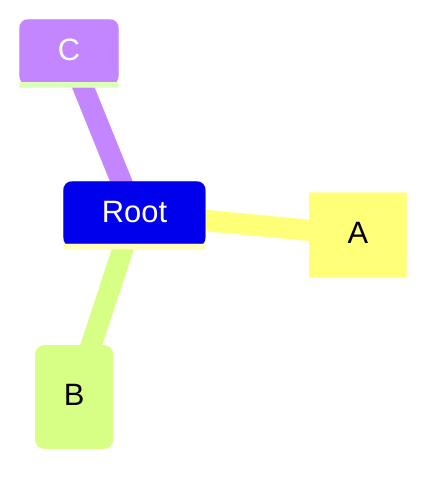
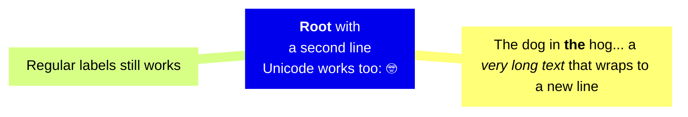

> 快照：<https://pele.run/examples/mindmap> · Pele 1.13.0 · 抓取于 2026-11-04。内容原样保留，未做删改。

```mermaid
mindmap
  root((mindmap))
    Origins
      Long history
      ::icon(fa fa-book)
      Popularization
        British popular psychology author Tony Buzan
    Research
      On effectiveness<br/>and features
      On Automatic creation
        Uses
            Creative techniques
            Strategic planning
            Argument mapping
    Tools
      Pen and paper
      Mermaid
```

```mermaid
mindmap
Root
    A
      B
      C
```

```mermaid
mindmap
    id[I am a square]
```

```mermaid
mindmap
    id(I am a rounded square)
```

```mermaid
mindmap
    id((I am a circle))
```

```mermaid
mindmap
    id))I am a bang((
```

```mermaid
mindmap
    id)I am a cloud(
```

```mermaid
mindmap
    id{{I am a hexagon}}
```

```mermaid
mindmap
    I am the default shape
```

```mermaid
mindmap
    Root
        A
        ::icon(fa fa-book)
        B(B)
        ::icon(mdi mdi-skull-outline)
```

```mermaid
mindmap
    Root
        A[A]
        :::urgent large
        B(B)
        C
```

```mermaid
mindmap
Root
    A
        B
      C
```

```mermaid
mindmap
    id1["`**Root** with
a second line
Unicode works too: 🤓`"]
      id2["`The dog in **the** hog... a *very long text* that wraps to a new line`"]
      id3[Regular labels still works]
```
