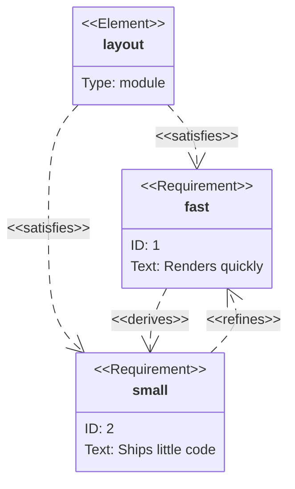
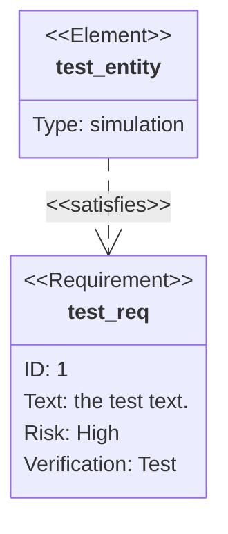
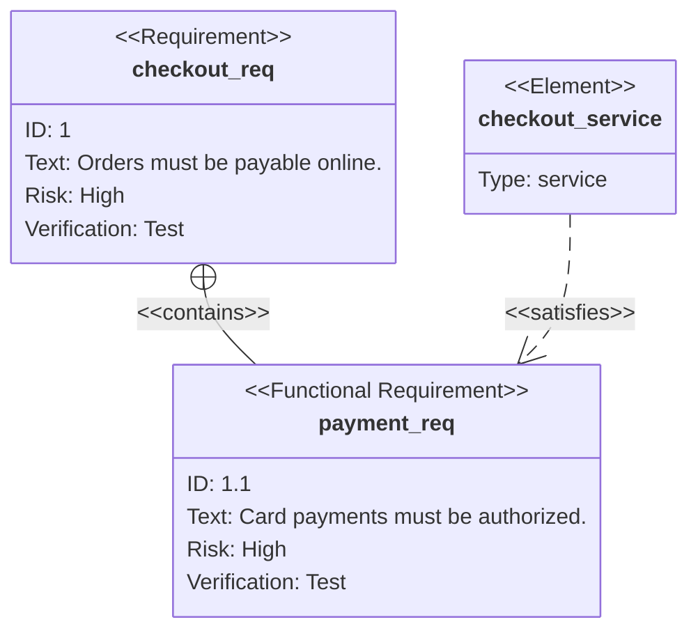
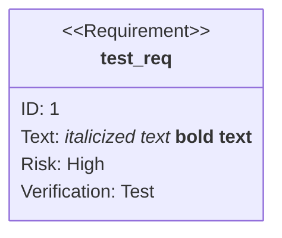
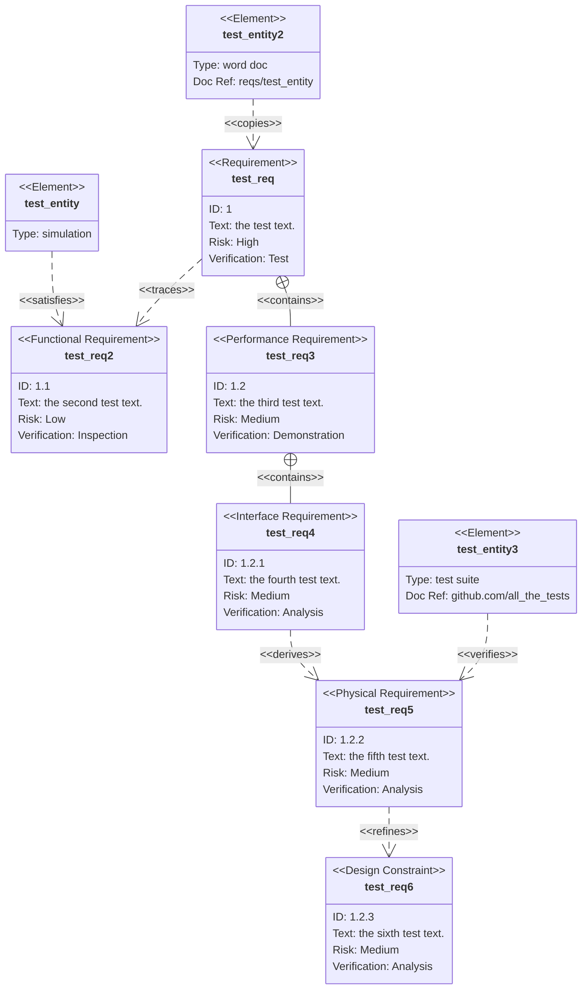
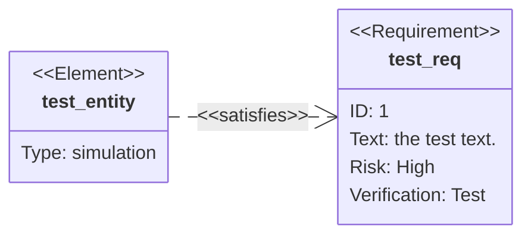
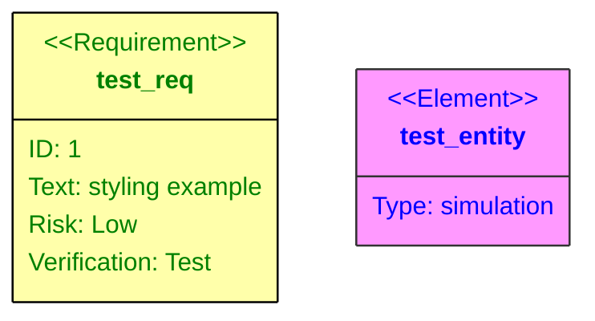
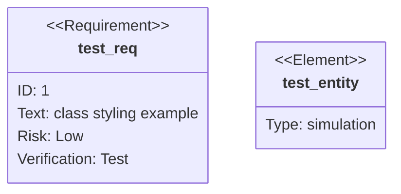
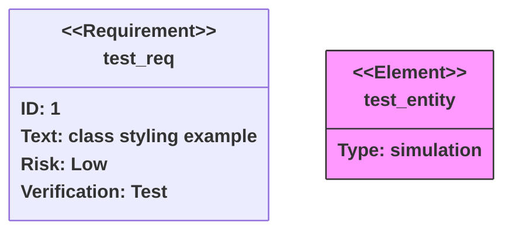

> 快照：<https://pele.run/examples/requirement> · Pele 1.13.0 · 抓取于 2026-11-04。内容原样保留，未做删改。

## Edges

### Relations both ways

```mermaid
requirementDiagram
  requirement fast {
    id: 1
    text: Renders quickly
  }
  requirement small {
    id: 2
    text: Ships little code
  }
  element layout {
    type: module
  }
  layout - satisfies -> fast
  layout - satisfies -> small
  fast - derives -> small
  small - refines -> fast
```

## Documentation examples

```mermaid
    requirementDiagram

    requirement test_req {
    id: 1
    text: the test text.
    risk: high
    verifymethod: test
    }

    element test_entity {
    type: simulation
    }

    test_entity - satisfies -> test_req
```

```mermaid
requirementDiagram
  requirement checkout_req {
    id: 1
    text: Orders must be payable online.
    risk: high
    verifymethod: test
  }
  functionalRequirement payment_req {
    id: 1.1
    text: Card payments must be authorized.
    risk: high
    verifymethod: test
  }
  element checkout_service {
    type: service
  }
  checkout_req - contains -> payment_req
  checkout_service - satisfies -> payment_req
```

```mermaid
---
config:
  theme: default
  look: classic
  layout: dagre
---
requirementDiagram
  requirement checkout_req {
    id: 1
    text: Orders must be payable online.
    risk: high
    verifymethod: test
  }
  functionalRequirement payment_req {
    id: 1.1
    text: Card payments must be authorized.
    risk: high
    verifymethod: test
  }
  element checkout_service {
    type: service
  }
  checkout_req - contains -> payment_req
  checkout_service - satisfies -> payment_req
```

```mermaid
requirementDiagram

requirement "__test_req__" {
    id: 1
    text: "*italicized text* **bold text**"
    risk: high
    verifymethod: test
}
```

```mermaid
    requirementDiagram

    requirement test_req {
    id: 1
    text: the test text.
    risk: high
    verifymethod: test
    }

    functionalRequirement test_req2 {
    id: 1.1
    text: the second test text.
    risk: low
    verifymethod: inspection
    }

    performanceRequirement test_req3 {
    id: 1.2
    text: the third test text.
    risk: medium
    verifymethod: demonstration
    }

    interfaceRequirement test_req4 {
    id: 1.2.1
    text: the fourth test text.
    risk: medium
    verifymethod: analysis
    }

    physicalRequirement test_req5 {
    id: 1.2.2
    text: the fifth test text.
    risk: medium
    verifymethod: analysis
    }

    designConstraint test_req6 {
    id: 1.2.3
    text: the sixth test text.
    risk: medium
    verifymethod: analysis
    }

    element test_entity {
    type: simulation
    }

    element test_entity2 {
    type: word doc
    docRef: reqs/test_entity
    }

    element test_entity3 {
    type: "test suite"
    docRef: github.com/all_the_tests
    }


    test_entity - satisfies -> test_req2
    test_req - traces -> test_req2
    test_req - contains -> test_req3
    test_req3 - contains -> test_req4
    test_req4 - derives -> test_req5
    test_req5 - refines -> test_req6
    test_entity3 - verifies -> test_req5
    test_req <- copies - test_entity2
```

```mermaid
requirementDiagram

direction LR

requirement test_req {
    id: 1
    text: the test text.
    risk: high
    verifymethod: test
}

element test_entity {
    type: simulation
}

test_entity - satisfies -> test_req
```

```mermaid
requirementDiagram

requirement test_req {
    id: 1
    text: styling example
    risk: low
    verifymethod: test
}

element test_entity {
    type: simulation
}

style test_req fill:#ffa,stroke:#000, color: green
style test_entity fill:#f9f,stroke:#333, color: blue
```

```mermaid
requirementDiagram

requirement test_req {
    id: 1
    text: "class styling example"
    risk: low
    verifymethod: test
}

element test_entity {
    type: simulation
}

classDef important fill:#f96,stroke:#333,stroke-width:4px
classDef test fill:#ffa,stroke:#000
```

```mermaid
requirementDiagram

requirement test_req:::important {
    id: 1
    text: "class styling example"
    risk: low
    verifymethod: test
}

element test_entity {
    type: simulation
}

classDef important font-weight:bold

class test_entity important
style test_entity fill:#f9f,stroke:#333
```
