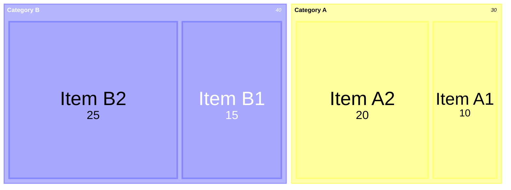
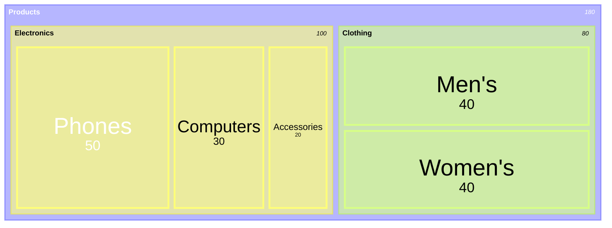
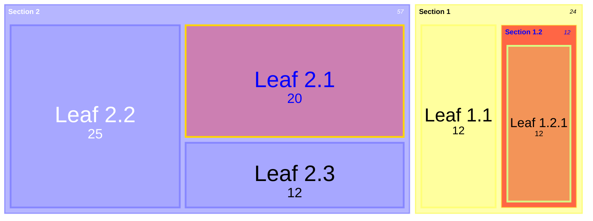
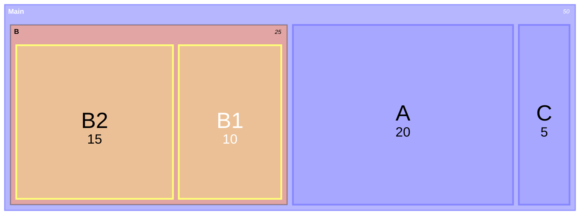
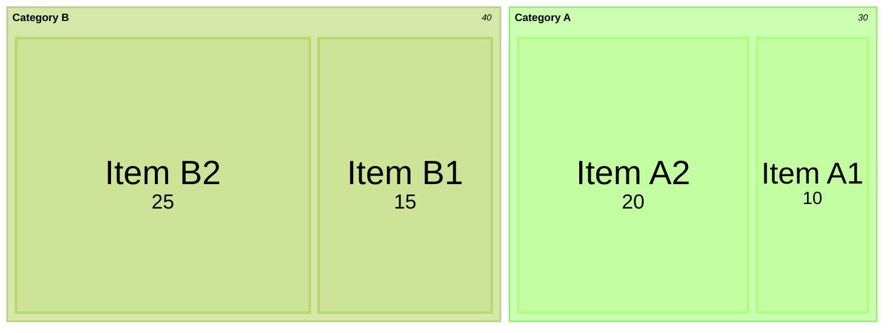
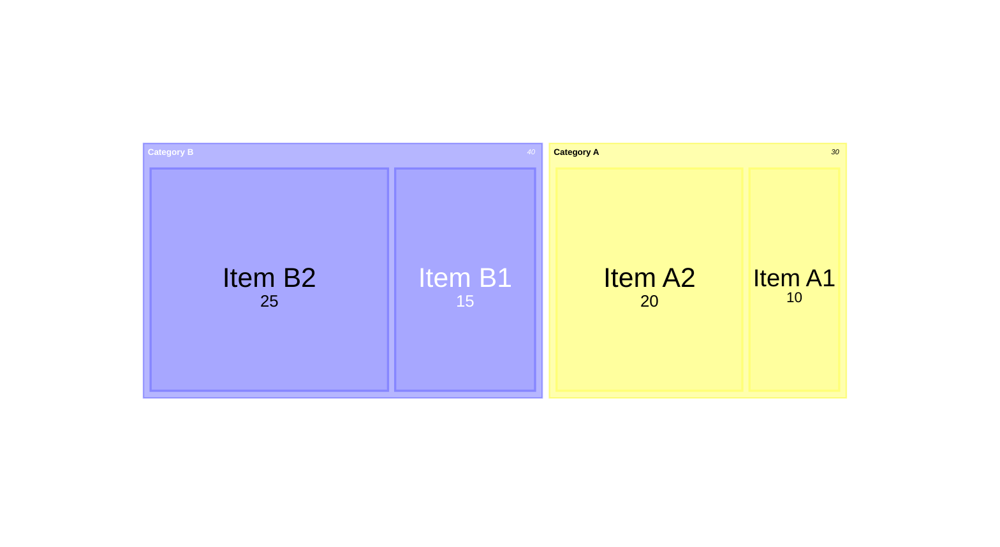
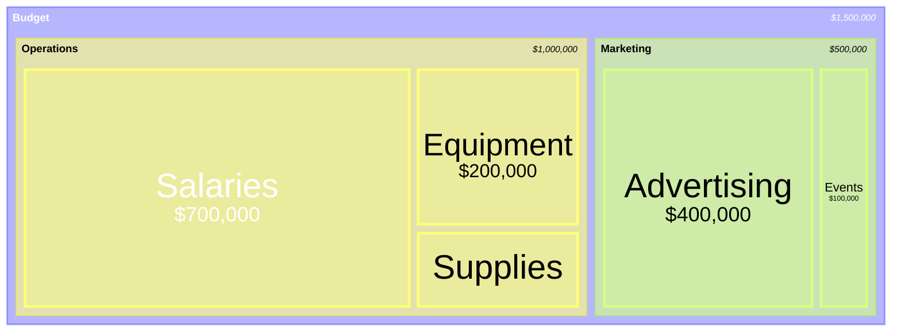
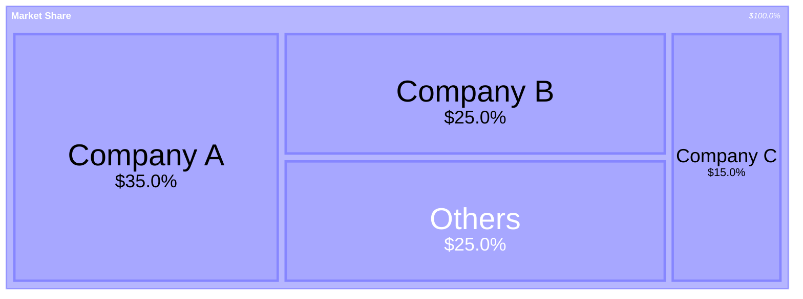

> 快照：<https://pele.run/examples/treemap> · Pele 1.13.0 · 抓取于 2026-11-04。内容原样保留，未做删改。

```mermaid
treemap-beta
"Category A"
    "Item A1": 10
    "Item A2": 20
"Category B"
    "Item B1": 15
    "Item B2": 25
```

```mermaid
treemap-beta
"Products"
    "Electronics"
        "Phones": 50
        "Computers": 30
        "Accessories": 20
    "Clothing"
        "Men's": 40
        "Women's": 40
```

```mermaid
treemap-beta
"Section 1"
    "Leaf 1.1": 12
    "Section 1.2":::class1
      "Leaf 1.2.1": 12
"Section 2"
    "Leaf 2.1": 20:::class1
    "Leaf 2.2": 25
    "Leaf 2.3": 12

classDef class1 fill:red,color:blue,stroke:#FFD600;
```

```mermaid
treemap-beta
"Main"
    "A": 20
    "B":::important
        "B1": 10
        "B2": 15
    "C": 5

classDef important fill:#f96,stroke:#333,stroke-width:2px;
```

```mermaid
---
config:
    theme: 'forest'
---
treemap-beta
"Category A"
    "Item A1": 10
    "Item A2": 20
"Category B"
    "Item B1": 15
    "Item B2": 25
```

```mermaid
---
config:
  treemap:
    diagramPadding: 200
---
treemap-beta
"Category A"
    "Item A1": 10
    "Item A2": 20
"Category B"
    "Item B1": 15
    "Item B2": 25
```

```mermaid
---
config:
  treemap:
    valueFormat: '$0,0'
---
treemap-beta
"Budget"
    "Operations"
        "Salaries": 700000
        "Equipment": 200000
        "Supplies": 100000
    "Marketing"
        "Advertising": 400000
        "Events": 100000
```

```mermaid
---
config:
  treemap:
    valueFormat: '$.1%'
---
treemap-beta
"Market Share"
    "Company A": 0.35
    "Company B": 0.25
    "Company C": 0.15
    "Others": 0.25
```
