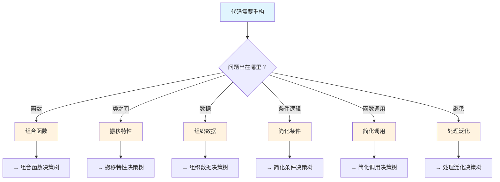
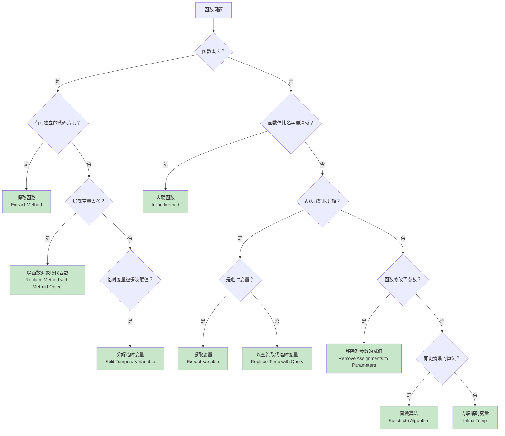
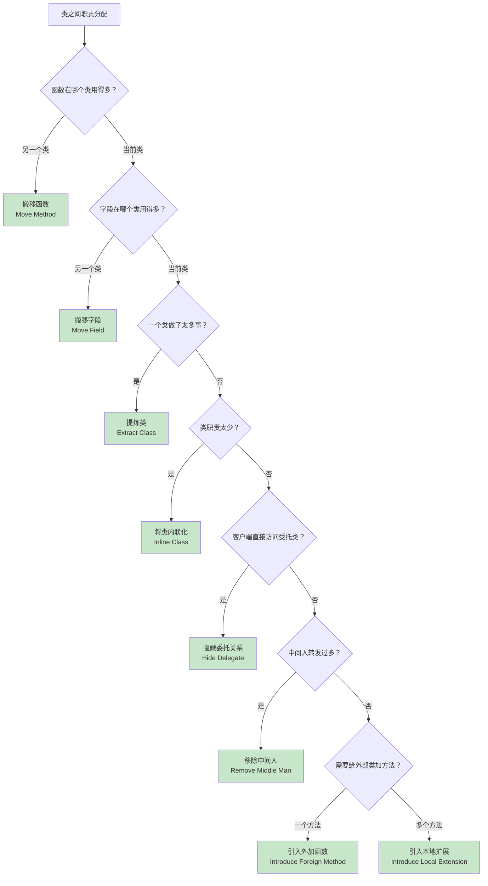
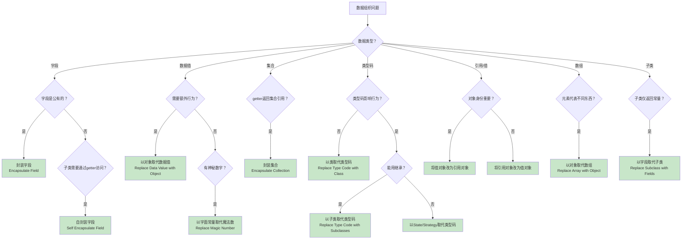
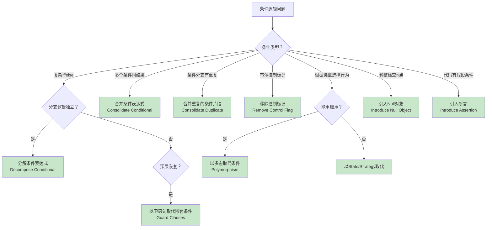
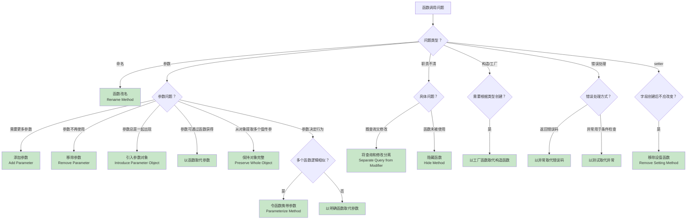
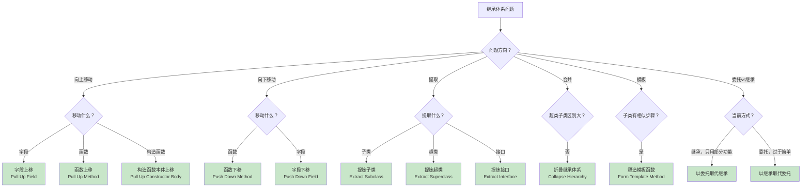
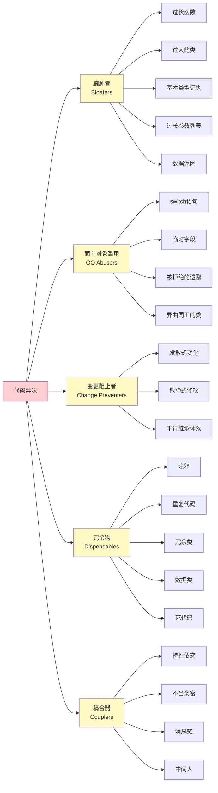

# 重构指南

基于 Refactoring.Guru 的 66 种重构技术中文参考手册。

## 使用方式

当用户提出重构需求时：

1. **识别问题** - 通过决策树定位代码问题
2. **选择技术** - 根据决策树选择对应的重构手法
3. **执行重构** - 按步骤实施，每步后测试

---

## 总体决策路由

---

## 1. 组合函数决策树

---

## 2. 搬移特性决策树

---

## 3. 组织数据决策树

---

## 4. 简化条件决策树

---

## 5. 简化调用决策树

---

## 6. 处理泛化决策树

---

## 代码异味速查

---

## 详细参考

每个分类的详细重构步骤请参考：
- `references/composing-methods.md` - 组合函数
- `references/moving-features.md` - 搬移特性
- `references/organizing-data.md` - 组织数据
- `references/simplifying-conditionals.md` - 简化条件
- `references/simplifying-method-calls.md` - 简化调用
- `references/dealing-with-generalization.md` - 处理泛化

## 重构原则

1. **小步前进** - 每次只做一个小改动
2. **频繁测试** - 每步之后运行测试
3. **保持可运行** - 代码在重构过程中始终可以运行
4. **可回滚** - 使用版本控制，随时可以撤销
